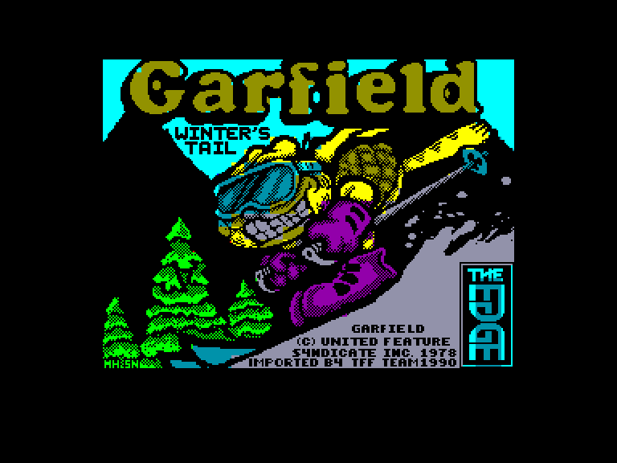
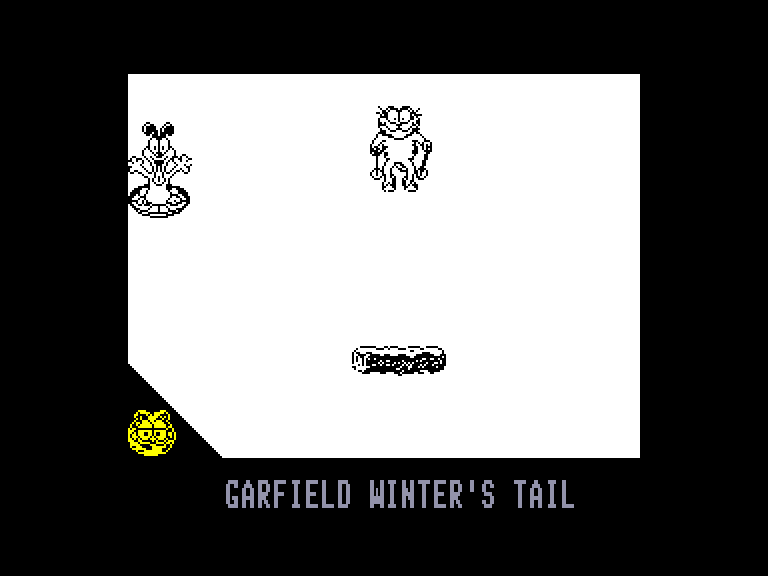
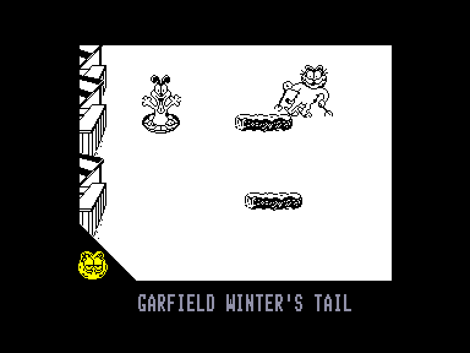
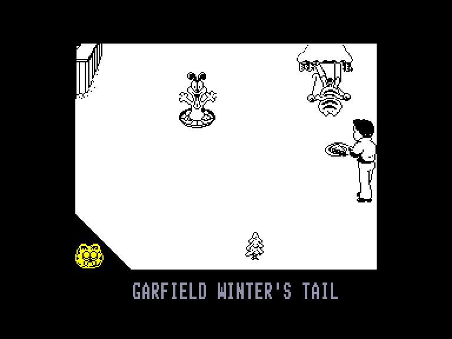

[0-9](../0/games-0.md) - [A](../a/games-a.md) - [B](../b/games-b.md) - [C](../c/games-c.md) - [D](../d/games-d.md) - [E](../e/games-e.md) - [F](../f/games-f.md) - [G](../g/games-g.md) - [H](../h/games-h.md) - [I](../i/games-i.md) - [J](../j/games-j.md) - [K](../k/games-k.md) - [L](../l/games-l.md) - [M](../m/games-m.md) - [N](../n/games-n.md) - [O](../o/games-o.md) - [P](../p/games-p.md) - [Q](../q/games-q.md) - [R](../r/games-r.md) - [S](../s/games-s.md) - [T](../t/games-t.md) - [U](../u/games-u.md) - [V](../v/games-v.md) - [W](../w/games-w.md) - [X](../x/games-x.md) - [Y](../y/games-y.md) - [Z](../z/games-z.md)

Ігри для [Enterprise 64k](../games-ep64.md) - [Enterprise 128k+RAMexp](../games-epramexp.md)

Ігри для систем [IS-DOS](../games-is-dos.md) - [SymbOS](../games-symbos.md) - [EDC Windows](../games-edcw.md)

Ігри для емуляторів [ZX Spectrum 48k/128k](../zxemu/games-zxemu.md) - [Amstrad CPC](../cpcemu/games-cpc.md) - [Sinclair ZX81](../zx81emu/games-zx81.md) - [Videoton TVC](../tvcemu/games-tvc.md) - [Commodore VIC-20](../vic20emu/games-vic20.md)

----------

# Garfield: Winter's Tail

**ID:** garfield-winters-tail-zx

## Скріншоти

## Опис

(temporary description generated by AI [ChatGPT])

**Опис гри: Garfield: Winter's Tail**

Гравець стає на місце кота Гарфілда, який після насиченого дня снує мрії про швейцарські Альпи. Його мета - досягти найбільшої фабрики лазаньї у світі та знайти міфічну курку, що несе шоколадні яйця. У грі є три міні-ігри: спочатку Гарфілд катається на лижах, потім працює в шоколадній фабриці, а наприкінці ковзає по замерзлому озеру. Під час гри гравець повинен уникати перешкод, які створює собака Оді, що намагається заважати Гарфілду.

**Правила гри:**
1. Гравець може вибрати будь-яку з трьох міні-ігор: лижі, шоколадна фабрика або катання на ковзанах.
2. Щоб побачити закінчення гри, потрібно спочатку пройти рівень на лижах.
3. Уникайте перешкод, які створює Оді, щоб зберегти енергію Гарфілда.
4. Виконуйте завдання в кожній міні-грі, щоб досягти успіху і допомогти Гарфілду реалізувати свої мрії.

## Основна інформація
- **Оригінальна платформа:** ZX Spectrum

## Посилання
- [Інформація про оригінальну версію](https://spectrumcomputing.co.uk/entry/1979/ZX-Spectrum/Garfield-Winters_Tail)
- [Завантажити гру](http://www.ep128.hu/Ep_Games/Prg/Garfield2.rar)

**Дата генерації:** 28.07.2026

