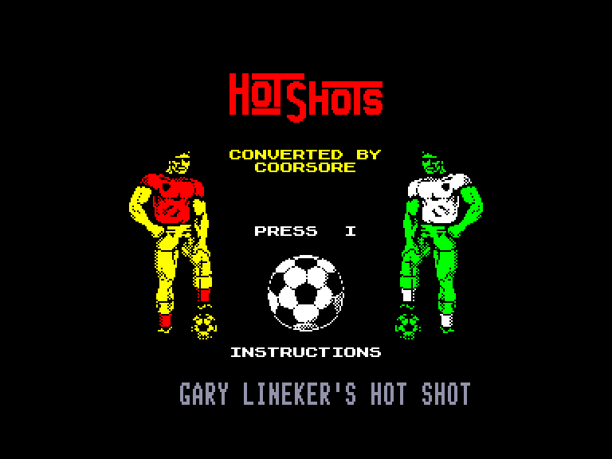
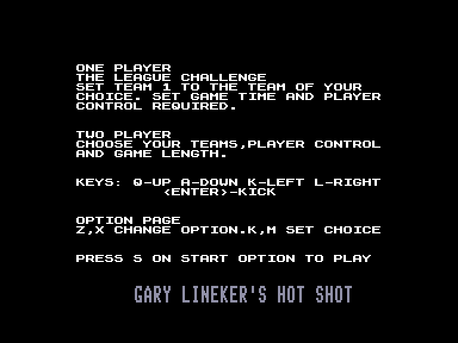
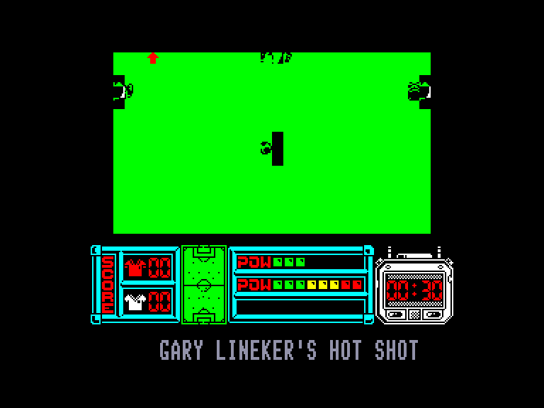
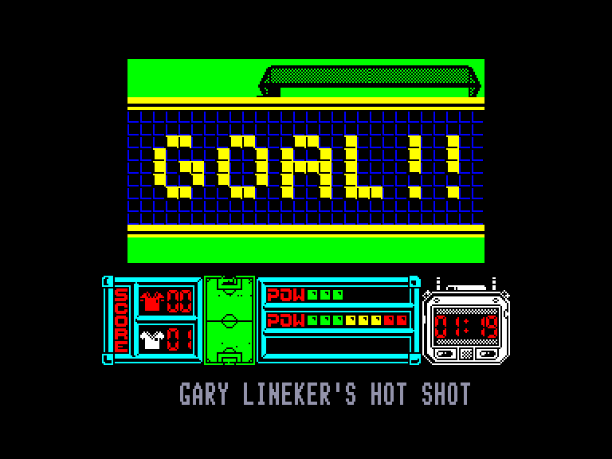

[0-9](../0/games-0.md) - [A](../a/games-a.md) - [B](../b/games-b.md) - [C](../c/games-c.md) - [D](../d/games-d.md) - [E](../e/games-e.md) - [F](../f/games-f.md) - [G](../g/games-g.md) - [H](../h/games-h.md) - [I](../i/games-i.md) - [J](../j/games-j.md) - [K](../k/games-k.md) - [L](../l/games-l.md) - [M](../m/games-m.md) - [N](../n/games-n.md) - [O](../o/games-o.md) - [P](../p/games-p.md) - [Q](../q/games-q.md) - [R](../r/games-r.md) - [S](../s/games-s.md) - [T](../t/games-t.md) - [U](../u/games-u.md) - [V](../v/games-v.md) - [W](../w/games-w.md) - [X](../x/games-x.md) - [Y](../y/games-y.md) - [Z](../z/games-z.md)

Ігри для [Enterprise 64k](../games-ep64.md) - [Enterprise 128k+RAMexp](../games-epramexp.md)

Ігри для систем [IS-DOS](../games-is-dos.md) - [SymbOS](../games-symbos.md) - [EDC Windows](../games-edcw.md)

Ігри для емуляторів [ZX Spectrum 48k/128k](../zxemu/games-zxemu.md) - [Amstrad CPC](../cpcemu/games-cpc.md) - [Sinclair ZX81](../zx81emu/games-zx81.md) - [Videoton TVC](../tvcemu/games-tvc.md) - [Commodore VIC-20](../vic20emu/games-vic20.md)

----------

# Gary Lineker's Hot-Shot!

**ID:** gary-linekers-hot-shot-zx

## Скріншоти

## Опис

(temporary description generated by AI [ChatGPT])

**Опис гри:**

Gary Lineker's Hot-Shot! — це футбольна гра, в якій дві команди змагаються за перемогу в матчі. Гравець може налаштувати кількість гравців, тривалість тайму та рівень штучного інтелекту. Гра ведеться з верхнього виду, що показує лише частину ігрового поля. Гравець контролює спортсмена, який володіє м'ячем, або, в захисті, того, хто найближче до м'яча. Сила удару залежить від того, як довго тримався кнопка, а напрямок змінюється відповідно до руху джойстика.

**Правила гри:**

1. Гравець обирає кількість учасників (1-2 гравці).
2. Налаштуйте тривалість тайму та рівень складності.
3. Гра починається з кидка м'яча в центрі поля.
4. Керуйте своїм гравцем, щоб отримати м'яч і забити гол.
5. Сила удару визначається тривалістю натискання кнопки.
6. Використовуйте рухи джойстика, щоб змінити напрямок удару.
7. Переможе команда, яка заб'є більше голів до закінчення матчу.

## Основна інформація
- **Оригінальна платформа:** ZX Spectrum

## Посилання
- [Інформація про оригінальну версію](https://spectrumcomputing.co.uk/entry/1982/ZX-Spectrum/Gary_Linekers_Hot-Shot)

