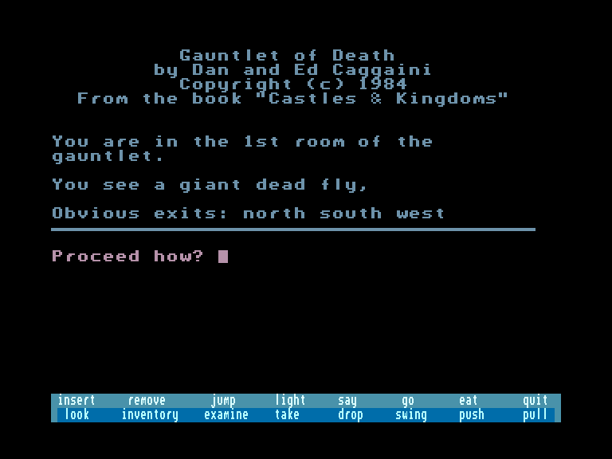
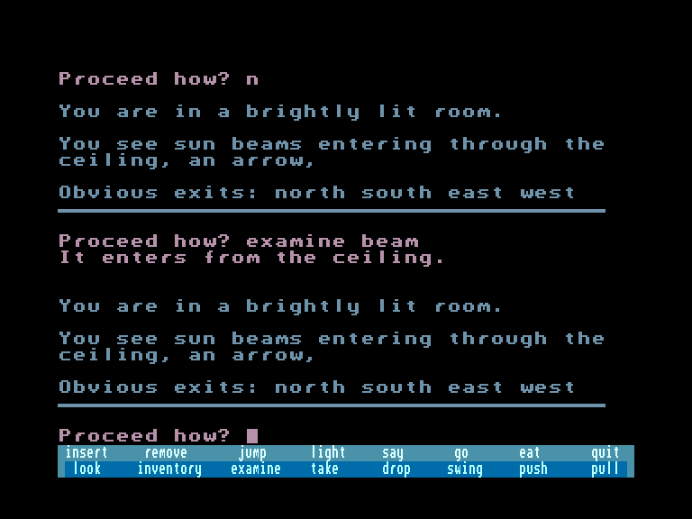
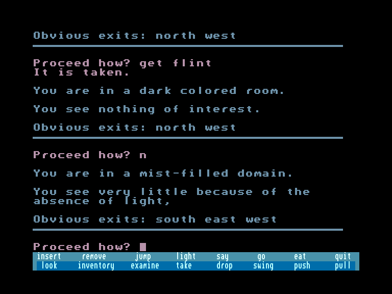

[0-9](../0/games-0.md) - [A](../a/games-a.md) - [B](../b/games-b.md) - [C](../c/games-c.md) - [D](../d/games-d.md) - [E](../e/games-e.md) - [F](../f/games-f.md) - [G](../g/games-g.md) - [H](../h/games-h.md) - [I](../i/games-i.md) - [J](../j/games-j.md) - [K](../k/games-k.md) - [L](../l/games-l.md) - [M](../m/games-m.md) - [N](../n/games-n.md) - [O](../o/games-o.md) - [P](../p/games-p.md) - [Q](../q/games-q.md) - [R](../r/games-r.md) - [S](../s/games-s.md) - [T](../t/games-t.md) - [U](../u/games-u.md) - [V](../v/games-v.md) - [W](../w/games-w.md) - [X](../x/games-x.md) - [Y](../y/games-y.md) - [Z](../z/games-z.md)

Ігри для [Enterprise 64k](../games-ep64.md) - [Enterprise 128k+RAMexp](../games-epramexp.md)

Ігри для систем [IS-DOS](../games-is-dos.md) - [SymbOS](../games-symbos.md) - [EDC Windows](../games-edcw.md)

Ігри для емуляторів [ZX Spectrum 48k/128k](../zxemu/games-zxemu.md) - [Amstrad CPC](../cpcemu/games-cpc.md) - [Sinclair ZX81](../zx81emu/games-zx81.md) - [Videoton TVC](../tvcemu/games-tvc.md) - [Commodore VIC-20](../vic20emu/games-vic20.md)

----------

# Gauntlet of Death

**ID:** gauntlet-of-death-bas

## Скріншоти

## Опис

(temporary description generated by AI)

**Гра: Gauntlet of Death**

**Опис:**  
У грі "Gauntlet of Death" вам потрібно пройти випробування мужності та витривалості, щоб звільнити викрадену доньку Бротона, вождя північних людей. Якщо ви досягнете успіху, ви отримаєте її звільнення та повагу Королівського Дому для людства. Якщо ж ви зазнаєте поразки, то загинете, і надії людства на рівноправність загинуть разом з вами.

**Правила гри:**
1. Виконуйте завдання, щоб довести свою мужність.
2. Уникайте небезпек і ворогів на своєму шляху.
3. Збирайте ресурси та підказки, щоб допомогти у проходженні.
4. Досліджуйте різні локації та вирішуйте головоломки.
5. Завершіть гру, звільнивши доньку Бротона, щоб отримати перемогу.

## Посилання
- [Опис гри на ep128.hu (угорською)](http://www.ep128.hu/Ep_Games/Leiras/Castles_and_Kingdoms.htm)
- [Інформація про гру (SolutionArchive.com)](https://solutionarchive.com/game/id%2C5489/Gauntlet+of+Death.html)
- [Завантажити гру](http://www.ep128.hu/Ep_Games/Prg/Castles_and_Kingdoms.rar)

