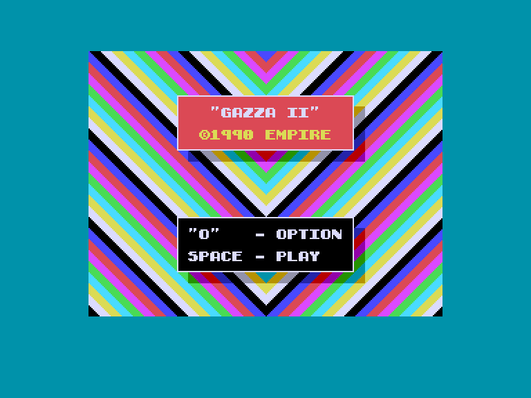
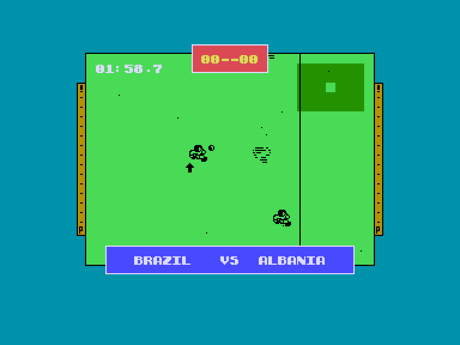
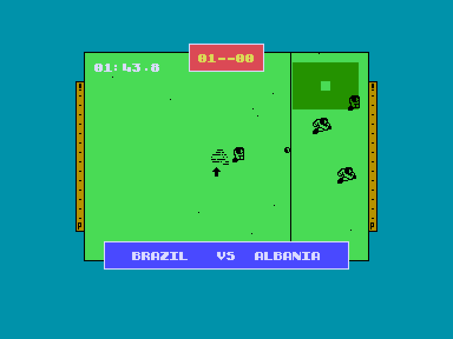
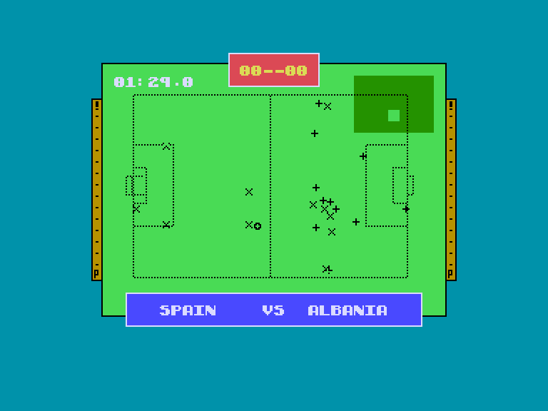

[0-9](../0/games-0.md) - [A](../a/games-a.md) - [B](../b/games-b.md) - [C](../c/games-c.md) - [D](../d/games-d.md) - [E](../e/games-e.md) - [F](../f/games-f.md) - [G](../g/games-g.md) - [H](../h/games-h.md) - [I](../i/games-i.md) - [J](../j/games-j.md) - [K](../k/games-k.md) - [L](../l/games-l.md) - [M](../m/games-m.md) - [N](../n/games-n.md) - [O](../o/games-o.md) - [P](../p/games-p.md) - [Q](../q/games-q.md) - [R](../r/games-r.md) - [S](../s/games-s.md) - [T](../t/games-t.md) - [U](../u/games-u.md) - [V](../v/games-v.md) - [W](../w/games-w.md) - [X](../x/games-x.md) - [Y](../y/games-y.md) - [Z](../z/games-z.md)

Ігри для [Enterprise 64k](../games-ep64.md) - [Enterprise 128k+RAMexp](../games-epramexp.md) - [2dfx](../games-2dfx.md)

Ігри для систем [IS-DOS](../games-is-dos.md) - [SymbOS](../games-symbos.md) - [EDC Windows](../games-edcw.md)

Ігри для емуляторів [ZX Spectrum 48k/128k](../zxemu/games-zxemu.md) - [Amstrad CPC](../cpcemu/games-cpc.md) - [Sinclair ZX81](../zx81emu/games-zx81.md) - [Videoton TVC](../tvcemu/games-tvc.md) - [Commodore VIC-20](../vic20emu/games-vic20.md)

----------

# Gazza II

**ID:** gazza2-zx

## Скріншоти

## Опис

(temporary description generated by AI [ChatGPT])

**Опис гри: Gazza II**

Gazza II - це футбольна гра, випущена у 1990 році компанією Empire Software для платформ Spectrum (128k) та Enterprise. Гравці можуть насолоджуватися грою з верхньої камери, що дозволяє краще слідкувати за рухами м'яча на полі. Гра пропонує просте, але функціональне графічне оформлення, а також музичний супровід на 128K, що створює атмосферу футбольного матчу.

**Правила гри:**

1. **Управління командами:** 
   - Налаштуйте управління для обох команд через меню, натиснувши клавішу "O".
   - Можна вибрати управління з клавіатури (клавіші Q, A, O, P, SPACE) або за допомогою джойстика (JOY1 / JOY2).

2. **Тривалість матчу:** 
   - Налаштуйте тривалість матчу від 2 до 90 хвилин, натискаючи "O" та "P".

3. **Початок гри:**
   - Натисніть SPACE для початку гри. Виберіть суперника зі списку, що вказує на рівень складності.

4. **Графіка та управління:**
   - Гравець, якого ви контролюєте, позначений стрілкою. Система автоматично вибирає гравця, за якого ви граєте.
   - Воротар контролюється комп'ютером, але його реакція не завжди адекватна.

5. **Перемикання режимів:** 
   - Натискаючи "X", можна перемикатися між "класичним" та тактичним видом гри, що дозволяє краще бачити поле.

6. **Пауза та вихід:** 
   - Гру можна призупинити натисканням "H", а для виходу натисніть 8+9 (для Spectrum) або STOP (для Enterprise).

Ця гра пропонує простий, але захопливий досвід, і варта вашої уваги!

## Основна інформація
- **Оригінальна платформа:** ZX Spectrum

## Посилання
- [Опис на ep128.hu (угорською)](http://www.ep128.hu/Games/Gazza2.htm)
- [Інформація про оригінальну версію](https://spectrumcomputing.co.uk/entry/1996/ZX-Spectrum/Gazza_II)
- [Завантажити](http://www.ep128.hu/Ep_Games/Prg/Gazza_2.rar)

## Відео

<iframe src="https://www.youtube.com/embed/ypmjWq718LE"  
style="width:75%; aspect-ratio:16/9;" allowfullscreen></iframe>

