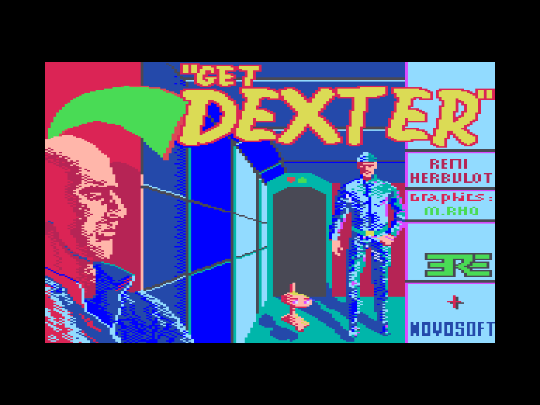
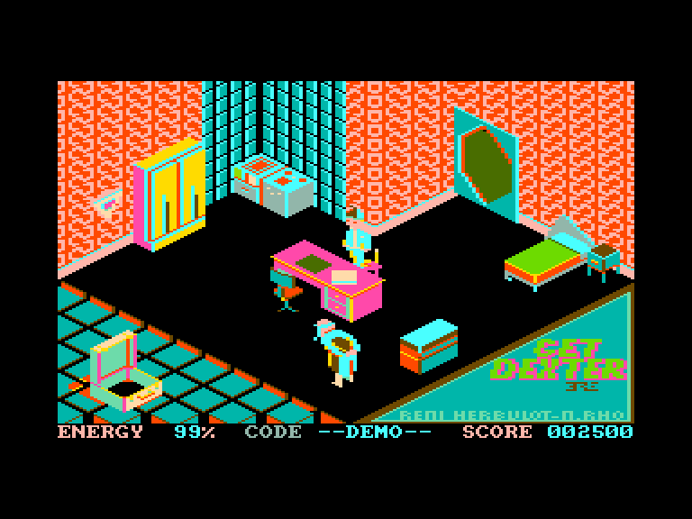
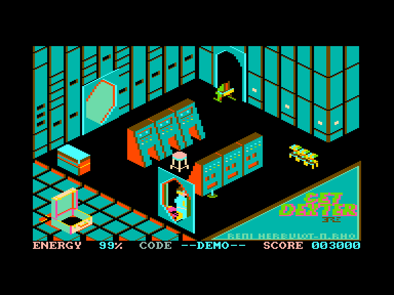
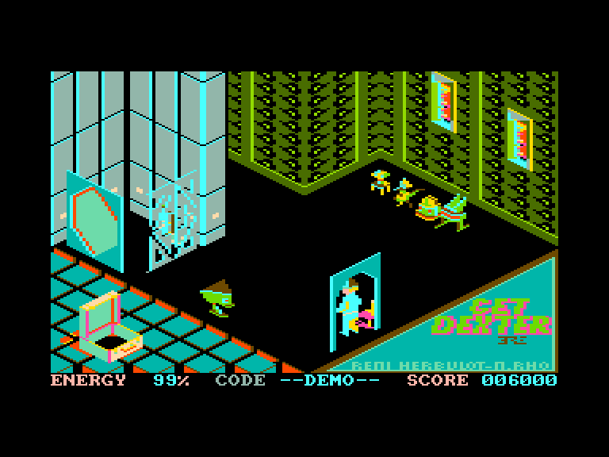

[0-9](../0/games-0.md) - [A](../a/games-a.md) - [B](../b/games-b.md) - [C](../c/games-c.md) - [D](../d/games-d.md) - [E](../e/games-e.md) - [F](../f/games-f.md) - [G](../g/games-g.md) - [H](../h/games-h.md) - [I](../i/games-i.md) - [J](../j/games-j.md) - [K](../k/games-k.md) - [L](../l/games-l.md) - [M](../m/games-m.md) - [N](../n/games-n.md) - [O](../o/games-o.md) - [P](../p/games-p.md) - [Q](../q/games-q.md) - [R](../r/games-r.md) - [S](../s/games-s.md) - [T](../t/games-t.md) - [U](../u/games-u.md) - [V](../v/games-v.md) - [W](../w/games-w.md) - [X](../x/games-x.md) - [Y](../y/games-y.md) - [Z](../z/games-z.md)

Ігри для [Enterprise 64k](../games-ep64.md) - [Enterprise 128k+RAMexp](../games-epramexp.md) - [2dfx](games-2dfx.md)

Ігри для систем [IS-DOS](../games-is-dos.md) - [SymbOS](../games-symbos.md) - [EDC Windows](../games-edcw.md)

Ігри для емуляторів [ZX Spectrum 48k/128k](../zxemu/games-zxemu.md) - [Amstrad CPC](../cpcemu/games-cpc.md) - [Sinclair ZX81](../zx81emu/games-zx81.md) - [Videoton TVC](../tvcemu/games-tvc.md) - [Commodore VIC-20](../vic20emu/games-vic20.md)

----------

# Get Dexter

**ID:** get-dexter-cpc

## Скріншоти

## Опис

(temporary description generated by AI [Assistant])

**Опис гри: Get Dexter**

Гравці беруть на себе роль Декстера, агента Служби національної безпеки та життєзабезпечення, який повинен врятувати вісім людей, що залишилися на космічній станції, зараженій токсичним газом, що прискорює старіння. Для цього потрібно знайти вісім шприців із протиотрутою та отримати коди для відкриття головних дверей. Гравець стикається з небезпечними роботами, які заважають виконанню завдання, і має використовувати різні предмети для їх знищення.

**Правила гри:**
1. Використовуйте джойстик або клавіші "Q", "A", "I", "O", "SPACE" для управління.
2. Збирайте предмети, натискаючи "ENTER".
3. Для скидання предметів використовуйте "D".
4. Для переміщення предметів натискайте "P".
5. Щоб покликати птаха Bird X, натискайте "R".
6. Уникайте контактів з роботами, щоб не втратити енергію.
7. Знищуйте роботів за допомогою різних предметів, таких як кнопки, гранати, квіти та пляшки.
8. Відкривайте двері за допомогою відповідних кодів, зібраних у старих людей.
9. Після збору всіх кодів, вирушайте до кімнати праворуч на карті, щоб розгадати головоломку для відкриття фінальних дверей.

Бажаємо успіху в цій захоплюючій пригоді!

## Основна інформація
- **Оригінальна платформа:** Amstrad CPC

## Посилання
- [Опис на ep128.hu (угорською)](http://www.ep128.hu/Ep_Games/Leiras/Get_Dexter.htm)
- [Інформація про оригінальну версію](https://www.cpc-power.com/index.php?page=detail&num=625)
- [Завантажити](http://www.ep128.hu/Ep_Games/Prg/Get_Dexter.rar)
- [Easy Load&Play](https://t.me/EP128k_Load_n_Play/353) *(Telegram-канал Vibrant Waves)*

## Відео

<iframe src="https://www.youtube.com/embed/goAYoq0WpGs"  
style="width:75%; aspect-ratio:16/9;" allowfullscreen></iframe>

