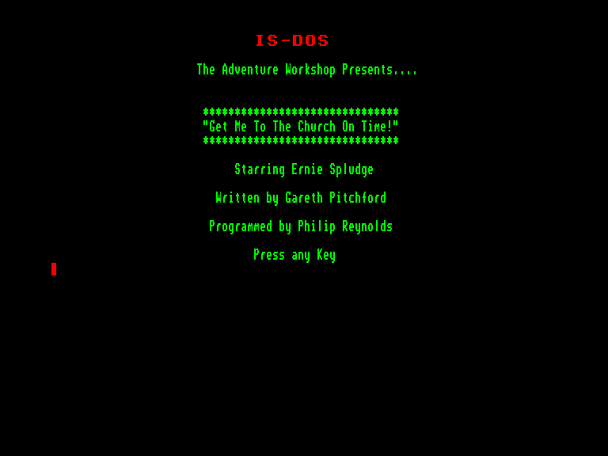
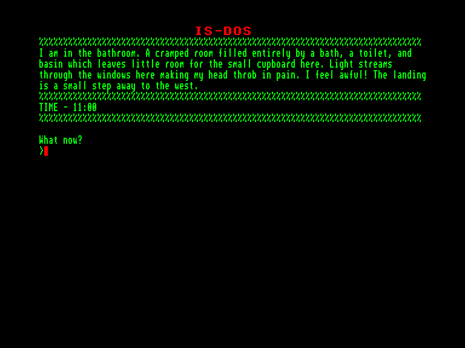

[0-9](../0/games-0.md) - [A](../a/games-a.md) - [B](../b/games-b.md) - [C](../c/games-c.md) - [D](../d/games-d.md) - [E](../e/games-e.md) - [F](../f/games-f.md) - [G](../g/games-g.md) - [H](../h/games-h.md) - [I](../i/games-i.md) - [J](../j/games-j.md) - [K](../k/games-k.md) - [L](../l/games-l.md) - [M](../m/games-m.md) - [N](../n/games-n.md) - [O](../o/games-o.md) - [P](../p/games-p.md) - [Q](../q/games-q.md) - [R](../r/games-r.md) - [S](../s/games-s.md) - [T](../t/games-t.md) - [U](../u/games-u.md) - [V](../v/games-v.md) - [W](../w/games-w.md) - [X](../x/games-x.md) - [Y](../y/games-y.md) - [Z](../z/games-z.md)

Ігри для [Enterprise 64k](../games-ep64.md) - [Enterprise 128k+RAMexp](../games-epramexp.md)

Ігри для систем [IS-DOS](../games-is-dos.md) - [SymbOS](../games-symbos.md) - [EDC Windows](../games-edcw.md)

Ігри для емуляторів [ZX Spectrum 48k/128k](../zxemu/games-zxemu.md) - [Amstrad CPC](../cpcemu/games-cpc.md) - [Sinclair ZX81](../zx81emu/games-zx81.md) - [Videoton TVC](../tvcemu/games-tvc.md) - [Commodore VIC-20](../vic20emu/games-vic20.md)

----------

# Get Me to the Church On Time!

**ID:** get-me-to-the-church-on-time-isdos

**Жанри:** Текстова пригода

## Скріншоти

## Опис

(temporary description generated by AI Assistant)

**Опис гри: "Дістанься до церкви вчасно!"**

Приготуйтеся до весілля! У цій захоплюючій пригодницькій грі вам потрібно буде вирішити різноманітні головоломки та подолати перешкоди, щоб дістатися до церкви вчасно. Гра пропонує унікальні виклики та цікаві персонажі, які допоможуть або завадять вам на вашому шляху.

**Правила гри:**
1. Використовуйте клавіші для переміщення та взаємодії з предметами.
2. Розв'язуйте головоломки, щоб отримати доступ до нових локацій.
3. Збирайте предмети, які можуть знадобитися для досягнення мети.
4. Будьте уважні до підказок та персонажів, які можуть допомогти вам.
5. Вашою основною метою є дістатися до церкви до початку церемонії.

Удачі!

## Основна інформація
- **Мови:** Англійська
- **Оригінальна платформа:** Amstrad CPC
### Загальні системні вимоги
- **Апаратні:** EXDOS
- **Програмні:** IS-DOS
### Геймплей
- **Керування:** Keyboard
- **Кількість гравців:** 1 player
- **Додаткові теги:** Text80 mode, PAW
### Розробка
- **Рік випуску:** 1992
- **Автор:** Gareth Pitchford, Scott P. Denyer

## Посилання
- [Домашня сторінка гри](http://8bitag.com/games/church.html)
- [Інформація про оригінальну версію](https://www.cpc-power.com/index.php?page=detail&num=4512)
- [Інформація про гру (SolutionArchive.com)](https://solutionarchive.com/game/id%2C1151/Get+Me+to+the+Church+On+Time%21.html)

