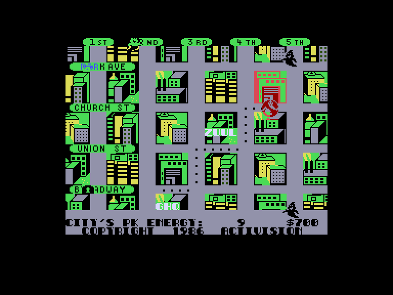
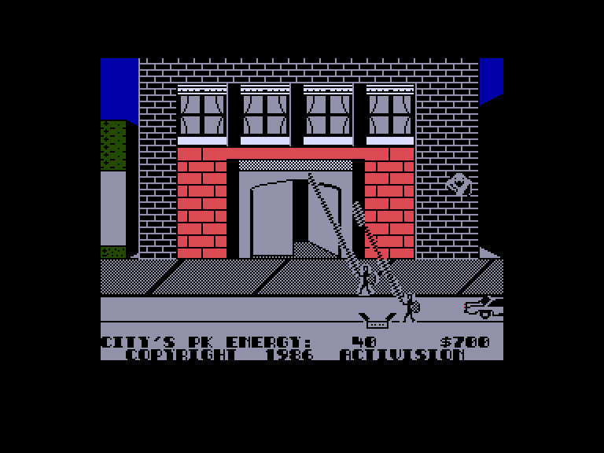
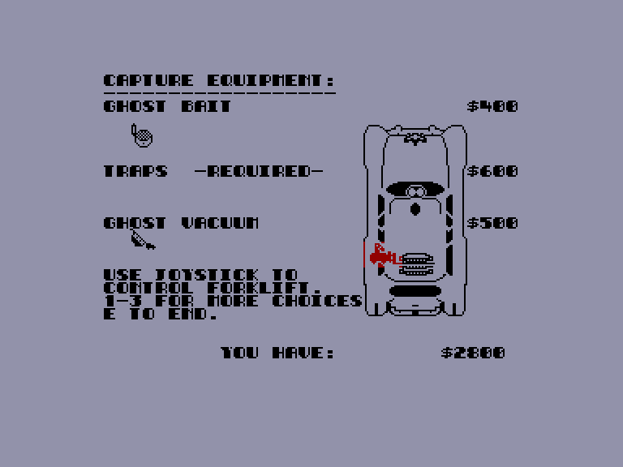

[0-9](../0/games-0.md) - [A](../a/games-a.md) - [B](../b/games-b.md) - [C](../c/games-c.md) - [D](../d/games-d.md) - [E](../e/games-e.md) - [F](../f/games-f.md) - [G](../g/games-g.md) - [H](../h/games-h.md) - [I](../i/games-i.md) - [J](../j/games-j.md) - [K](../k/games-k.md) - [L](../l/games-l.md) - [M](../m/games-m.md) - [N](../n/games-n.md) - [O](../o/games-o.md) - [P](../p/games-p.md) - [Q](../q/games-q.md) - [R](../r/games-r.md) - [S](../s/games-s.md) - [T](../t/games-t.md) - [U](../u/games-u.md) - [V](../v/games-v.md) - [W](../w/games-w.md) - [X](../x/games-x.md) - [Y](../y/games-y.md) - [Z](../z/games-z.md)

Ігри для [Enterprise 64k](../games-ep64.md) - [Enterprise 128k+RAMexp](../games-epramexp.md)

Ігри для систем [IS-DOS](../games-is-dos.md) - [SymbOS](../games-symbos.md) - [EDC Windows](../games-edcw.md)

Ігри для емуляторів [ZX Spectrum 48k/128k](../zxemu/games-zxemu.md) - [Amstrad CPC](../cpcemu/games-cpc.md) - [Sinclair ZX81](../zx81emu/games-zx81.md) - [Videoton TVC](../tvcemu/games-tvc.md) - [Commodore VIC-20](../vic20emu/games-vic20.md)

----------

# Ghostbusters

**ID:** ghostbusters-zx

## Скріншоти

## Опис

(temporary description generated by AI [ChatGPT])

**Опис гри: Ghostbusters**

У Нью-Йорку відбуваються дивні та таємничі речі: привиди лякають жителів міста. Ці часті "напади привидів" не є випадковими... Лише троє звільнених професорів парапсихології можуть врятувати світ від надприродних істот. Вони вирішують зайнятися бізнесом з вигнання привидів. Гра, заснована на популярному фільмі, була випущена Activision у 1984 році, а у 1986 році з'явилася її 128K версія, яка запам'яталася атмосферною музикою.

**Правила гри:**
1. **Вибір управління:** Після завантаження виберіть тип управління (Sinclair, Kempston, Cursor або клавіатура).
2. **Введення імені:** Введіть своє ім'я та, при бажанні, номер рахунку.
3. **Фінансування:** Ви починаєте з 10,000 доларів для купівлі обладнання.
4. **Вибір транспорту:** Виберіть автомобіль (рекомендується 1963 року Hearse) для перевезення обладнання.
5. **Обладнання:** Купуйте різні предмети для полювання на привидів, такі як детектори, пастки та приманки.
6. **Мета гри:** Збирати привидів, запобігти зустрічі Ключника та Охоронця, а також зупинити Маршмеллоу Людину від руйнування міста.
7. **Стратегії:** Використовуйте приманки для залучення привидів та управляйте персонажами для їх захоплення.
8. **Перемога:** Збирайте якомога більше привидів і грошей, щоб врятувати світ від ЗУУЛа.

Удачі в полюванні на привидів!

## Основна інформація
- **Оригінальна платформа:** ZX Spectrum

## Посилання
- [Опис гри на ep128.hu (угорською)](http://www.ep128.hu/Games/Ghostbusters.htm)
- [Інформація про оригінальну версію](https://spectrumcomputing.co.uk/entry/2025/ZX-Spectrum/Ghostbusters)
- [Завантажити гру](http://www.ep128.hu/Ep_Games/Prg/Ghostbusters.rar)

## Відео

<iframe src="https://www.youtube.com/embed/hE83p4X2WgY"  
style="width:75%; aspect-ratio:16/9;" allowfullscreen></iframe>

