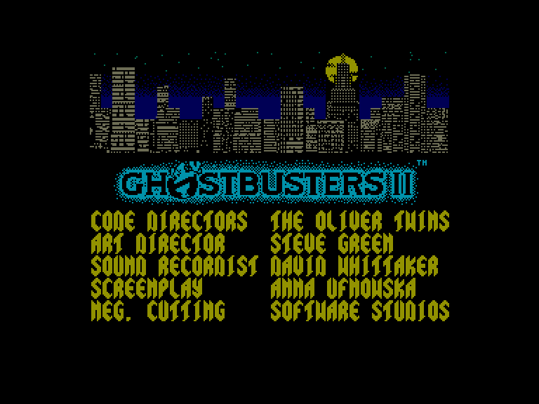
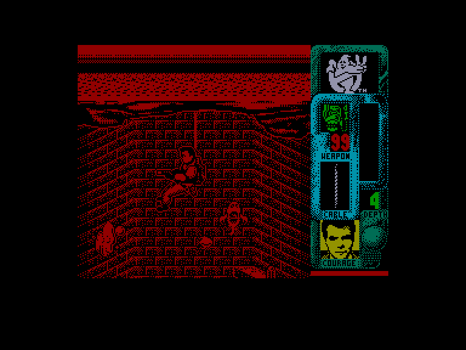
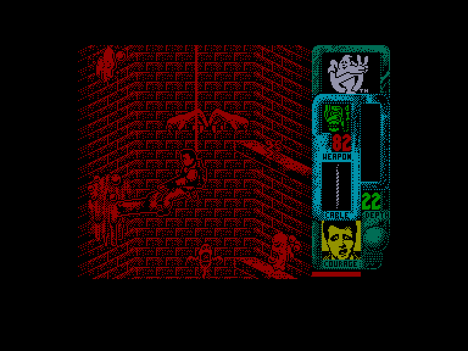

[0-9](../0/games-0.md) - [A](../a/games-a.md) - [B](../b/games-b.md) - [C](../c/games-c.md) - [D](../d/games-d.md) - [E](../e/games-e.md) - [F](../f/games-f.md) - [G](../g/games-g.md) - [H](../h/games-h.md) - [I](../i/games-i.md) - [J](../j/games-j.md) - [K](../k/games-k.md) - [L](../l/games-l.md) - [M](../m/games-m.md) - [N](../n/games-n.md) - [O](../o/games-o.md) - [P](../p/games-p.md) - [Q](../q/games-q.md) - [R](../r/games-r.md) - [S](../s/games-s.md) - [T](../t/games-t.md) - [U](../u/games-u.md) - [V](../v/games-v.md) - [W](../w/games-w.md) - [X](../x/games-x.md) - [Y](../y/games-y.md) - [Z](../z/games-z.md)

Ігри для [Enterprise 64k](../games-ep64.md) - [Enterprise 128k+RAMexp](../games-epramexp.md)

Ігри для систем [IS-DOS](../games-is-dos.md) - [SymbOS](../games-symbos.md) - [EDC Windows](../games-edcw.md)

Ігри для емуляторів [ZX Spectrum 48k/128k](../zxemu/games-zxemu.md) - [Amstrad CPC](../cpcemu/games-cpc.md) - [Sinclair ZX81](../zx81emu/games-zx81.md) - [Videoton TVC](../tvcemu/games-tvc.md) - [Commodore VIC-20](../vic20emu/games-vic20.md)

----------

# Ghostbusters II

**ID:** ghostbusters2-zx

## Скріншоти

## Опис

(temporary description generated by AI [ChatGPT])

**Опис гри:**
"Ghostbusters II" — це відеогра, основана на однойменному фільмі, де гравці беруть на себе роль знаменитих мисливців за привидами. У Нью-Йорку знову з'явилися привиди, і гравцям потрібно буде пройти три захоплюючі рівні, щоб зупинити зловісного Віго, який прагне захопити світ. Використовуючи різноманітні зброї та інструменти, гравці повинні дослідити підземні канали, боротися зі злочинними духами та врятувати дітей.

**Правила гри:**
1. Гравець керує одним з чотирьох мисливців за привидами (Рей, Пітер, Егон або Вінстон) через три рівні.
2. На першому рівні потрібно зібрати три частини чаші, використовуючи мотузку, щоб спуститися в каналізацію.
3. Гравець повинен уникати привидів і перешкод, які забирають життєву енергію.
4. На другому рівні гравець використовує статую Свободи для пересування, збираючи "привидну слиз" і борючись зі злими монстрами.
5. Третій рівень є найскладнішим, де потрібно звільнити дитину і перемогти Віго, використовуючи спеціальні зброї.
6. Керування здійснюється за допомогою клавіатури або джойстика, з можливістю паузи гри.

Успіх у грі залежить від швидкості реакції, стратегічного використання зброї та збору енергії для подальших рівнів.

## Основна інформація
- **Оригінальна платформа:** ZX Spectrum

## Посилання
- [Опис гри на ep128.hu (угорською)](http://www.ep128.hu/Games/Ghostbusters2.htm)
- [Інформація про оригінальну версію](https://spectrumcomputing.co.uk/entry/2031/ZX-Spectrum/Ghostbusters_II)
- [Завантажити гру](http://www.ep128.hu/Ep_Games/Prg/Ghostbusters2.rar)

## Відео

<iframe src="https://www.youtube.com/embed/xHoMg--V3lA"  
style="width:75%; aspect-ratio:16/9;" allowfullscreen></iframe>

