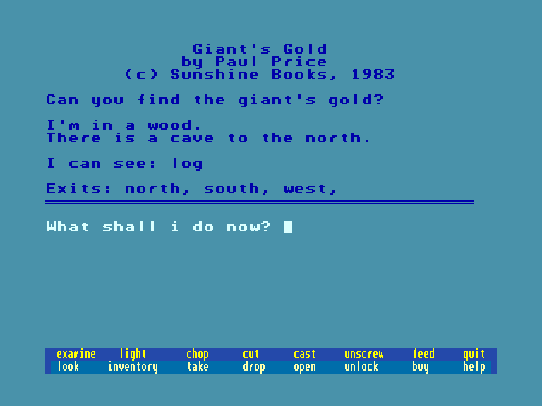
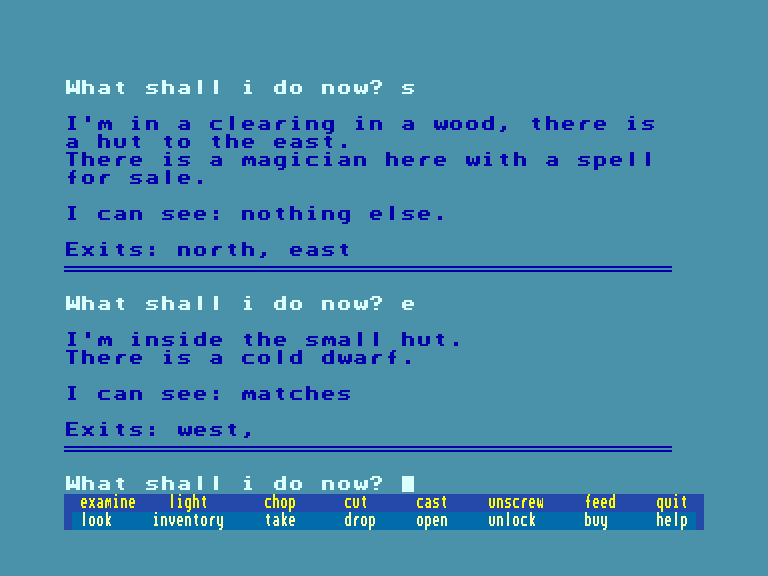
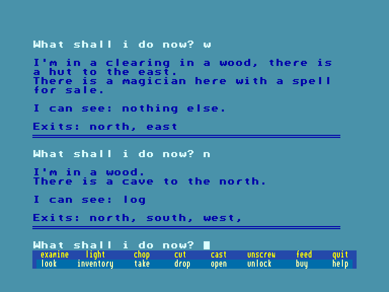

[0-9](../0/games-0.md) - [A](../a/games-a.md) - [B](../b/games-b.md) - [C](../c/games-c.md) - [D](../d/games-d.md) - [E](../e/games-e.md) - [F](../f/games-f.md) - [G](../g/games-g.md) - [H](../h/games-h.md) - [I](../i/games-i.md) - [J](../j/games-j.md) - [K](../k/games-k.md) - [L](../l/games-l.md) - [M](../m/games-m.md) - [N](../n/games-n.md) - [O](../o/games-o.md) - [P](../p/games-p.md) - [Q](../q/games-q.md) - [R](../r/games-r.md) - [S](../s/games-s.md) - [T](../t/games-t.md) - [U](../u/games-u.md) - [V](../v/games-v.md) - [W](../w/games-w.md) - [X](../x/games-x.md) - [Y](../y/games-y.md) - [Z](../z/games-z.md)

Ігри для [Enterprise 64k](../games-ep64.md) - [Enterprise 128k+RAMexp](../games-epramexp.md) - [2dfx](games-2dfx.md)

Ігри для систем [IS-DOS](../games-is-dos.md) - [SymbOS](../games-symbos.md) - [EDC Windows](../games-edcw.md)

Ігри для емуляторів [ZX Spectrum 48k/128k](../zxemu/games-zxemu.md) - [Amstrad CPC](../cpcemu/games-cpc.md) - [Sinclair ZX81](../zx81emu/games-zx81.md) - [Videoton TVC](../tvcemu/games-tvc.md) - [Commodore VIC-20](../vic20emu/games-vic20.md)

----------

# Giant's Gold

**ID:** giants-gold-bas

## Скріншоти

## Опис

(temporary description generated by AI [ChatGPT])

**Гра: Золото Гіганта**

**Опис:**  
У грі "Золото Гіганта" вам потрібно знайти золото гіганта. Це типова гра, розроблена для платформи VIC20, яка була опублікована в журналі Micro Adventurer у 1983 році. Гра доступна для різних комп'ютерних систем, оскільки її код не містить специфічних інструкцій для конкретних машин, що робить її легкою для портування.

**Правила гри:**
1. Ваша мета - знайти золото, сховане гігантом.
2. Використовуйте доступні команди для дослідження світу гри.
3. Будьте обережні, адже на вас можуть чекати різні небезпеки.
4. Грайте, досліджуйте та вирішуйте головоломки, щоб досягти успіху.

Приємної гри!

## Посилання
- [Опис на ep128.hu (угорською)](http://www.ep128.hu/Ep_Games/Leiras/Basic_Program_Pack.htm)
- [Інформація про гру (SolutionArchive.com)](https://solutionarchive.com/game/id%2C5038/Giant%27s+Gold.html)
- [Завантажити](http://www.ep128.hu/Ep_Games/Prg/Basic_Program_Pack.rar)

