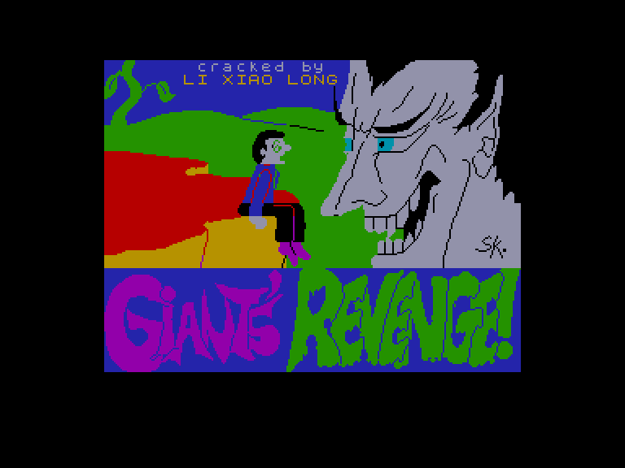
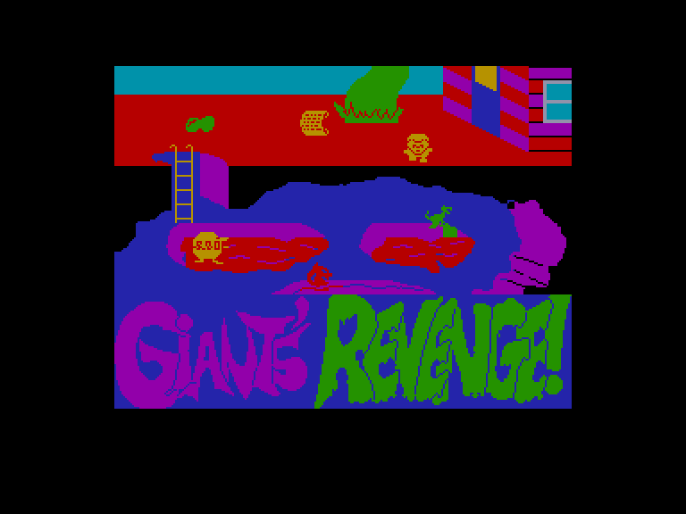
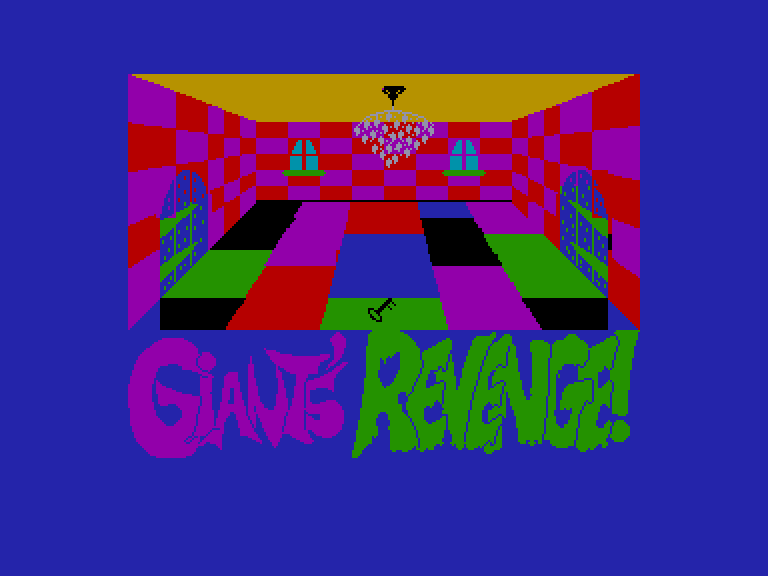
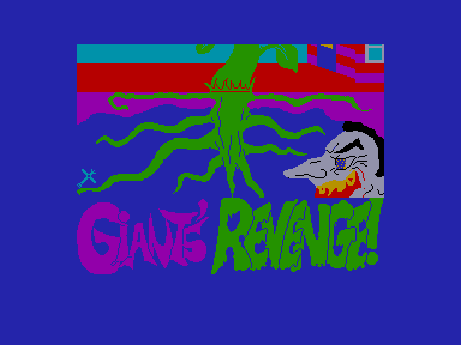

[0-9](../0/games-0.md) - [A](../a/games-a.md) - [B](../b/games-b.md) - [C](../c/games-c.md) - [D](../d/games-d.md) - [E](../e/games-e.md) - [F](../f/games-f.md) - [G](../g/games-g.md) - [H](../h/games-h.md) - [I](../i/games-i.md) - [J](../j/games-j.md) - [K](../k/games-k.md) - [L](../l/games-l.md) - [M](../m/games-m.md) - [N](../n/games-n.md) - [O](../o/games-o.md) - [P](../p/games-p.md) - [Q](../q/games-q.md) - [R](../r/games-r.md) - [S](../s/games-s.md) - [T](../t/games-t.md) - [U](../u/games-u.md) - [V](../v/games-v.md) - [W](../w/games-w.md) - [X](../x/games-x.md) - [Y](../y/games-y.md) - [Z](../z/games-z.md)

Ігри для [Enterprise 64k](../games-ep64.md) - [Enterprise 128k+RAMexp](../games-epramexp.md) - [2dfx](games-2dfx.md)

Ігри для систем [IS-DOS](../games-is-dos.md) - [SymbOS](../games-symbos.md) - [EDC Windows](../games-edcw.md)

Ігри для емуляторів [ZX Spectrum 48k/128k](../zxemu/games-zxemu.md) - [Amstrad CPC](../cpcemu/games-cpc.md) - [Sinclair ZX81](../zx81emu/games-zx81.md) - [Videoton TVC](../tvcemu/games-tvc.md) - [Commodore VIC-20](../vic20emu/games-vic20.md)

----------

# Giant's Revenge

**ID:** giants-revenge-zx

## Скріншоти

## Опис

(temporary description generated by AI [Assistant])

**Опис гри:**

"Giant's Revenge" - це продовження історії про Джека та бобове стебло. Після того, як Джек переміг велетня, його життя стало нудним і сірим. Одного ранку він виявляє яму у своєму саду, куди впав велетень. Після дослідження глибини ями, Джек дізнається, що велетень не загинув, а створив серію підземних печер, де тепер планує помститися. У печерах чекають на Джека численні пастки, і йому потрібно бути обережним, щоб не впасти у смерть.

**Правила гри:**

1. Гравець управляє Джеком, який повинен досліджувати підземні печери.
2. Уникайте пасток, які можуть призвести до загибелі персонажа.
3. Джек може стрибати через пастки та переміщатися по певних точках у печерах.
4. Збирайте скарби та еліксири, щоб покращити свої можливості.
5. Будьте уважні до світла та інших індикаторів, які можуть допомогти в проходженні рівнів.

## Основна інформація
- **Оригінальна платформа:** ZX Spectrum

## Посилання
- [Інформація про оригінальну версію](https://spectrumcomputing.co.uk/entry/2040/ZX-Spectrum/Giants_Revenge)

