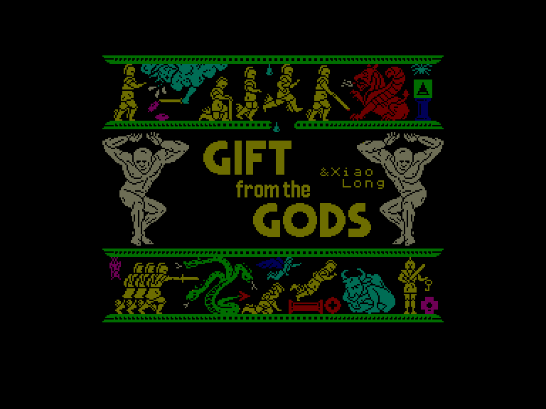
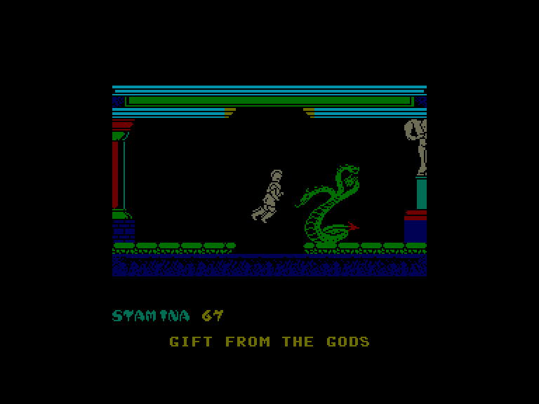
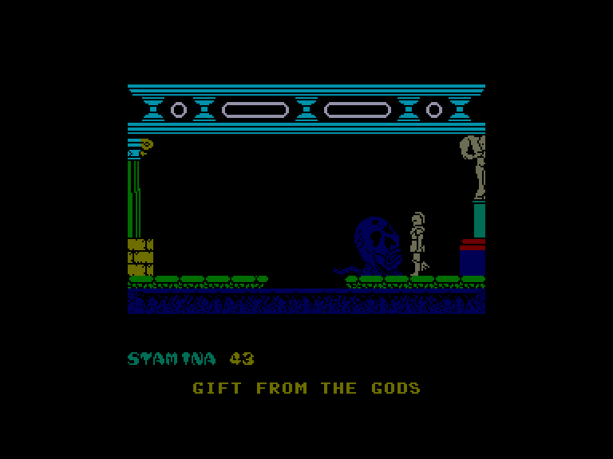
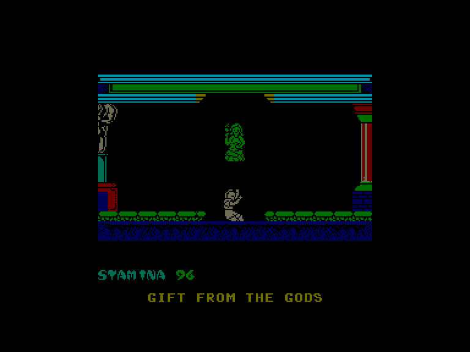

[0-9](../0/games-0.md) - [A](../a/games-a.md) - [B](../b/games-b.md) - [C](../c/games-c.md) - [D](../d/games-d.md) - [E](../e/games-e.md) - [F](../f/games-f.md) - [G](../g/games-g.md) - [H](../h/games-h.md) - [I](../i/games-i.md) - [J](../j/games-j.md) - [K](../k/games-k.md) - [L](../l/games-l.md) - [M](../m/games-m.md) - [N](../n/games-n.md) - [O](../o/games-o.md) - [P](../p/games-p.md) - [Q](../q/games-q.md) - [R](../r/games-r.md) - [S](../s/games-s.md) - [T](../t/games-t.md) - [U](../u/games-u.md) - [V](../v/games-v.md) - [W](../w/games-w.md) - [X](../x/games-x.md) - [Y](../y/games-y.md) - [Z](../z/games-z.md)

Ігри для [Enterprise 64k](../games-ep64.md) - [Enterprise 128k+RAMexp](../games-epramexp.md) - [2dfx](games-2dfx.md)

Ігри для систем [IS-DOS](../games-is-dos.md) - [SymbOS](../games-symbos.md) - [EDC Windows](../games-edcw.md)

Ігри для емуляторів [ZX Spectrum 48k/128k](../zxemu/games-zxemu.md) - [Amstrad CPC](../cpcemu/games-cpc.md) - [Sinclair ZX81](../zx81emu/games-zx81.md) - [Videoton TVC](../tvcemu/games-tvc.md) - [Commodore VIC-20](../vic20emu/games-vic20.md)

----------

# Gift from the Gods

**ID:** gift-from-the-gods-zx

## Скріншоти

## Опис

(temporary description generated by AI)

**Опис гри: "Подарунок богів"**

Гра "Подарунок богів" розгортається в палаці Мікен в Стародавній Греції і слідкує за випробуваннями Ореста, який, під керівництвом богів Зевса і Аполлона, повинен помститися за вбивство свого батька, царя Агамемнона. Оресту потрібно виконати своє призначення, пройшовши лабіринт під палацом та знайти розв'язання головоломки, інакше він загине в спробі.

У 16 спеціальних кімнатах заховані об'єкти, відомі як евклідичні форми – геометричні фігури, засновані на трикутниках, колах і квадратах. Шість із них, коли правильно розміщені в кімнаті Охоронця, відкривають вихід. Орест отримує допомогу від своєї сестри Електри, яка була ув'язнена в лабіринті і може вказати йому, де заховані форми, але Орест сам повинен вирішити, які форми взяти до кімнати Охоронця. Ілюзорні істоти, створені напівбогами, намагаються виснажити сили Ореста, але в певних кімнатах з даху капає живлюща вода, відновлюючи енергію. Також напівбоги створили ілюзорні евклідичні форми, які сидять поряд із реальними, і хоча вони не обманюють Електру, вона не завжди поруч, щоб допомогти. Важливою проблемою є його мати, Клітемнестра, яка дізналася про його завдання і увійшла в лабіринт, щоб вбити Електру.

Орест може ходити або літати та захищатися мечем. Гравець може взаємодіяти з оточенням, використовуючи чотири напрямки джойстика.

**Правила гри:**
1. Використовуйте джойстик для переміщення Ореста по лабіринту.
2. Збирайте евклідичні форми, щоб знайти вихід з кімнати Охоронця.
3. Спілкуйтеся з Електрою для отримання підказок про розташування форм.
4. Уникайте ілюзорних істот, які намагаються вас зупинити.
5. Використовуйте живлющу воду для відновлення енергії.
6. Приймайте рішення самостійно, які форми взяти до кімнати Охоронця.

## Основна інформація
- **Оригінальна платформа:** ZX Spectrum

## Посилання
- [Інформація про оригінальну версію](https://spectrumcomputing.co.uk/entry/2041/ZX-Spectrum/Gift_from_the_Gods)

