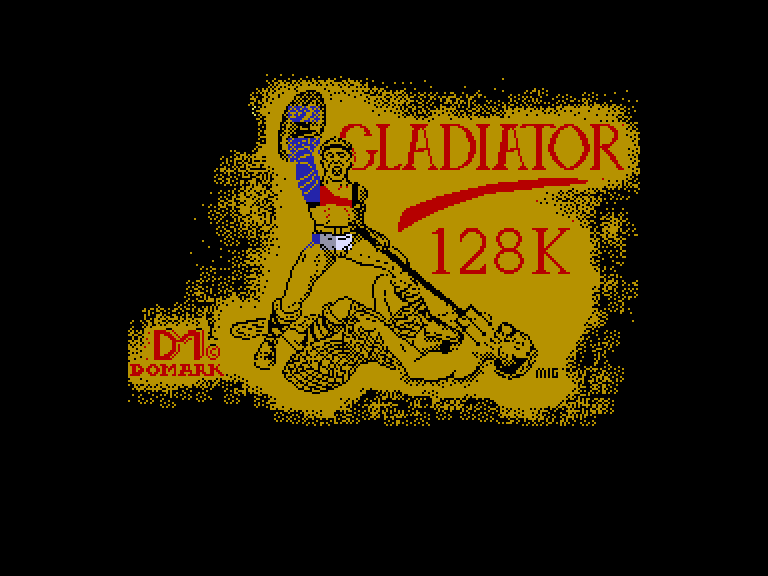
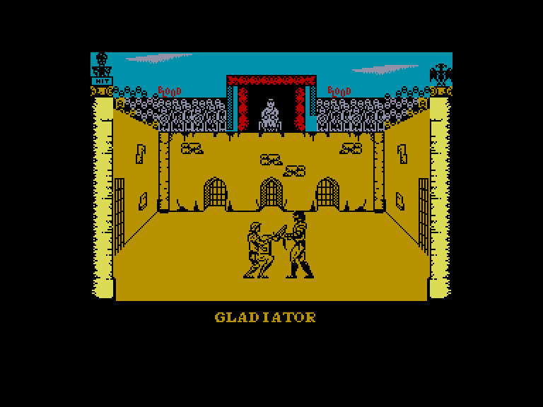
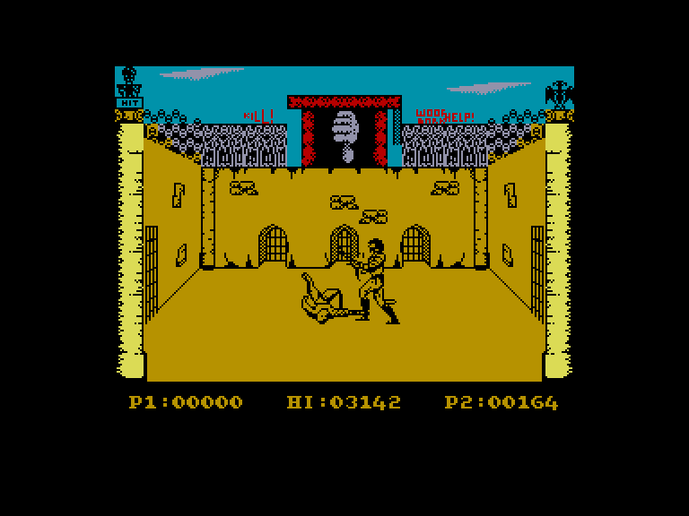
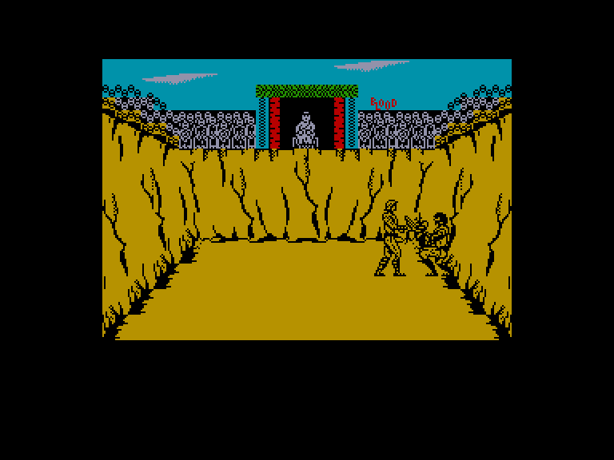

[0-9](../0/games-0.md) - [A](../a/games-a.md) - [B](../b/games-b.md) - [C](../c/games-c.md) - [D](../d/games-d.md) - [E](../e/games-e.md) - [F](../f/games-f.md) - [G](../g/games-g.md) - [H](../h/games-h.md) - [I](../i/games-i.md) - [J](../j/games-j.md) - [K](../k/games-k.md) - [L](../l/games-l.md) - [M](../m/games-m.md) - [N](../n/games-n.md) - [O](../o/games-o.md) - [P](../p/games-p.md) - [Q](../q/games-q.md) - [R](../r/games-r.md) - [S](../s/games-s.md) - [T](../t/games-t.md) - [U](../u/games-u.md) - [V](../v/games-v.md) - [W](../w/games-w.md) - [X](../x/games-x.md) - [Y](../y/games-y.md) - [Z](../z/games-z.md)

Ігри для [Enterprise 64k](../games-ep64.md) - [Enterprise 128k+RAMexp](../games-epramexp.md)

Ігри для систем [IS-DOS](../games-is-dos.md) - [SymbOS](../games-symbos.md) - [EDC Windows](../games-edcw.md)

Ігри для емуляторів [ZX Spectrum 48k/128k](../zxemu/games-zxemu.md) - [Amstrad CPC](../cpcemu/games-cpc.md) - [Sinclair ZX81](../zx81emu/games-zx81.md) - [Videoton TVC](../tvcemu/games-tvc.md) - [Commodore VIC-20](../vic20emu/games-vic20.md)

----------

# Gladiator

**ID:** gladiator-zx

## Скріншоти

## Опис

(temporary description generated by AI [Assistant])

**Опис гри:**
У грі "Гладіатор" ви берете на себе роль Марка з Масіни, який був захоплений римськими легіонерами та проданий у рабство. Ваше завдання — змагатися у гладіаторських боях, вигравати поєдинки та заробляти гроші, щоб стати чемпіоном імператора і здобути свободу. Ви можете вибрати зброю перед боєм та використовувати різні тактики в боях.

**Правила гри:**
1. Гравець змагається у гладіаторських боях, намагаючись виграти, щоб заробити гроші.
2. Перед кожним боєм можна вибрати три з сорока п'яти різних видів зброї.
3. Зброя має різні показники атаки та захисту, які потрібно вивчати через експерименти.
4. Під час бою доступно 25 різних рухів.
5. Гра підтримує мультиплеєрний режим, де можуть змагатися 2 або 4 гравці.

Постарайтеся стати найкращим гладіатором і здобути свободу!

## Основна інформація
- **Оригінальна платформа:** ZX Spectrum

## Посилання
- [Інформація про оригінальну версію](https://spectrumcomputing.co.uk/entry/2050/ZX-Spectrum/Gladiator)

**Дата генерації:** 29.07.2026

