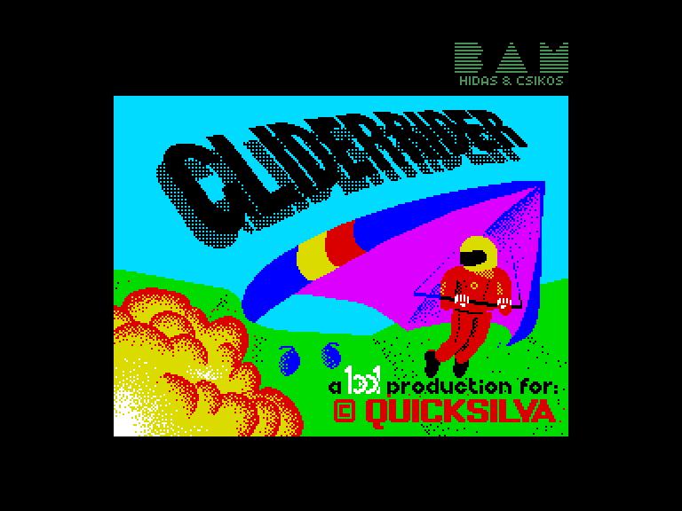
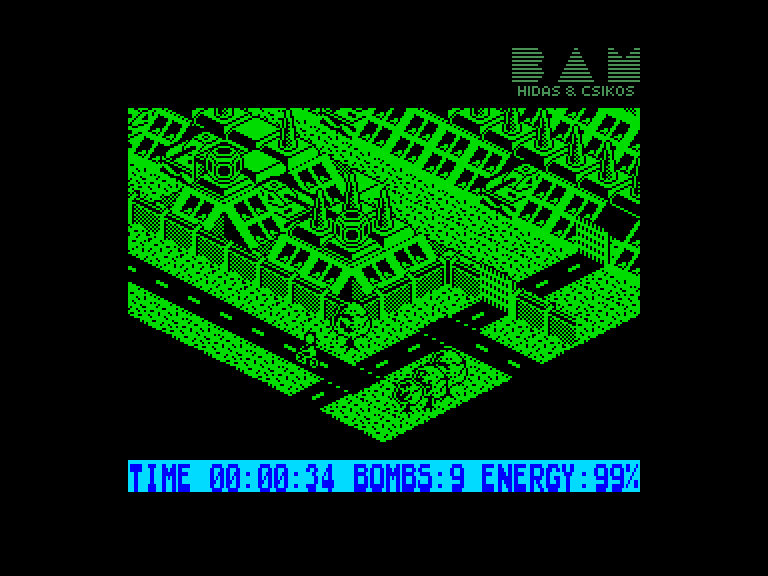
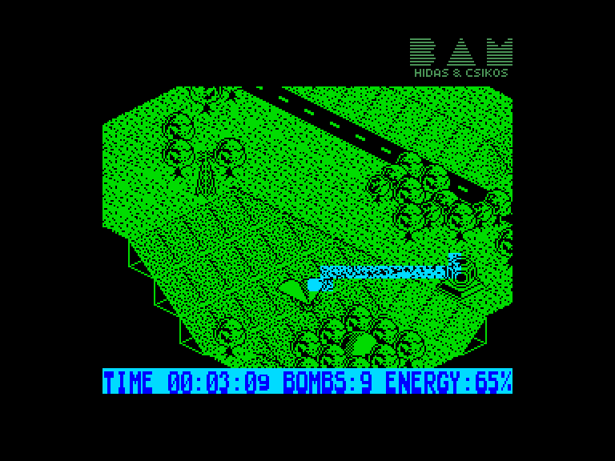
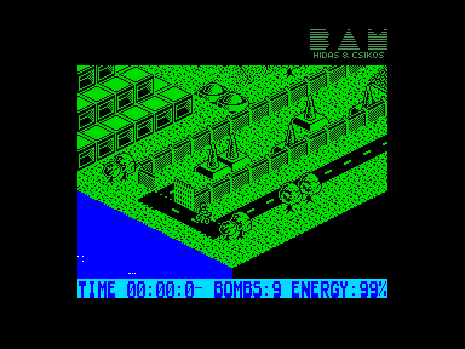

[0-9](../0/games-0.md) - [A](../a/games-a.md) - [B](../b/games-b.md) - [C](../c/games-c.md) - [D](../d/games-d.md) - [E](../e/games-e.md) - [F](../f/games-f.md) - [G](../g/games-g.md) - [H](../h/games-h.md) - [I](../i/games-i.md) - [J](../j/games-j.md) - [K](../k/games-k.md) - [L](../l/games-l.md) - [M](../m/games-m.md) - [N](../n/games-n.md) - [O](../o/games-o.md) - [P](../p/games-p.md) - [Q](../q/games-q.md) - [R](../r/games-r.md) - [S](../s/games-s.md) - [T](../t/games-t.md) - [U](../u/games-u.md) - [V](../v/games-v.md) - [W](../w/games-w.md) - [X](../x/games-x.md) - [Y](../y/games-y.md) - [Z](../z/games-z.md)

Ігри для [Enterprise 64k](../games-ep64.md) - [Enterprise 128k+RAMexp](../games-epramexp.md)

Ігри для систем [IS-DOS](../games-is-dos.md) - [SymbOS](../games-symbos.md) - [EDC Windows](../games-edcw.md)

Ігри для емуляторів [ZX Spectrum 48k/128k](../zxemu/games-zxemu.md) - [Amstrad CPC](../cpcemu/games-cpc.md) - [Sinclair ZX81](../zx81emu/games-zx81.md) - [Videoton TVC](../tvcemu/games-tvc.md) - [Commodore VIC-20](../vic20emu/games-vic20.md)

----------

# Glider Rider

**ID:** glider-rider-zx

## Скріншоти

## Опис

(temporary description generated by AI [Assistant])

**Опис гри: Glider Rider**

У грі Glider Rider ви берете на себе роль члена елітної сили Silent But Deadly, яка отримала завдання знищити корпорацію Abraxas, що займається торгівлею зброєю. Ваше завдання - знищити їх пластику острів, зокрема 10 реакторів, використовуючи гіроскутер. Вам потрібно обережно маневрувати, залишаючись низько до землі, щоб уникнути лазерів, які охороняють реактори. Для цього потрібно активувати контрольні вежі, щоб відволікти захист і мати можливість знищити реактори.

**Правила гри:**
1. Використовуйте гіроскутер для навігації навколо острова.
2. Знищте всі 10 реакторів, використовуючи гранати.
3. Уникайте лазерів, які охороняють реактори.
4. Активація контрольних веж дозволить вам знищити реактори без загрози.
5. Залишайтеся низько до землі, щоб забезпечити ефективність пересування.

Гра пропонує захоплюючий досвід у жанрі екшн з ізометричною графікою в науково-фантастичному сеттингу.

## Основна інформація
- **Оригінальна платформа:** ZX Spectrum

## Посилання
- [Інформація про оригінальну версію](https://spectrumcomputing.co.uk/entry/2054/ZX-Spectrum/Glider_Rider)
- [Завантажити гру](http://www.ep128.hu/Ep_Games/Prg/Glider_Rider.rar)

**Дата генерації:** 28.07.2026

