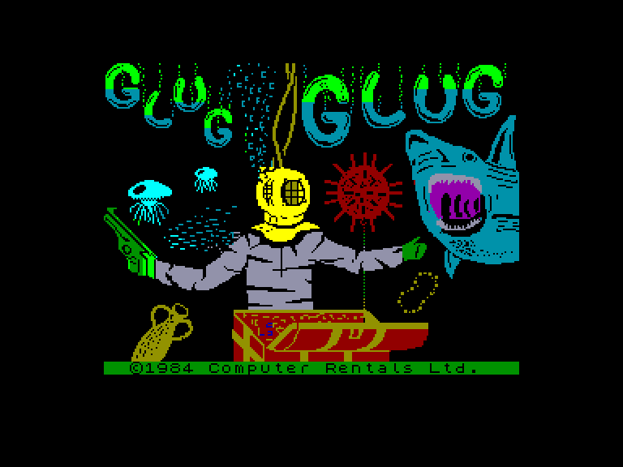
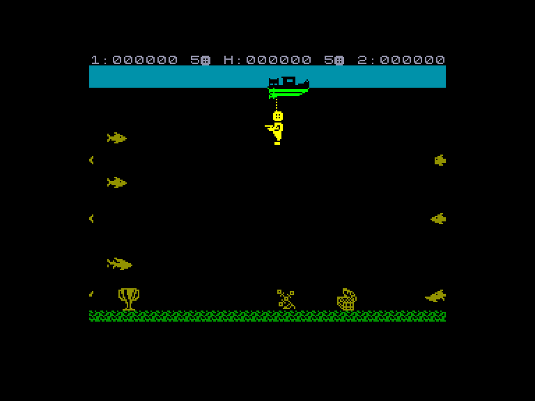
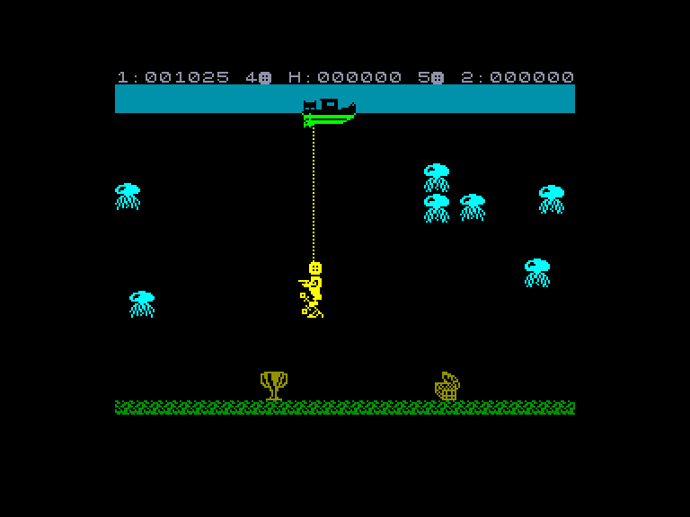
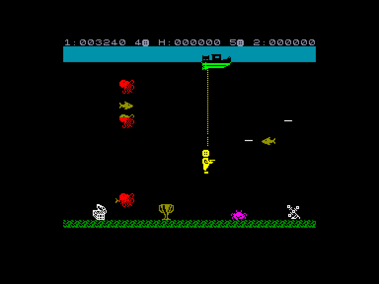

[0-9](../0/games-0.md) - [A](../a/games-a.md) - [B](../b/games-b.md) - [C](../c/games-c.md) - [D](../d/games-d.md) - [E](../e/games-e.md) - [F](../f/games-f.md) - [G](../g/games-g.md) - [H](../h/games-h.md) - [I](../i/games-i.md) - [J](../j/games-j.md) - [K](../k/games-k.md) - [L](../l/games-l.md) - [M](../m/games-m.md) - [N](../n/games-n.md) - [O](../o/games-o.md) - [P](../p/games-p.md) - [Q](../q/games-q.md) - [R](../r/games-r.md) - [S](../s/games-s.md) - [T](../t/games-t.md) - [U](../u/games-u.md) - [V](../v/games-v.md) - [W](../w/games-w.md) - [X](../x/games-x.md) - [Y](../y/games-y.md) - [Z](../z/games-z.md)

Ігри для [Enterprise 64k](../games-ep64.md) - [Enterprise 128k+RAMexp](../games-epramexp.md)

Ігри для систем [IS-DOS](../games-is-dos.md) - [SymbOS](../games-symbos.md) - [EDC Windows](../games-edcw.md)

Ігри для емуляторів [ZX Spectrum 48k/128k](../zxemu/games-zxemu.md) - [Amstrad CPC](../cpcemu/games-cpc.md) - [Sinclair ZX81](../zx81emu/games-zx81.md) - [Videoton TVC](../tvcemu/games-tvc.md) - [Commodore VIC-20](../vic20emu/games-vic20.md)

----------

# Glug Glug

**ID:** glug-glug-zx

## Скріншоти

## Опис

(temporary description generated by AI [Assistant])

**Опис гри: Glug Glug**

Glug Glug — це проста, але креативна та розважальна гра, у якій ви виступаєте в ролі підводного мисливця. Ваше завдання полягає в підйомі скарбів з дна океану. Ви спускаєтеся з корабля за допомогою мотузки і можете піднімати скарби лише по одному. Однак будьте обережні, адже океан наповнений небезпечними істотами!

**Правила гри:**
1. Гравець спускається на дно океану, щоб знайти та підняти три скарби на кожному рівні.
2. Використовуйте свою арсенал — безкінечну гарпунну рушницю, щоб захищатися від небезпечних морських істот.
3. Корабель можна переміщувати вліво та вправо, а також підніматися та спускатися.
4. Гра може бути зіграна одним або двома гравцями (по черзі).
5. Клавіші управління: 
   - A — вгору
   - Z — вниз
   - M — вліво
   - Symbol Shift — вправо
   - SPACE — вогонь
6. Версія для Enterprise працює лише в режимі 128K.

Гарного вам занурення!

## Основна інформація
- **Оригінальна платформа:** ZX Spectrum

## Посилання
- [Опис гри на ep128.hu (угорською)](http://www.ep128.hu/Games/GlugGlug.htm)
- [Інформація про оригінальну версію](https://spectrumcomputing.co.uk/entry/2062/ZX-Spectrum/Glug_Glug)
- [Завантажити гру](http://www.ep128.hu/Ep_Games/Prg/Glug_Glug.rar)

