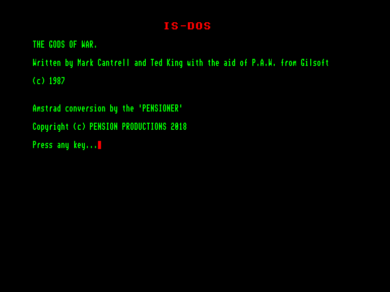
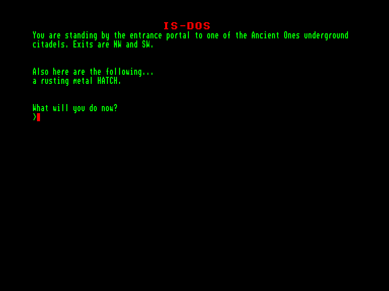

[0-9](../0/games-0.md) - [A](../a/games-a.md) - [B](../b/games-b.md) - [C](../c/games-c.md) - [D](../d/games-d.md) - [E](../e/games-e.md) - [F](../f/games-f.md) - [G](../g/games-g.md) - [H](../h/games-h.md) - [I](../i/games-i.md) - [J](../j/games-j.md) - [K](../k/games-k.md) - [L](../l/games-l.md) - [M](../m/games-m.md) - [N](../n/games-n.md) - [O](../o/games-o.md) - [P](../p/games-p.md) - [Q](../q/games-q.md) - [R](../r/games-r.md) - [S](../s/games-s.md) - [T](../t/games-t.md) - [U](../u/games-u.md) - [V](../v/games-v.md) - [W](../w/games-w.md) - [X](../x/games-x.md) - [Y](../y/games-y.md) - [Z](../z/games-z.md)

Ігри для [Enterprise 64k](../games-ep64.md) - [Enterprise 128k+RAMexp](../games-epramexp.md)

Ігри для систем [IS-DOS](../games-is-dos.md) - [SymbOS](../games-symbos.md) - [EDC Windows](../games-edcw.md)

Ігри для емуляторів [ZX Spectrum 48k/128k](../zxemu/games-zxemu.md) - [Amstrad CPC](../cpcemu/games-cpc.md) - [Sinclair ZX81](../zx81emu/games-zx81.md) - [Videoton TVC](../tvcemu/games-tvc.md) - [Commodore VIC-20](../vic20emu/games-vic20.md)

----------

# The Gods of War

**ID:** gods-of-war-isdos

**Жанри:** Текстова пригода

## Скріншоти

## Опис

(temporary description generated by AI [ChatGPT])

**Опис гри: "Боги війни"**

У давні часи раса, відома як Древні, володіла великими магічними силами і забула про своїх богів. Боги розгнівалися, вбили багатьох Древніх і позбавили їх сил. Як покарання, вони перетворили деяких із тих, хто вижив, на расу, що згодом стала відома як "МУТТИ". Виснажені від усіх цих подій, боги від withdrew, кожен у свою окрему гробницю. 

Після багатьох років "МУТТИ" стали сильними. Ваше завдання - знайти гробницю, відому як "Зал богів", яка слугує штаб-квартирою Верховного чаклуна "МУТТІВ". Вам потрібно скинути Верховного чаклуна, перш ніж він здобуде знання богів.

**Правила гри:**
1. Досліджуйте світ, щоб знайти "Зал богів".
2. Збирайте предмети та інформацію, які можуть допомогти вам у вашій місії.
3. Взаємодійте з іншими персонажами та вирішуйте головоломки.
4. Уникайте небезпек і ворогів, які можуть заважати вам у досягненні мети.
5. Завершіть гру, скинувши Верховного чаклуна до того, як він здобуде силу богів.

## Основна інформація
- **Мови:** Англійська
- **Оригінальна платформа:** Amstrad CPC
### Системні вимоги
- **Апаратні:** EXDOS
- **Програмні:** IS-DOS
### Геймплей
- **Керування:** Keyboard
- **Кількість гравців:** 1 player
- **Додаткові теги:** Text80 mode, PAW
### Розробка
- **Рік випуску:** 1987
- **Автор:** Mark Cantrell, Ted King

## Посилання
- [Інформація про оригінальну версію](https://www.cpc-power.com/index.php?page=detail&num=15815)
- [Інформація про гру (SolutionArchive.com)](https://solutionarchive.com/game/id%2C761/Gods+of+War%2C+The.html)

