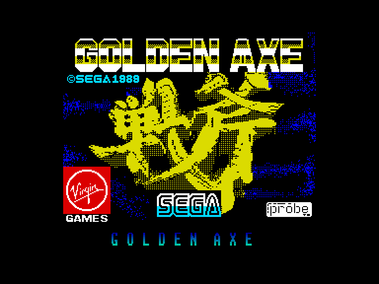
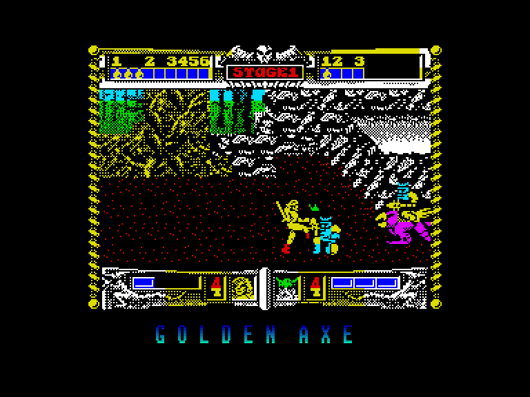
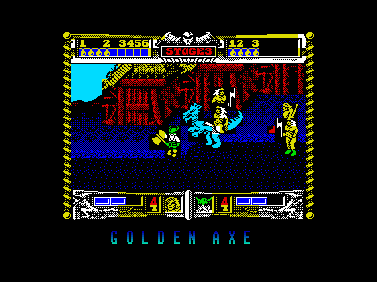
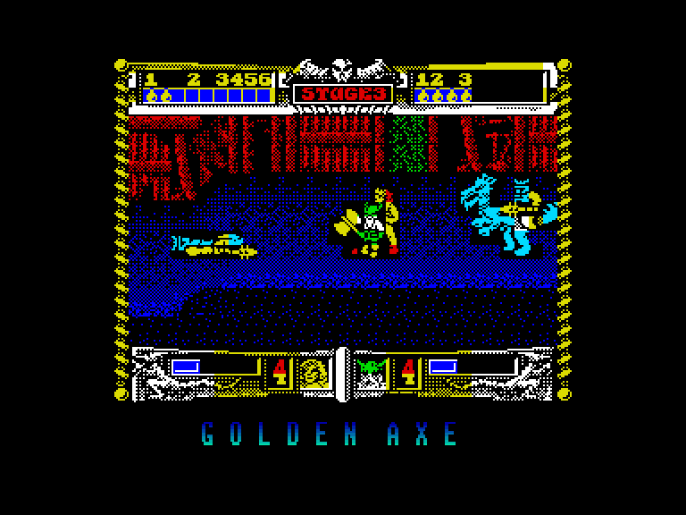

[0-9](../0/games-0.md) - [A](../a/games-a.md) - [B](../b/games-b.md) - [C](../c/games-c.md) - [D](../d/games-d.md) - [E](../e/games-e.md) - [F](../f/games-f.md) - [G](../g/games-g.md) - [H](../h/games-h.md) - [I](../i/games-i.md) - [J](../j/games-j.md) - [K](../k/games-k.md) - [L](../l/games-l.md) - [M](../m/games-m.md) - [N](../n/games-n.md) - [O](../o/games-o.md) - [P](../p/games-p.md) - [Q](../q/games-q.md) - [R](../r/games-r.md) - [S](../s/games-s.md) - [T](../t/games-t.md) - [U](../u/games-u.md) - [V](../v/games-v.md) - [W](../w/games-w.md) - [X](../x/games-x.md) - [Y](../y/games-y.md) - [Z](../z/games-z.md)

Ігри для [Enterprise 64k](../games-ep64.md) - [Enterprise 128k+RAMexp](../games-epramexp.md)

Ігри для систем [IS-DOS](../games-is-dos.md) - [SymbOS](../games-symbos.md) - [EDC Windows](../games-edcw.md)

Ігри для емуляторів [ZX Spectrum 48k/128k](../zxemu/games-zxemu.md) - [Amstrad CPC](../cpcemu/games-cpc.md) - [Sinclair ZX81](../zx81emu/games-zx81.md) - [Videoton TVC](../tvcemu/games-tvc.md) - [Commodore VIC-20](../vic20emu/games-vic20.md)

----------

# Golden Axe

**ID:** golden-axe-zx

## Скріншоти

## Опис

(temporary description generated by AI [Assistant])

**Опис гри:**
У грі "Золотий Топір" вам доведеться боротися з армією злого Діта Аддера, яка захопила короля та принцесу. Ви обираєте одного з трьох героїв, кожен з яких має свої унікальні здібності, і вирушаєте в небезпечну подорож, щоб звільнити полонених та знищити ворога. Гра включає в себе різноманітні рівні, де вам потрібно буде перемагати ворогів, долати перешкоди та збирати магічні горщики для підвищення ваших здібностей.

**Правила гри:**
1. Гравці можуть обрати одного з трьох персонажів: 
   - Ax-Battler: барбар, який використовує вулканічну магію.
   - Gilius-Thunderhead: гном, який володіє блискавичною магією.
   - Tyris-Flare: амазонка, яка може використовувати вогняну магію.
  
2. Гра проходить через кілька рівнів, де гравці повинні знищити всіх ворогів, щоб продовжити рухатися вперед.

3. Гравці можуть грати поодинці або вдвох, вибираючи різні контролери для управління.

4. Кожен персонаж має обмежену кількість життів (3 удари), після чого гра закінчується.

5. Збирайте магічні горщики, які можуть бути отримані, якщо вдарити по міні-ворогам, що їх несуть.

6. Після кожного другого рівня буде бонусний рівень для збору додаткових горщиків і відновлення енергії.

7. Будьте обережні, адже вороги можуть атакувати з різних сторін, і деякі з них можуть бути значно більшими за вас.

8. Використовуйте комбінації клавіш для виконання атак, стрибків і спеціальних рухів.

Гра "Золотий Топір" пропонує захоплюючий бойовий досвід з елементами фентезі, що вимагатиме від вас стратегічного мислення та швидкої реакції.

## Основна інформація
- **Оригінальна платформа:** ZX Spectrum

## Посилання
- [Опис гри на ep128.hu (угорською)](http://www.ep128.hu/Games/Golden_Axe.htm)
- [Інформація про оригінальну версію](https://spectrumcomputing.co.uk/entry/2081/ZX-Spectrum/Golden_Axe)
- [Завантажити гру](http://www.ep128.hu/Ep_Games/Prg/Golden_Axe.rar)

**Дата генерації:** 28.07.2026

