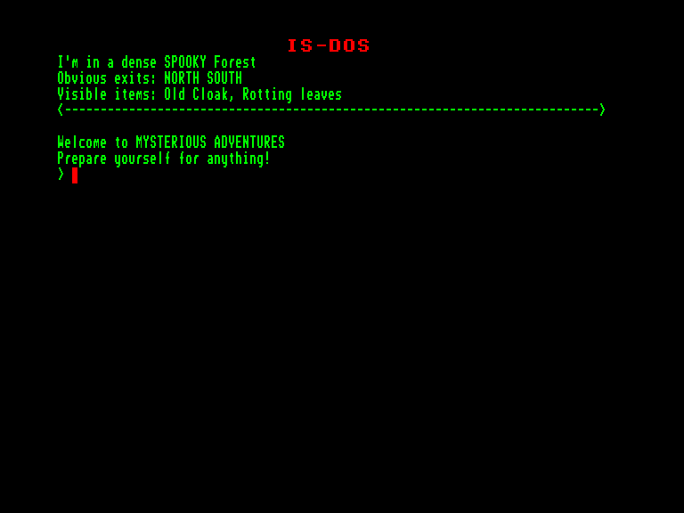
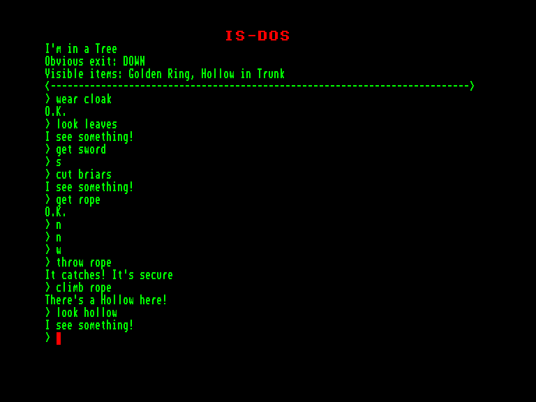
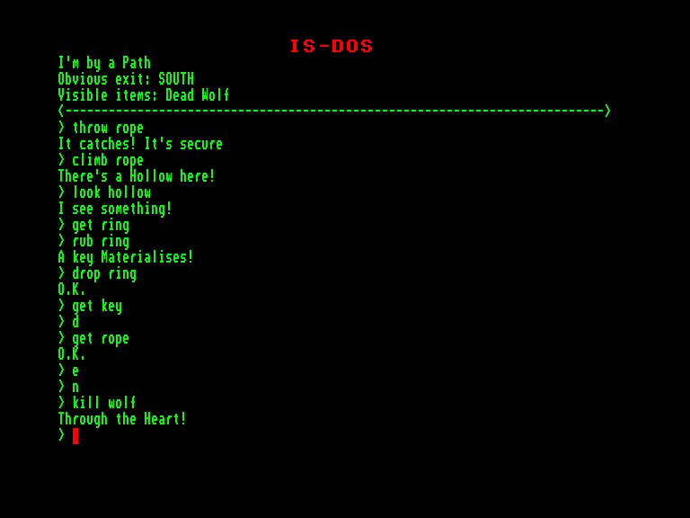

[0-9](../0/games-0.md) - [A](../a/games-a.md) - [B](../b/games-b.md) - [C](../c/games-c.md) - [D](../d/games-d.md) - [E](../e/games-e.md) - [F](../f/games-f.md) - [G](../g/games-g.md) - [H](../h/games-h.md) - [I](../i/games-i.md) - [J](../j/games-j.md) - [K](../k/games-k.md) - [L](../l/games-l.md) - [M](../m/games-m.md) - [N](../n/games-n.md) - [O](../o/games-o.md) - [P](../p/games-p.md) - [Q](../q/games-q.md) - [R](../r/games-r.md) - [S](../s/games-s.md) - [T](../t/games-t.md) - [U](../u/games-u.md) - [V](../v/games-v.md) - [W](../w/games-w.md) - [X](../x/games-x.md) - [Y](../y/games-y.md) - [Z](../z/games-z.md)

Ігри для [Enterprise 64k](../games-ep64.md) - [Enterprise 128k+RAMexp](../games-epramexp.md) - [2dfx](../games-2dfx.md)

Ігри для систем [IS-DOS](../games-is-dos.md) - [SymbOS](../games-symbos.md) - [EDC Windows](../games-edcw.md)

Ігри для емуляторів [ZX Spectrum 48k/128k](../zxemu/games-zxemu.md) - [Amstrad CPC](../cpcemu/games-cpc.md) - [Sinclair ZX81](../zx81emu/games-zx81.md) - [Videoton TVC](../tvcemu/games-tvc.md) - [Commodore VIC-20](../vic20emu/games-vic20.md)

----------

# The Golden Baton

**Альтернативні назви:**
 - Mysterious Adventures 1 - The Golden Baton

**ID:** golden-baton-zcode

**Жанри:** Текстова пригода

## Примітка

ℹ Мультиплатформенна гра на рушії Z-machine від Infocom.

## Скріншоти

## Опис

Темні хмари загрозиво пропливають на тлі місяця, що сходить. Ви здригаєтеся, коли нічну тишу раптом розтинає моторошне виття якоїсь лютої істоти в глибині лісу. Утомлені від подорожі, не в змозі змусити себе йти далі, ви опускаєтеся на землю й спираєтеся на стовбур величезного старого вузлуватого дерева. Поки ваші виснажені тіло й кінцівки повільно розслабляються, ви подумки проклинаєте дорогу, що привела вас у це прокляте місце. Смертоносна місія, здається, тьмяніє на тлі тих небезпек, які ви досі змогли пережити.  

Ваше завдання — повернути легендарний Золотий жезл, безцінний артефакт, якому ваш народ поклонявся протягом незліченних поколінь. Жезл викрали з палацу короля Ферренуїла, правителя вашої батьківщини. Більшість мудрих радників твердо переконані, що Золотий жезл містить у собі своєрідну життєву силу, яка підтримує рівновагу між силами добра і зла. Протягом багатьох століть ваші рідні землі не знали ані воєн, ані посух чи голоду. Тепер король Ферренуїл страхається за майбутнє свого народу, оскільки його землі втратили вплив Жезла.  

Відтоді, як Жезл було викрадено, хоробрих воїнів та загартованих лицарів відправляли в усі куточки світу на пошуки цього артефакту... але жоден так і не повернувся.  

Так розпочалася й ваша подорож, крізь чужі, ворожі землі, аж поки ви врешті не дісталися цієї території злих чарів, чиє ім'я ніколи не вимовляють уголос. Майже фізично відчутна злоба пронизує тутешню атмосферу, а втома спадає на подорожнього, наче смертельний саван.  

Ви щільніше загортаєтесь у плащ, аби захиститися від крижаного нічного холоду, і поринаєте в тривожний сон, до смерті боячись того, що можуть принести вам прийдешні дні...

## Основна інформація
- **Мови:** Англійська
### Загальні системні вимоги
- **Апаратні:** EXDOS
- **Програмні:** IS-DOS
### Геймплей
- **Керування:** Keyboard
- **Кількість гравців:** 1 player
- **Додаткові теги:** Z-code
### Розробка
- **Рік випуску:** 1981
- **Автор:** Brian Howarth

## Посилання
- [Інформація про гру (SolutionArchive.com)](https://solutionarchive.com/game/id%2C229/Golden+Baton%2C+The.html)
- [Завантажити](https://www.ifarchive.org/if-archive/games/inform/mysterious_inform.zip)

## [Керування](../controllers.md)

`Keyboard`

## Детальна інформація

### Історія розробки  

Перша гра у серії «Mysterious Adventures»  

Браян Гаварт написав свої одинадцять текстових пригод «Mysterious Adventures» у 1981–1983 роках, початково як суто текстові ігри (саме так вони представлені тут). Пізніші версії (Spectrum, C64) мали контурну графіку. Усі файли даних є конверсіями з версій для Spectrum/C64 (але без графіки). Браян Гаварт дав свій дозвіл на завантаження ігор до IF Archive.