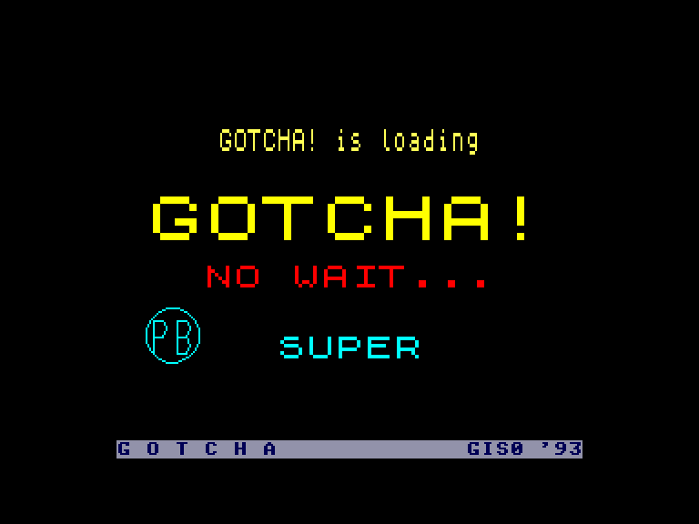
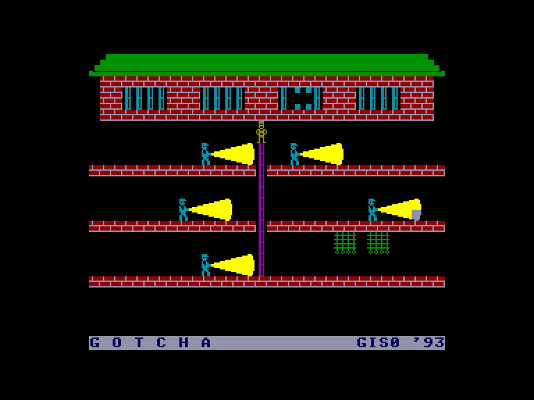
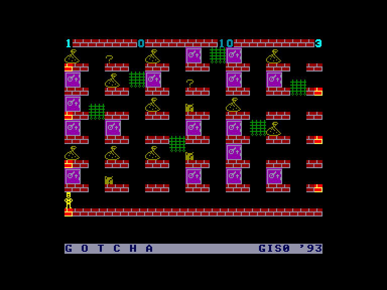
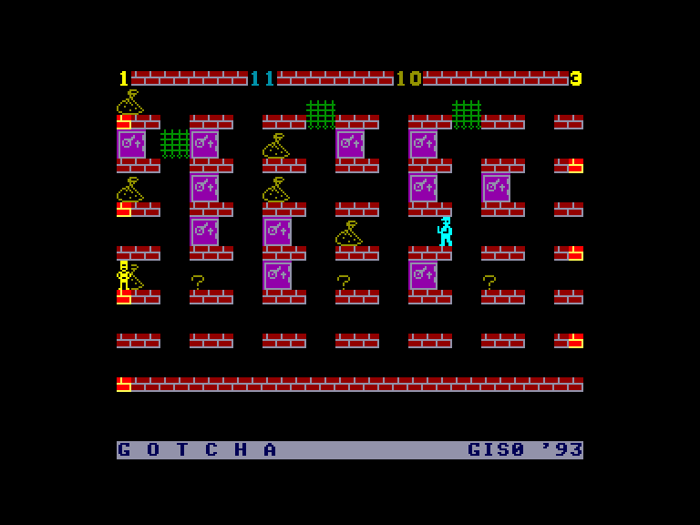

[0-9](../0/games-0.md) - [A](../a/games-a.md) - [B](../b/games-b.md) - [C](../c/games-c.md) - [D](../d/games-d.md) - [E](../e/games-e.md) - [F](../f/games-f.md) - [G](../g/games-g.md) - [H](../h/games-h.md) - [I](../i/games-i.md) - [J](../j/games-j.md) - [K](../k/games-k.md) - [L](../l/games-l.md) - [M](../m/games-m.md) - [N](../n/games-n.md) - [O](../o/games-o.md) - [P](../p/games-p.md) - [Q](../q/games-q.md) - [R](../r/games-r.md) - [S](../s/games-s.md) - [T](../t/games-t.md) - [U](../u/games-u.md) - [V](../v/games-v.md) - [W](../w/games-w.md) - [X](../x/games-x.md) - [Y](../y/games-y.md) - [Z](../z/games-z.md)

Ігри для [Enterprise 64k](../games-ep64.md) - [Enterprise 128k+RAMexp](../games-epramexp.md)

Ігри для систем [IS-DOS](../games-is-dos.md) - [SymbOS](../games-symbos.md) - [EDC Windows](../games-edcw.md)

Ігри для емуляторів [ZX Spectrum 48k/128k](../zxemu/games-zxemu.md) - [Amstrad CPC](../cpcemu/games-cpc.md) - [Sinclair ZX81](../zx81emu/games-zx81.md) - [Videoton TVC](../tvcemu/games-tvc.md) - [Commodore VIC-20](../vic20emu/games-vic20.md)

----------

# Gotcha

**ID:** gotcha-zx

## Скріншоти

## Опис

(temporary description generated by AI [ChatGPT])

**Опис гри: Gotcha**

У грі "Gotcha" ви берете на себе роль Ерні, колишнього злодія, який намагається втекти з в'язниці та повернутися до своїх злочинних справ. Гравцеві потрібно уникати охоронців, які патрулюють з ліхтарями, та проходити через різні рівні, щоб зібрати якомога більше цінних предметів. Ви повинні бути обережними, адже охоронець може вас спіймати, якщо ви потрапите в його поле зору.

**Правила гри:**
1. Гравець повинен втекти з в'язниці, використовуючи драбину та уникаючи світла ліхтарів охоронців.
2. Після втечі Ерні відправляється до торгового центру, де йому потрібно пограбувати різні відділи.
3. Гравець не може зупинятися, але може змінювати напрямок руху.
4. Необхідно уникати рухомих решіток та нічного охоронця, який випадковим чином патрулює поверхи.
5. Збирайте предмети, щоб отримати максимальну кількість очок, але будьте обережні, адже охоронець може вас спіймати.

Гра представлена у стилі 1983 року з характерною анімацією та звуками. Керування здійснюється за допомогою клавіатури або джойстика.

## Основна інформація
- **Оригінальна платформа:** ZX Spectrum
### Геймплей
- **Керування:** Keyboard (Z, X, K, M), Internal Joy, External Joy 1, External Joy 2

## Посилання
- [Опис гри на ep128.hu (угорською)](http://www.ep128.hu/Games/Gotcha.htm)
- [Інформація про оригінальну версію](https://spectrumcomputing.co.uk/entry/2106/ZX-Spectrum/Gotcha)
- [Завантажити гру](http://www.ep128.hu/Ep_Games/Prg/Gotcha.rar)

**Дата генерації:** 29.07.2026

