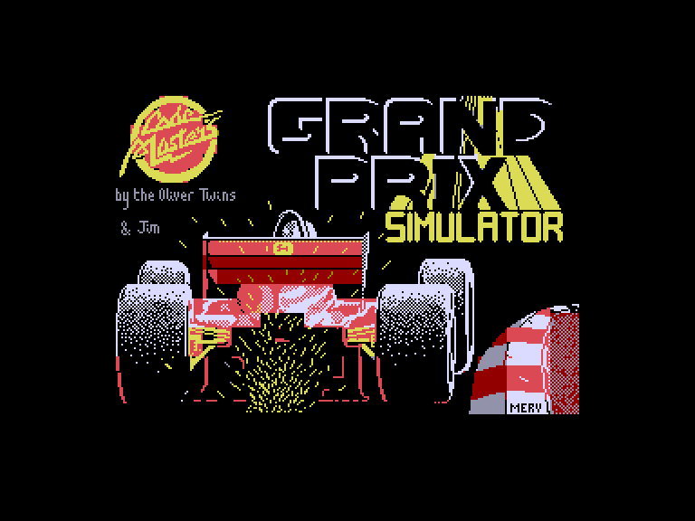
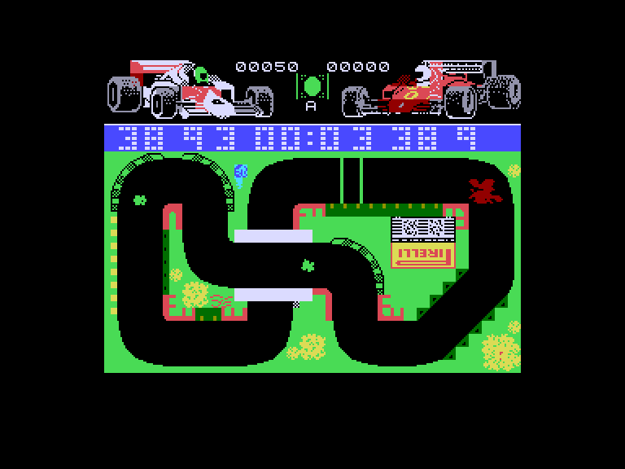

[0-9](../0/games-0.md) - [A](../a/games-a.md) - [B](../b/games-b.md) - [C](../c/games-c.md) - [D](../d/games-d.md) - [E](../e/games-e.md) - [F](../f/games-f.md) - [G](../g/games-g.md) - [H](../h/games-h.md) - [I](../i/games-i.md) - [J](../j/games-j.md) - [K](../k/games-k.md) - [L](../l/games-l.md) - [M](../m/games-m.md) - [N](../n/games-n.md) - [O](../o/games-o.md) - [P](../p/games-p.md) - [Q](../q/games-q.md) - [R](../r/games-r.md) - [S](../s/games-s.md) - [T](../t/games-t.md) - [U](../u/games-u.md) - [V](../v/games-v.md) - [W](../w/games-w.md) - [X](../x/games-x.md) - [Y](../y/games-y.md) - [Z](../z/games-z.md)

Ігри для [Enterprise 64k](../games-ep64.md) - [Enterprise 128k+RAMexp](../games-epramexp.md)

Ігри для систем [IS-DOS](../games-is-dos.md) - [SymbOS](../games-symbos.md) - [EDC Windows](../games-edcw.md)

Ігри для емуляторів [ZX Spectrum 48k/128k](../zxemu/games-zxemu.md) - [Amstrad CPC](../cpcemu/games-cpc.md) - [Sinclair ZX81](../zx81emu/games-zx81.md) - [Videoton TVC](../tvcemu/games-tvc.md) - [Commodore VIC-20](../vic20emu/games-vic20.md)

----------

# Grand Prix Simulator

**Альтернативні назви:**
 - Grand Prix Sim

**ID:** grand-prix-sim-zx

## Скріншоти

## Опис

(temporary description generated by AI [ChatGPT])

**Опис гри: Grand Prix Simulator**

Grand Prix Simulator - це автомобільна гонка, де гравці змагаються на 14 різних трасах. Гра пропонує два режими: один гравець (проти комп'ютера) або два гравці. Мета гри - виграти гонку, змагаючись з суперником. Гравець, що фінішує останнім, вибуває з гри. Гонка складається з трьох кіл, а на трасі можна збирати бонуси для підвищення свого рахунку.

**Правила гри:**
1. Виберіть режим гри: один або два гравці.
2. Кожна гонка триває три кола.
3. У режимі одного гравця ви змагаєтеся з комп'ютером, у режимі двох гравців - з іншим гравцем.
4. Під час гонки намагайтеся уникати зіткнень; автомобілі проходять один через одного, але можуть застрягти на краю траси.
5. Використовуйте клавіші для керування автомобілем:
   - Гравець 1: 
     - Ліворуч: A
     - Праворуч: D
     - Прискорення: W
     - Гальмування: S
   - Гравець 2:
     - Ліворуч: Z
     - Праворуч: X
     - Прискорення: F
     - Гальмування: C
6. Бонуси на трасі підвищують ваш рахунок, але не впливають на швидкість автомобіля.

Змагайтеся за перемогу та насолоджуйтеся гонками!

## Основна інформація
- **Оригінальна платформа:** ZX Spectrum
### Геймплей
- **Керування:** Keyboard, Internal Joy, External Joy 1, External Joy 2

## Посилання
- [Опис гри на ep128.hu (угорською)](http://www.ep128.hu/Games/Grand_Prix_Simulator.htm)
- [Інформація про оригінальну версію](https://spectrumcomputing.co.uk/entry/9353/ZX-Spectrum/Grand_Prix_Simulator)
- [Завантажити гру](http://www.ep128.hu/Ep_Games/Prg/Grand_Prix_Simulator.rar)

