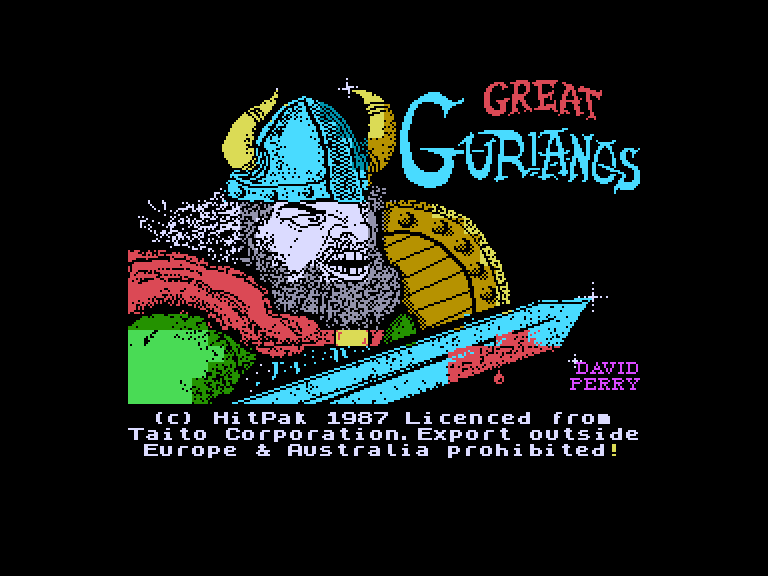
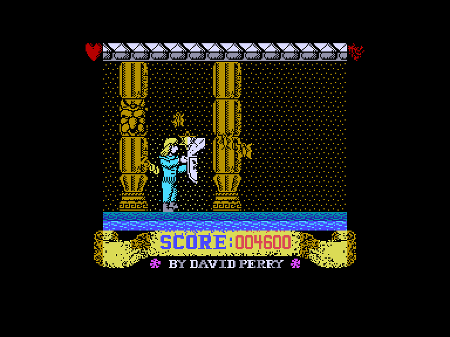
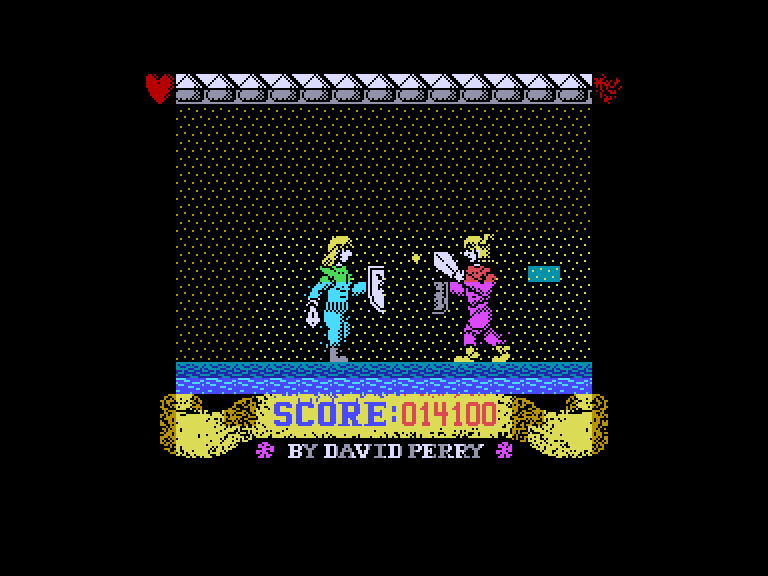

[0-9](../0/games-0.md) - [A](../a/games-a.md) - [B](../b/games-b.md) - [C](../c/games-c.md) - [D](../d/games-d.md) - [E](../e/games-e.md) - [F](../f/games-f.md) - [G](../g/games-g.md) - [H](../h/games-h.md) - [I](../i/games-i.md) - [J](../j/games-j.md) - [K](../k/games-k.md) - [L](../l/games-l.md) - [M](../m/games-m.md) - [N](../n/games-n.md) - [O](../o/games-o.md) - [P](../p/games-p.md) - [Q](../q/games-q.md) - [R](../r/games-r.md) - [S](../s/games-s.md) - [T](../t/games-t.md) - [U](../u/games-u.md) - [V](../v/games-v.md) - [W](../w/games-w.md) - [X](../x/games-x.md) - [Y](../y/games-y.md) - [Z](../z/games-z.md)

Ігри для [Enterprise 64k](../games-ep64.md) - [Enterprise 128k+RAMexp](../games-epramexp.md) - [2dfx](games-2dfx.md)

Ігри для систем [IS-DOS](../games-is-dos.md) - [SymbOS](../games-symbos.md) - [EDC Windows](../games-edcw.md)

Ігри для емуляторів [ZX Spectrum 48k/128k](../zxemu/games-zxemu.md) - [Amstrad CPC](../cpcemu/games-cpc.md) - [Sinclair ZX81](../zx81emu/games-zx81.md) - [Videoton TVC](../tvcemu/games-tvc.md) - [Commodore VIC-20](../vic20emu/games-vic20.md)

----------

# Great Gurianos

**ID:** great-gurianos-zx

## Скріншоти

## Опис

(temporary description generated by AI [ChatGPT])

**Опис гри:**

У грі "Гладіатор" гравець керує гладіатором, який повинен битися в замку. Гра має боковий вигляд з прокруткою екрану. Гравець контролює щит гладіатора, щоб відбивати об'єкти, що летять у нього. Гладіатор також може атакувати супротивників своїм мечем. У грі є іконки для збору, які підвищують броню або дають бонусні очки. Гладіатор має можливість тимчасової невразливості.

**Правила гри:**

1. Керуй гладіатором, використовуючи кнопки для руху та атаки.
2. Відбивай об'єкти, що летять, за допомогою щита.
3. Атакуй супротивників мечем, щоб їх перемогти.
4. Збирай іконки для покращення своїх навичок та отримання бонусів.
5. Використовуй тимчасову невразливість в критичних ситуаціях.
6. Гра може бути в однокористувацькому або багатокористувацькому режимі (до 2 гравців).

## Основна інформація
- **Оригінальна платформа:** ZX Spectrum

## Посилання
- [Інформація про оригінальну версію](https://spectrumcomputing.co.uk/entry/2130/ZX-Spectrum/Great_Gurianos)

