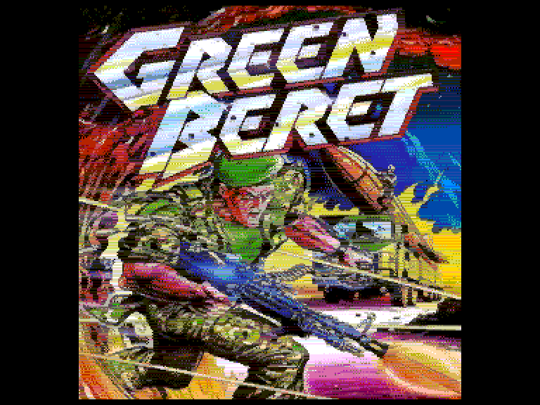
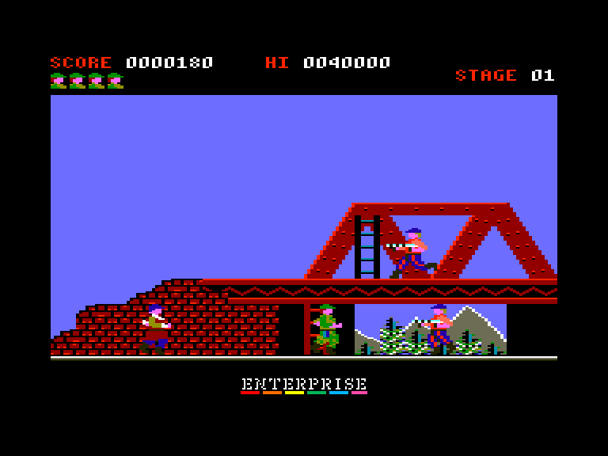
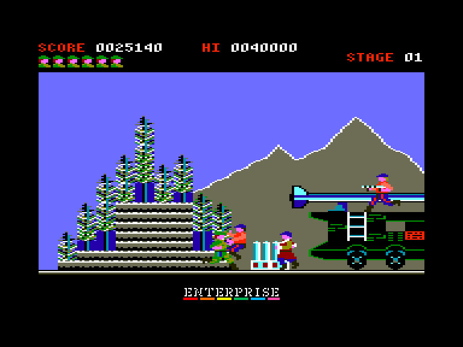
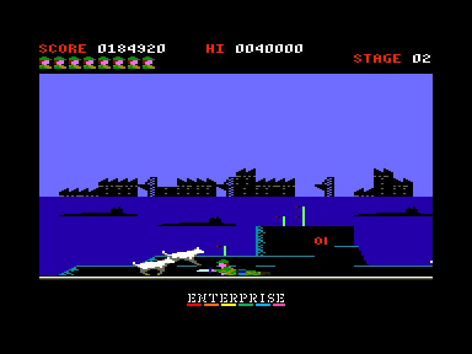

[0-9](../0/games-0.md) - [A](../a/games-a.md) - [B](../b/games-b.md) - [C](../c/games-c.md) - [D](../d/games-d.md) - [E](../e/games-e.md) - [F](../f/games-f.md) - [G](../g/games-g.md) - [H](../h/games-h.md) - [I](../i/games-i.md) - [J](../j/games-j.md) - [K](../k/games-k.md) - [L](../l/games-l.md) - [M](../m/games-m.md) - [N](../n/games-n.md) - [O](../o/games-o.md) - [P](../p/games-p.md) - [Q](../q/games-q.md) - [R](../r/games-r.md) - [S](../s/games-s.md) - [T](../t/games-t.md) - [U](../u/games-u.md) - [V](../v/games-v.md) - [W](../w/games-w.md) - [X](../x/games-x.md) - [Y](../y/games-y.md) - [Z](../z/games-z.md)

Ігри для [Enterprise 64k](../games-ep64.md) - [Enterprise 128k+RAMexp](../games-epramexp.md)

Ігри для систем [IS-DOS](../games-is-dos.md) - [SymbOS](../games-symbos.md) - [EDC Windows](../games-edcw.md)

Ігри для емуляторів [ZX Spectrum 48k/128k](../zxemu/games-zxemu.md) - [Amstrad CPC](../cpcemu/games-cpc.md) - [Sinclair ZX81](../zx81emu/games-zx81.md) - [Videoton TVC](../tvcemu/games-tvc.md) - [Commodore VIC-20](../vic20emu/games-vic20.md)

----------

# Green Beret

**ID:** green-beret-cpc

## Скріншоти

## Опис

(temporary description generated by AI [ChatGPT])

**Опис гри: Green Beret**

Green Beret – це аркадна гра, в якій гравець повинен пройти через чотири рівні, щоб врятувати заручників. Гра має різні версії для 8-бітних комп'ютерів, зокрема Spectrum, MSX, C64, C16 та CPC. Версія для CPC вирізняється кращою графікою, що робить її найбільш привабливою для гравців. Однак, гра не є легкою, оскільки вона була розроблена для японського ринку, що робить її складнішою за версію для Spectrum. Гравцеві потрібно бути обережним, оскільки вороги можуть атакувати в будь-який момент, а управління має свої особливості.

**Правила гри:**
1. Гравець починає з 5 життями.
2. Мета гри – врятувати заручників, проходячи через рівні.
3. Вороги атакують несподівано, тому потрібно бути готовим до швидких реакцій.
4. Кнопка вогню не може бути утримувана, що ускладнює стрільбу.
5. Гра підтримує EXOS і вимагає мінімум 112 КБ пам'яті.
6. Керування можливе за допомогою джойстика EXT 1/2 або клавіатури (клавіша за замовчуванням для стрільби – SPACE).
7. Додаткові функції:
   - F2: вибір музики та звуків.
   - F3: відтворення звуків.
   - F4: вимкнення звуків.
   - F5: прискорення гри.
   - F6: уповільнення гри.
   - F7: безсмертя.
   - F8: вічне життя.
   - STOP: пауза (продовження будь-якою клавішею).

Гра обіцяє бути захоплюючою та викликовою для всіх шанувальників аркадних ігор!

## Основна інформація
- **Оригінальна платформа:** Amstrad CPC
### Геймплей
- **Додаткові теги:** 16-color mode, SID-card

## Посилання
- [Опис гри на ep128.hu (угорською)](http://www.ep128.hu/Ep_Games/Leiras/Green_Beret.htm)
- [Інформація про оригінальну версію](https://www.cpc-power.com/index.php?page=detail&num=1009)
- [Завантажити гру](http://www.ep128.hu/Ep_Games/Prg/Green_Beret_CPC.rar)
- [Easy Load&Play](https://t.me/EP128k_Load_n_Play/357) *(Telegram-канал Vibrant Waves)*

## Відео

<iframe src="https://www.youtube.com/embed/Aiy_9Mz--5M"  
style="width:75%; aspect-ratio:16/9;" allowfullscreen></iframe>

