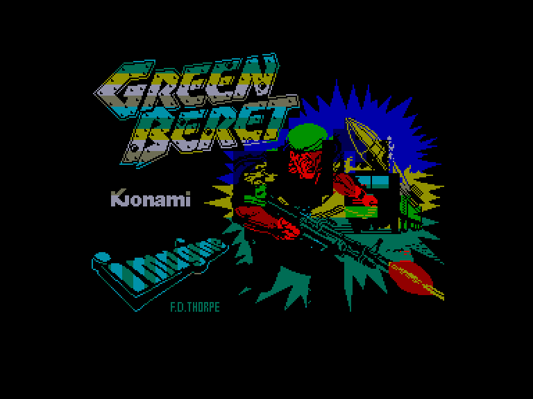
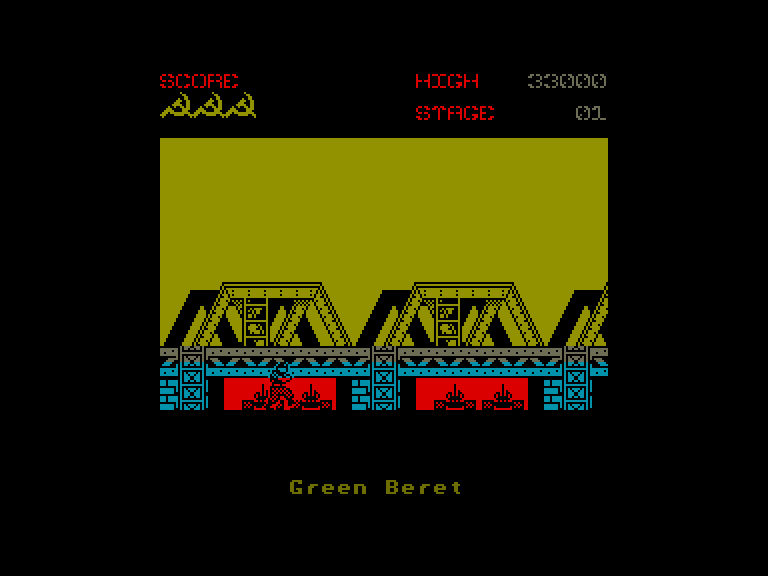
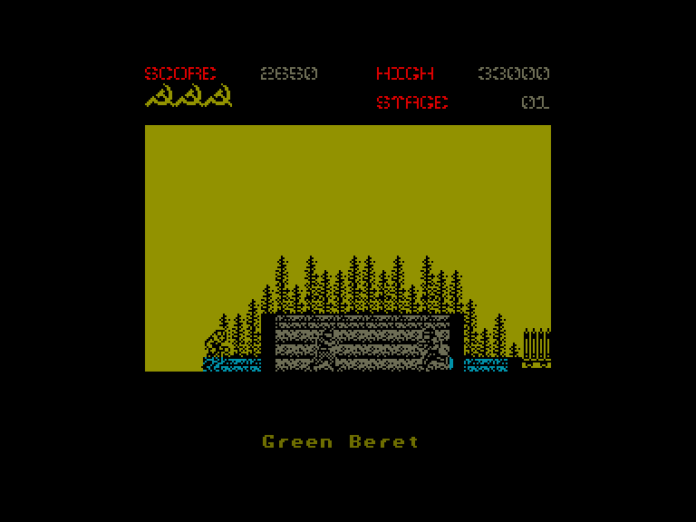
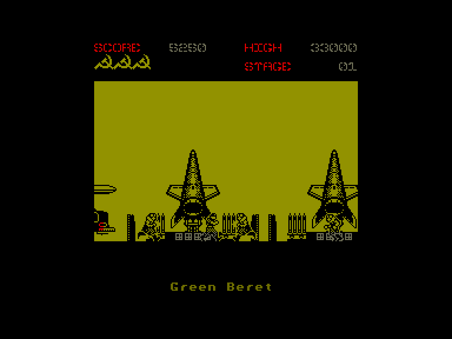

[0-9](../0/games-0.md) - [A](../a/games-a.md) - [B](../b/games-b.md) - [C](../c/games-c.md) - [D](../d/games-d.md) - [E](../e/games-e.md) - [F](../f/games-f.md) - [G](../g/games-g.md) - [H](../h/games-h.md) - [I](../i/games-i.md) - [J](../j/games-j.md) - [K](../k/games-k.md) - [L](../l/games-l.md) - [M](../m/games-m.md) - [N](../n/games-n.md) - [O](../o/games-o.md) - [P](../p/games-p.md) - [Q](../q/games-q.md) - [R](../r/games-r.md) - [S](../s/games-s.md) - [T](../t/games-t.md) - [U](../u/games-u.md) - [V](../v/games-v.md) - [W](../w/games-w.md) - [X](../x/games-x.md) - [Y](../y/games-y.md) - [Z](../z/games-z.md)

Ігри для [Enterprise 64k](../games-ep64.md) - [Enterprise 128k+RAMexp](../games-epramexp.md)

Ігри для систем [IS-DOS](../games-is-dos.md) - [SymbOS](../games-symbos.md) - [EDC Windows](../games-edcw.md)

Ігри для емуляторів [ZX Spectrum 48k/128k](../zxemu/games-zxemu.md) - [Amstrad CPC](../cpcemu/games-cpc.md) - [Sinclair ZX81](../zx81emu/games-zx81.md) - [Videoton TVC](../tvcemu/games-tvc.md) - [Commodore VIC-20](../vic20emu/games-vic20.md)

----------

# Green Beret

**ID:** green-beret-zx

## Скріншоти

## Опис

(temporary description generated by AI [ChatGPT])

**Опис гри: Green Beret**

Green Beret — це насичена бойова гра, що вимагає високих технічних навичок. Гравець виступає в ролі американського коммандос, який має звільнити заручників з військової бази противника (радянських військ). Гра починається з того, що герой озброєний лише ножем, але проти нього виступають численні вороги з автоматами та гранатометами. Гравець повинен пробратися на базу, знищуючи ворогів, ухиляючись від їхніх атак та використовуючи знайдену зброю.

**Правила гри:**
1. Вибір способу управління можливий лише один раз у меню.
2. Гравець може атакувати ворогів ударами та пострілами.
3. Для знищення ворогів, які наближаються, можна стрибати та бити.
4. У разі обстрілу можна лягти, але це небезпечно, оскільки можна втратити життя.
5. Гравець може підніматися по драбинах, щоб уникнути ворогів.
6. Необхідно уникати вибухових пристроїв на землі.
7. Знищені вороги можуть залишати за собою зброю, яку можна підбирати.
8. Гра має чотири рівні складності, кожен з яких завершується масованою атакою ворогів.
9. Гравець повинен проявити швидкість реакції та вміння.

Гра обіцяє захоплюючий досвід для любителів екшн-ігор!

## Основна інформація
- **Оригінальна платформа:** ZX Spectrum

## Посилання
- [Опис гри на ep128.hu (угорською)](http://www.ep128.hu/Games/Green_Beret.htm)
- [Інформація про оригінальну версію](https://spectrumcomputing.co.uk/entry/2134/ZX-Spectrum/Green_Beret)
- [Завантажити гру](http://www.ep128.hu/Ep_Games/Prg/Green_Beret.rar)

