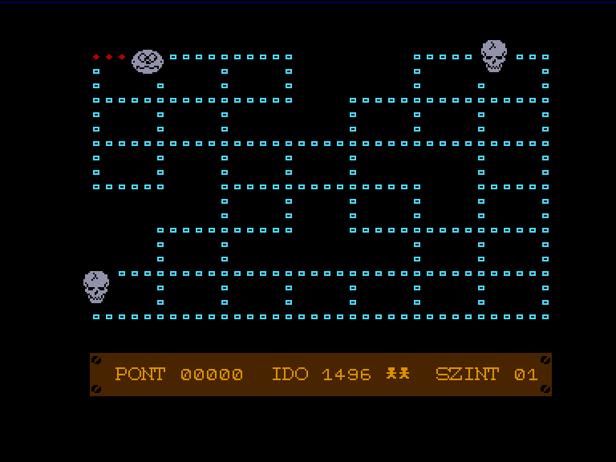
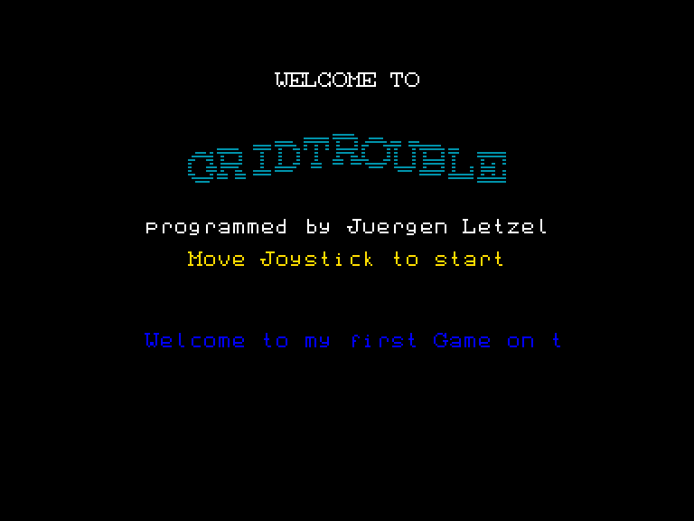
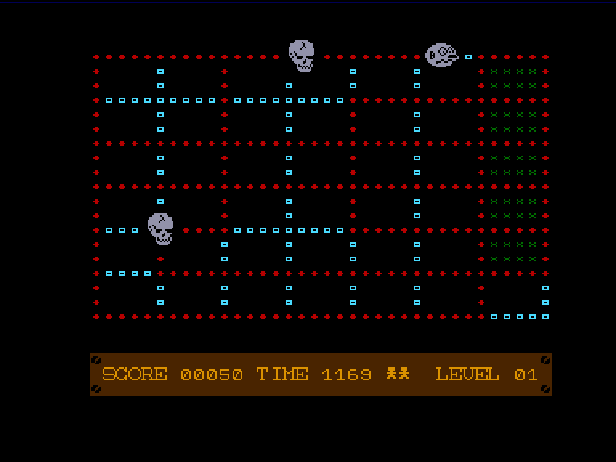
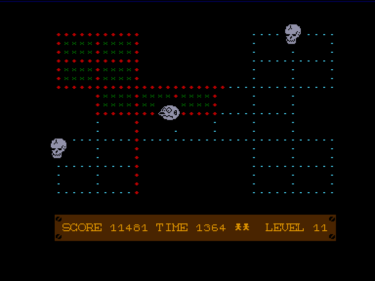

[0-9](../0/games-0.md) - [A](../a/games-a.md) - [B](../b/games-b.md) - [C](../c/games-c.md) - [D](../d/games-d.md) - [E](../e/games-e.md) - [F](../f/games-f.md) - [G](../g/games-g.md) - [H](../h/games-h.md) - [I](../i/games-i.md) - [J](../j/games-j.md) - [K](../k/games-k.md) - [L](../l/games-l.md) - [M](../m/games-m.md) - [N](../n/games-n.md) - [O](../o/games-o.md) - [P](../p/games-p.md) - [Q](../q/games-q.md) - [R](../r/games-r.md) - [S](../s/games-s.md) - [T](../t/games-t.md) - [U](../u/games-u.md) - [V](../v/games-v.md) - [W](../w/games-w.md) - [X](../x/games-x.md) - [Y](../y/games-y.md) - [Z](../z/games-z.md)

Ігри для [Enterprise 64k](../games-ep64.md) - [Enterprise 128k+RAMexp](../games-epramexp.md)

Ігри для систем [IS-DOS](../games-is-dos.md) - [SymbOS](../games-symbos.md) - [EDC Windows](../games-edcw.md)

Ігри для емуляторів [ZX Spectrum 48k/128k](../zxemu/games-zxemu.md) - [Amstrad CPC](../cpcemu/games-cpc.md) - [Sinclair ZX81](../zx81emu/games-zx81.md) - [Videoton TVC](../tvcemu/games-tvc.md) - [Commodore VIC-20](../vic20emu/games-vic20.md)

----------

# Gridtrouble

**Альтернативні назви:**
 - Gridtrouble 2
 - Gridtrouble 3

**ID:** gridtrouble

**Жанри:** Аркада, Amidar-подібна

## Скріншоти

## Опис

(temporary description generated by AI [ChatGPT])

**Опис гри: Grid Trouble**

Grid Trouble – це класичний представник ігрового стилю, популярного в 80-х роках. Гравець повинен пройти по всій ігровій площі, "фарбуючи" шлях за собою. Коли квадрат оточений з усіх чотирьох сторін, його колір змінюється, і ви отримуєте бали. Але будьте обережні: за вами гнаться "привабливі" черепи, і якщо вони вас зловлять, ви втратите життя. Їхній рух передбачуваний: якщо ви потрапите в їхнє поле зору (в одну лінію або стовпець), вони почнуть вас переслідувати. Ви можете відриватися від них, змінюючи напрямок. Гра триває на час, і за виконання рівня ви отримуєте бонуси за залишений час. У грі є 32 рівні, які забезпечать вам достатньо викликів.

**Правила гри:**
1. Проходьте по всій площі, фарбуючи шлях.
2. Змінюйте колір квадратів, оточуючи їх з усіх сторін.
3. Уникайте черепів, які переслідують вас, потрапивши в їхнє поле зору.
4. Використовуйте просте управління: не потрібно постійно натискати кнопки, але будьте обережні з краями.
5. Грайте на час і намагайтеся зібрати якомога більше балів.
6. Якщо втратите всі три життя, ви зможете записати свій монограм у список найкращих гравців.

**Чит-код:**
- Під час гри натисніть ALT + ліву стрілку, щоб перейти на наступний рівень.

## Основна інформація
- **Мови:** Англійська, Угорська
- **Оригінальна платформа:** Enterprise
### Загальні системні вимоги
- **Апаратні:** EP64, EP128
- **Програмні:** EXOS 2.1
### Геймплей
- **Керування:** Internal Joy
- **Кількість гравців:** 1 player
### Розробка
- **Автор:** Juergen Letzel

## Посилання
- [Опис гри на ep128.hu (угорською)](http://www.ep128.hu/Ep_Games/Leiras/Grid_Trouble.htm)
- [Опис гри на ep128.hu (угорською)](http://www.ep128.hu/Ep_Games/Leiras/Grid_Trouble2.htm)
- [Завантажити гру](http://www.ep128.hu/Ep_Games/Prg/Grid_Trouble.rar)
- [Завантажити гру](http://www.ep128.hu/Ep_Games/Prg/Grid_Trouble_2.rar)
- [Завантажити гру](http://www.ep128.hu/Ep_Games/Prg/Grid_Trouble_3.rar)
- [Easy Load&Play](https://t.me/EP128k_Load_n_Play/364) *(Telegram-канал Vibrant Waves)*

## Відео

<iframe src="https://www.youtube.com/embed/8YCIYo7pJQA"  
style="width:75%; aspect-ratio:16/9;" allowfullscreen></iframe>

- [Відео](https://youtu.be/onhU94atj4E)

