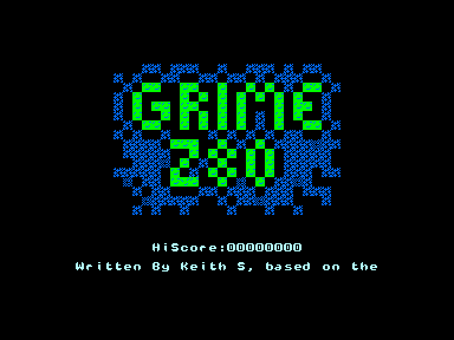
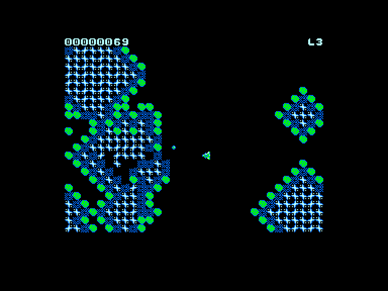
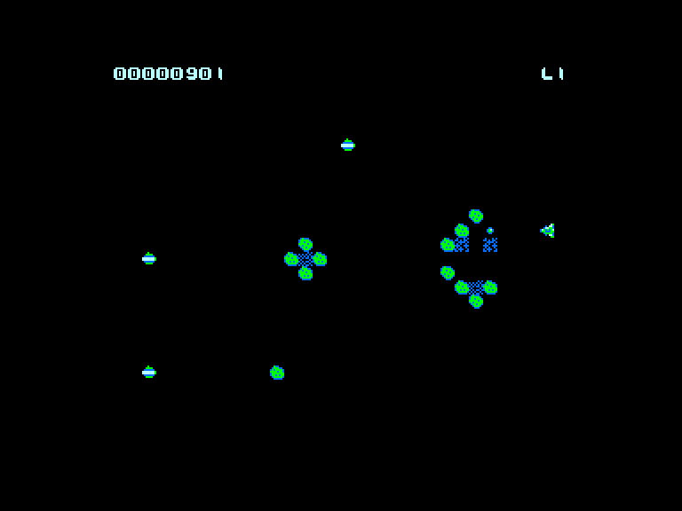
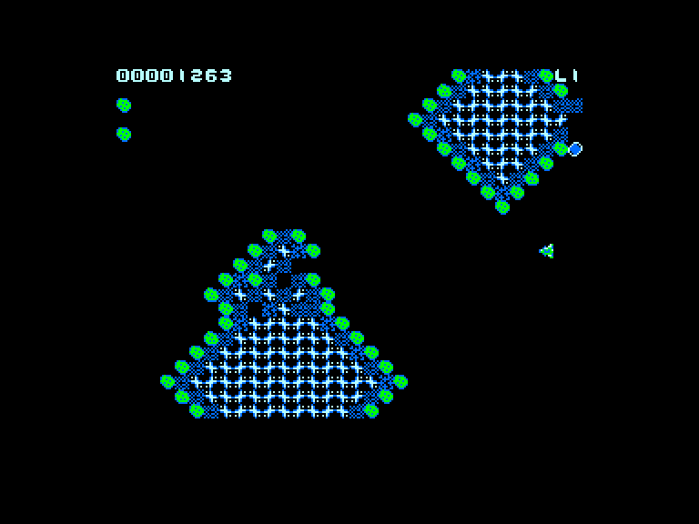

[0-9](../0/games-0.md) - [A](../a/games-a.md) - [B](../b/games-b.md) - [C](../c/games-c.md) - [D](../d/games-d.md) - [E](../e/games-e.md) - [F](../f/games-f.md) - [G](../g/games-g.md) - [H](../h/games-h.md) - [I](../i/games-i.md) - [J](../j/games-j.md) - [K](../k/games-k.md) - [L](../l/games-l.md) - [M](../m/games-m.md) - [N](../n/games-n.md) - [O](../o/games-o.md) - [P](../p/games-p.md) - [Q](../q/games-q.md) - [R](../r/games-r.md) - [S](../s/games-s.md) - [T](../t/games-t.md) - [U](../u/games-u.md) - [V](../v/games-v.md) - [W](../w/games-w.md) - [X](../x/games-x.md) - [Y](../y/games-y.md) - [Z](../z/games-z.md)

Ігри для [Enterprise 64k](../games-ep64.md) - [Enterprise 128k+RAMexp](../games-epramexp.md)

Ігри для систем [IS-DOS](../games-is-dos.md) - [SymbOS](../games-symbos.md) - [EDC Windows](../games-edcw.md)

Ігри для емуляторів [ZX Spectrum 48k/128k](../zxemu/games-zxemu.md) - [Amstrad CPC](../cpcemu/games-cpc.md) - [Sinclair ZX81](../zx81emu/games-zx81.md) - [Videoton TVC](../tvcemu/games-tvc.md) - [Commodore VIC-20](../vic20emu/games-vic20.md)

----------

# Grime Z80

**ID:** grime-z80

## Скріншоти

## Опис

(temporary description generated by AI [ChatGPT])

**Опис гри:**

Grime Z80 — це ремейк текстової гри 1984 року Grime для IBM PC, тепер портований на різноманітні 8-бітні комп'ютери та пристрої, що базуються на процесорі Zilog Z80. Гравець керує маленьким кораблем, який бореться з розширенням брудної маси, що веде себе як клітинний автомат. Гра поєднує елементи шутера та аркади, де потрібно знищувати ворогів і уникати контакту з небезпечними спорами.

**Правила гри:**

1. Гравець має три життя. Втрачається життя, якщо корабель торкається рухомих спор або якщо його оточують брудні маси.
2. Корабель стріляє в чотирьох напрямках автоматично, знищуючи бруд.
3. Вороги переміщуються по екрану і висаджують нові ділянки бруду.
4. Мета гри — знищити якомога більше бруду, уникаючи при цьому контактів з ворогами.

Гра пропонує динамічний і захоплюючий ігровий процес, поєднуючи елементи класичних аркадних шутерів.

## Посилання
- [Домашня сторінка гри](https://www.chibiakumas.com/z80/grimez80.php)

**Дата генерації:** 29.07.2026

## Відео

- [Відео](https://www.youtube.com/playlist?list=PLp_QNRIYljFqwHWKzqpOcYl4bq6RUrvu4)