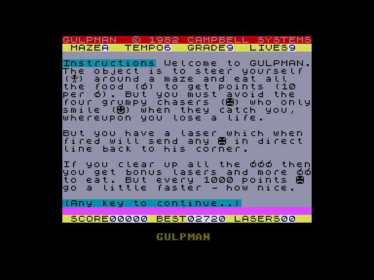
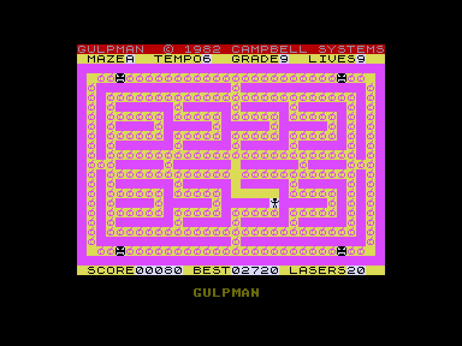
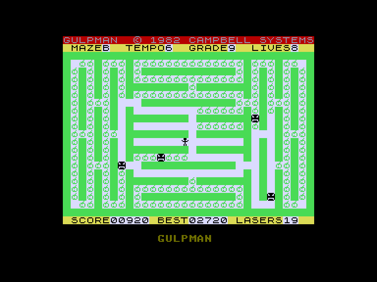
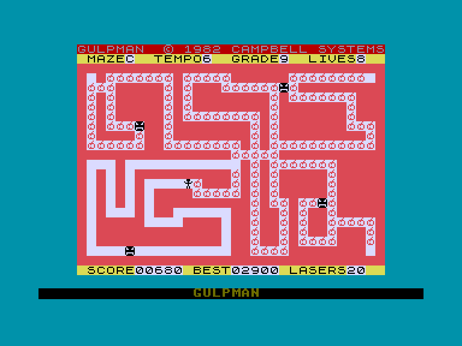

[0-9](../0/games-0.md) - [A](../a/games-a.md) - [B](../b/games-b.md) - [C](../c/games-c.md) - [D](../d/games-d.md) - [E](../e/games-e.md) - [F](../f/games-f.md) - [G](../g/games-g.md) - [H](../h/games-h.md) - [I](../i/games-i.md) - [J](../j/games-j.md) - [K](../k/games-k.md) - [L](../l/games-l.md) - [M](../m/games-m.md) - [N](../n/games-n.md) - [O](../o/games-o.md) - [P](../p/games-p.md) - [Q](../q/games-q.md) - [R](../r/games-r.md) - [S](../s/games-s.md) - [T](../t/games-t.md) - [U](../u/games-u.md) - [V](../v/games-v.md) - [W](../w/games-w.md) - [X](../x/games-x.md) - [Y](../y/games-y.md) - [Z](../z/games-z.md)

Ігри для [Enterprise 64k](../games-ep64.md) - [Enterprise 128k+RAMexp](../games-epramexp.md)

Ігри для систем [IS-DOS](../games-is-dos.md) - [SymbOS](../games-symbos.md) - [EDC Windows](../games-edcw.md)

Ігри для емуляторів [ZX Spectrum 48k/128k](../zxemu/games-zxemu.md) - [Amstrad CPC](../cpcemu/games-cpc.md) - [Sinclair ZX81](../zx81emu/games-zx81.md) - [Videoton TVC](../tvcemu/games-tvc.md) - [Commodore VIC-20](../vic20emu/games-vic20.md)

----------

# Gulpman

**ID:** gulpman-zx

## Скріншоти

## Опис

(temporary description generated by AI [Assistant])

**Опис гри: Gulpman**

Gulpman — це класична аркадна гра, що нагадує PACMAN, в якій гравець повинен збирати їжу (яблука) в лабіринті, уникаючи чотирьох переслідувачів. Гравець має можливість використовувати лазерну зброю для тимчасового відволікання ворогів, стріляючи в чотирьох напрямках. Гра містить 15 лабіринтів, але в процесі гри ви будете перебувати в одному з них. Гравець може налаштувати швидкість гри, вибрати лабіринт та зберегти свій прогрес.

**Правила гри:**
1. Збирайте яблука в лабіринті.
2. Уникайте чотирьох ворогів, які намагаються вас зловити.
3. Використовуйте лазерну зброю, щоб відволікти ворогів, але пам'ятайте, що кількість пострілів обмежена.
4. Виберіть лабіринт перед початком гри.
5. Налаштуйте швидкість гри та рівень складності.
6. Грайте за допомогою клавіатури або джойстика.
7. Зберігайте прогрес гри на касеті.

Удачі в зборі яблук і уникненні ворогів!

## Основна інформація
- **Оригінальна платформа:** ZX Spectrum

## Посилання
- [Опис гри на ep128.hu (угорською)](http://www.ep128.hu/Games/Gulpman.htm)
- [Інформація про оригінальну версію](https://spectrumcomputing.co.uk/entry/2175/ZX-Spectrum/Gulpman)
- [Завантажити гру](http://www.ep128.hu/Ep_Games/Prg/Gulpman.rar)

**Дата генерації:** 29.07.2026

