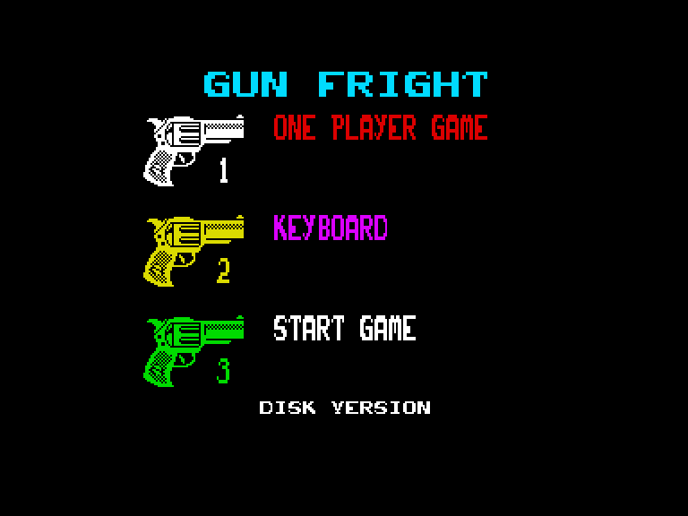
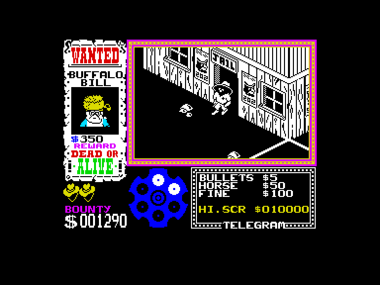
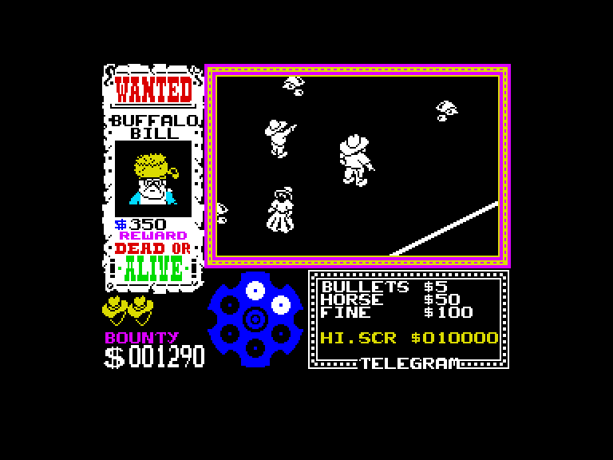
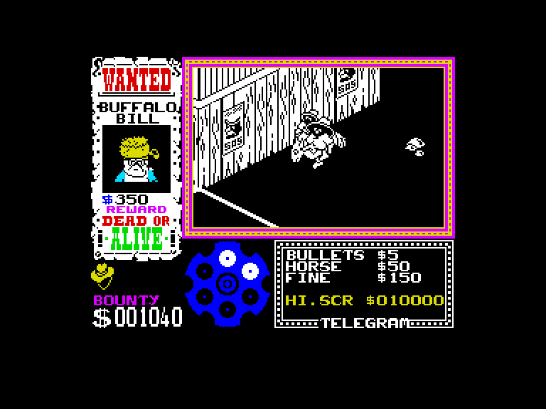

[0-9](../0/games-0.md) - [A](../a/games-a.md) - [B](../b/games-b.md) - [C](../c/games-c.md) - [D](../d/games-d.md) - [E](../e/games-e.md) - [F](../f/games-f.md) - [G](../g/games-g.md) - [H](../h/games-h.md) - [I](../i/games-i.md) - [J](../j/games-j.md) - [K](../k/games-k.md) - [L](../l/games-l.md) - [M](../m/games-m.md) - [N](../n/games-n.md) - [O](../o/games-o.md) - [P](../p/games-p.md) - [Q](../q/games-q.md) - [R](../r/games-r.md) - [S](../s/games-s.md) - [T](../t/games-t.md) - [U](../u/games-u.md) - [V](../v/games-v.md) - [W](../w/games-w.md) - [X](../x/games-x.md) - [Y](../y/games-y.md) - [Z](../z/games-z.md)

Ігри для [Enterprise 64k](../games-ep64.md) - [Enterprise 128k+RAMexp](../games-epramexp.md) - [2dfx](../games-2dfx.md)

Ігри для систем [IS-DOS](../games-is-dos.md) - [SymbOS](../games-symbos.md) - [EDC Windows](../games-edcw.md)

Ігри для емуляторів [ZX Spectrum 48k/128k](../zxemu/games-zxemu.md) - [Amstrad CPC](../cpcemu/games-cpc.md) - [Sinclair ZX81](../zx81emu/games-zx81.md) - [Videoton TVC](../tvcemu/games-tvc.md) - [Commodore VIC-20](../vic20emu/games-vic20.md)

----------

# Gunfright

**ID:** gunfright-zx

## Скріншоти

## Опис

(temporary description generated by AI [Assistant])

**Gunfright** - це захоплююча гра в стилі вестерн, де гравець бере на себе роль шерифа в селі Black Rock, що потерпає від нападу бандитів. Ваше завдання - очистити вулиці від злочинців, збираючи гроші та набої, щоб боротися з ворогами.

**Правила гри:**

1. **Вибір режиму:** В головному меню ви можете обрати кількість гравців (1 або 2) та налаштувати управління (клавіатура або інші контролери).
   
2. **Збір грошей:** Під час гри ви повинні збирати золоті монети, що падають з неба, щоб фінансувати свою боротьбу з бандитами. 

3. **Управління:** Використовуйте клавіші для переміщення, стрільби та зміни кута огляду. Стежте за кількістю набоїв і грошей.

4. **Бій з бандитами:** Використовуйте карту, щоб знайти бандитів. Коли ви їх знайдете, стріляйте в них у потрібний момент, щоб виграти дуель.

5. **Життя та штрафи:** Уникайте зустрічей з жінками та дітьми, оскільки це може коштувати вам життя або призвести до штрафів.

6. **Підтримка:** У грі є молоді хлопці, які покажуть вам напрямок до бандитів. Слідкуйте за їхніми вказівками, щоб швидше знайти ворога.

7. **Перемога:** Якщо ви переможете бандита, підготуйтеся до наступного. Найкращі шерифи можуть зустріти до 20 бандитів.

Гра пропонує захопливий і динамічний ігровий процес, який не залишить байдужим жодного любителя вестернів.

## Основна інформація
- **Оригінальна платформа:** ZX Spectrum

## Посилання
- [Опис на ep128.hu (угорською)](http://www.ep128.hu/Games/Gunfright.htm)
- [Інформація про оригінальну версію](https://spectrumcomputing.co.uk/entry/9357/ZX-Spectrum/Gunfright)
- [Завантажити](http://www.ep128.hu/Ep_Games/Prg/Gunfright.rar)

