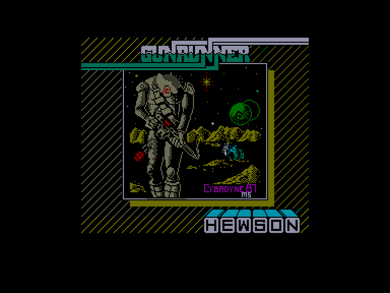
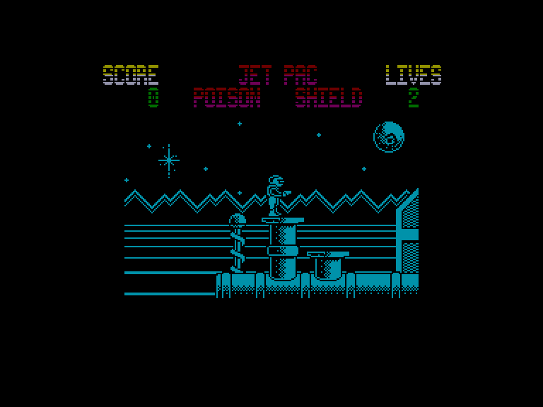
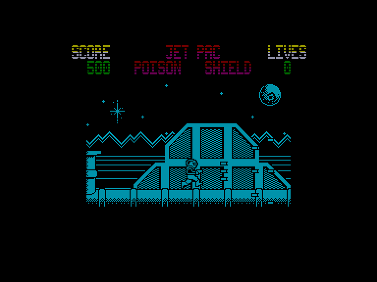
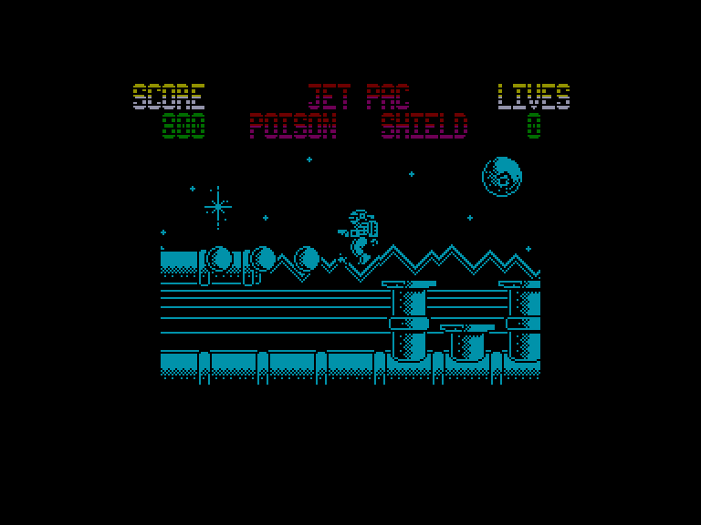

[0-9](../0/games-0.md) - [A](../a/games-a.md) - [B](../b/games-b.md) - [C](../c/games-c.md) - [D](../d/games-d.md) - [E](../e/games-e.md) - [F](../f/games-f.md) - [G](../g/games-g.md) - [H](../h/games-h.md) - [I](../i/games-i.md) - [J](../j/games-j.md) - [K](../k/games-k.md) - [L](../l/games-l.md) - [M](../m/games-m.md) - [N](../n/games-n.md) - [O](../o/games-o.md) - [P](../p/games-p.md) - [Q](../q/games-q.md) - [R](../r/games-r.md) - [S](../s/games-s.md) - [T](../t/games-t.md) - [U](../u/games-u.md) - [V](../v/games-v.md) - [W](../w/games-w.md) - [X](../x/games-x.md) - [Y](../y/games-y.md) - [Z](../z/games-z.md)

Ігри для [Enterprise 64k](../games-ep64.md) - [Enterprise 128k+RAMexp](../games-epramexp.md) - [2dfx](../games-2dfx.md)

Ігри для систем [IS-DOS](../games-is-dos.md) - [SymbOS](../games-symbos.md) - [EDC Windows](../games-edcw.md)

Ігри для емуляторів [ZX Spectrum 48k/128k](../zxemu/games-zxemu.md) - [Amstrad CPC](../cpcemu/games-cpc.md) - [Sinclair ZX81](../zx81emu/games-zx81.md) - [Videoton TVC](../tvcemu/games-tvc.md) - [Commodore VIC-20](../vic20emu/games-vic20.md)

----------

# Gunrunner

**ID:** gunrunner-zx

## Скріншоти

## Опис

(temporary description generated by AI [your name])

**Опис гри: Gunrunner**

У грі "Gunrunner" ви опиняєтеся в далекому майбутньому, де ваш герой має пройти через безліч небезпечних рівнів, озброєний лише пістолетом. Ваша мета — знищити таємничі чорні кулі, які стоять на стовпах, уникаючи численних перешкод у вигляді літаючих об'єктів. На вашому шляху ви зможете знайти різні корисні предмети, такі як:

- **Jetpac**: дозволяє швидко пролітати над перешкодами.
- **Shield**: захищає від зіткнень з літаючими об'єктами.
- **Poison**: граната, що знищує літаючі об'єкти та гранати, які кидають у вас.
- **Multifire**: потроює вогневу міць вашої зброї.

Але будьте обережні! Ці предмети мають обмежений час дії, який вказується кольором їх назви. Чим темніший колір, тим менше часу залишилося до закінчення їх ефекту. Лише "Multifire" має необмежений термін дії, але ви можете втратити його, якщо будете довго контактувати з ворогами.

Після завершення рівня ви маєте можливість пройти бонусний рівень на час, де втрата життя не призведе до смерті, але ви отримаєте менше очок.

**Правила гри:**
1. Використовуйте пістолет для знищення чорних куль.
2. Уникайте зіткнень з літаючими об'єктами.
3. Збирайте предмети для покращення своїх можливостей.
4. Пам'ятайте про обмежений час дії предметів.
5. Завершуйте бонусні рівні для отримання додаткових очок.

Гра доступна для управління через Kempston, Sinclair джойстики або клавіатуру. Не забудьте попередньо налаштувати клавіатуру для активації гранати "Poison".

## Основна інформація
- **Оригінальна платформа:** ZX Spectrum

## Посилання
- [Опис на ep128.hu (угорською)](http://www.ep128.hu/Games/Gunrunner.htm)
- [Інформація про оригінальну версію](https://spectrumcomputing.co.uk/entry/2181/ZX-Spectrum/Gunrunner)
- [Завантажити](http://www.ep128.hu/Ep_Games/Prg/Gunrunner.rar)

