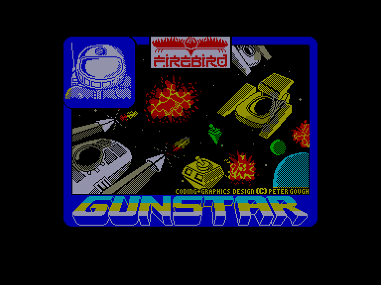
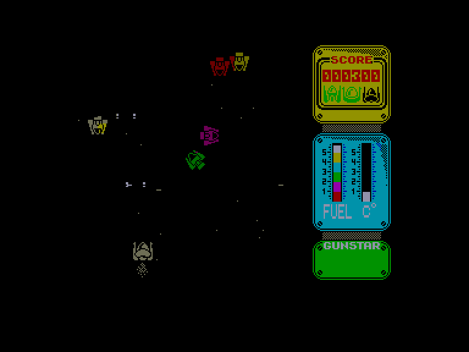
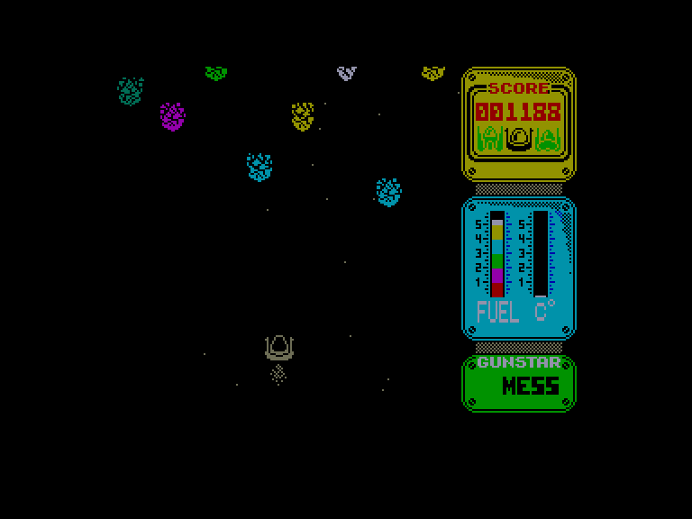
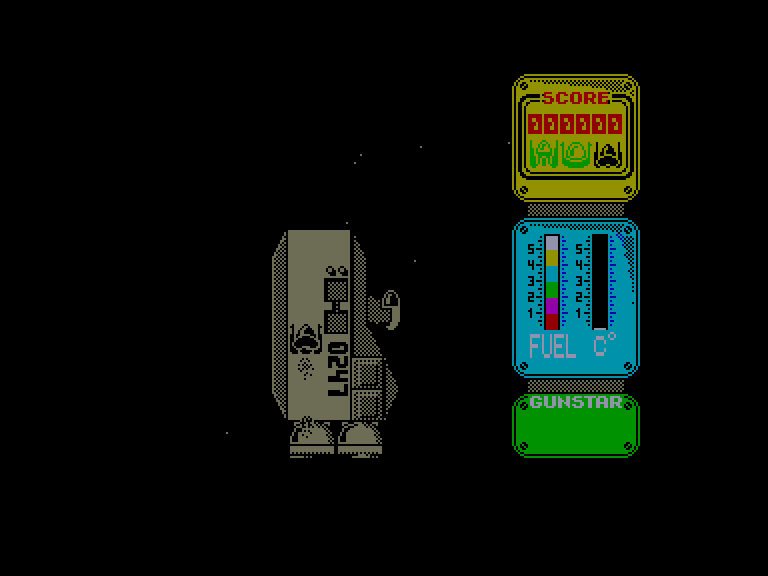

[0-9](../0/games-0.md) - [A](../a/games-a.md) - [B](../b/games-b.md) - [C](../c/games-c.md) - [D](../d/games-d.md) - [E](../e/games-e.md) - [F](../f/games-f.md) - [G](../g/games-g.md) - [H](../h/games-h.md) - [I](../i/games-i.md) - [J](../j/games-j.md) - [K](../k/games-k.md) - [L](../l/games-l.md) - [M](../m/games-m.md) - [N](../n/games-n.md) - [O](../o/games-o.md) - [P](../p/games-p.md) - [Q](../q/games-q.md) - [R](../r/games-r.md) - [S](../s/games-s.md) - [T](../t/games-t.md) - [U](../u/games-u.md) - [V](../v/games-v.md) - [W](../w/games-w.md) - [X](../x/games-x.md) - [Y](../y/games-y.md) - [Z](../z/games-z.md)

Ігри для [Enterprise 64k](../games-ep64.md) - [Enterprise 128k+RAMexp](../games-epramexp.md)

Ігри для систем [IS-DOS](../games-is-dos.md) - [SymbOS](../games-symbos.md) - [EDC Windows](../games-edcw.md)

Ігри для емуляторів [ZX Spectrum 48k/128k](../zxemu/games-zxemu.md) - [Amstrad CPC](../cpcemu/games-cpc.md) - [Sinclair ZX81](../zx81emu/games-zx81.md) - [Videoton TVC](../tvcemu/games-tvc.md) - [Commodore VIC-20](../vic20emu/games-vic20.md)

----------

# Gunstar

**ID:** gunstar-zx

## Скріншоти

## Опис

(temporary description generated by AI [Assistant])

**Опис гри: Gunstar**

Gunstar — це захоплююча гра в жанрі космічного шутера, де вам потрібно врятувати світ від злих інопланетян. Ви виступаєте в ролі пілота, який має знищити ворожі флотилії, космічні кораблі та величезних роботів. Гра складається з п'яти рівнів, кожен з яких має свої унікальні виклики.

**Правила гри:**
1. **Знищення ворожих винищувачів:** На початку гри вам потрібно знищити ворожі літаки, які піднімаються з материнських кораблів.
2. **Проходження астероїдного поля:** Далі ви повинні пройти через астероїдне поле, уникати перешкод, оскільки стріляти не можна.
3. **Атака на командний корабель:** Після цього вам потрібно атакувати ворожий командний корабель, завдаючи удари по його гарматам. На екрані буде відображено, скільки ударів залишилося до знищення корабля.
4. **Бій з роботом:** Наступний етап - бій з невідомим роботом, де вам потрібно використовувати ту ж тактику, що й раніше, але будьте обережні, адже ворог тепер може стріляти в усіх напрямках.
5. **Зарядка пального:** Завершивши всі етапи, вам потрібно з'єднатися з постачальницьким кораблем, щоб поповнити паливо. У вас є лише 9 секунд для цього маневру.

**Додаткові правила:**
- Якщо ваше судно буде знищене або ви зіткнетеся з чимось, ви почнете знову з початку рівня.
- На правій стороні екрана ви можете побачити свій рахунок, кількість життів (пілотів) та рівень пального.
- Управління можна здійснювати з клавіатури або джойстика.

Гра обіцяє бути складною, тому будьте готові до викликів!

## Основна інформація
- **Оригінальна платформа:** ZX Spectrum

## Посилання
- [Опис гри на ep128.hu (угорською)](http://www.ep128.hu/Games/GunStar.htm)
- [Інформація про оригінальну версію](https://spectrumcomputing.co.uk/entry/2186/ZX-Spectrum/Gunstar)
- [Завантажити гру](http://www.ep128.hu/Ep_Games/Prg/Gunstar.rar)

