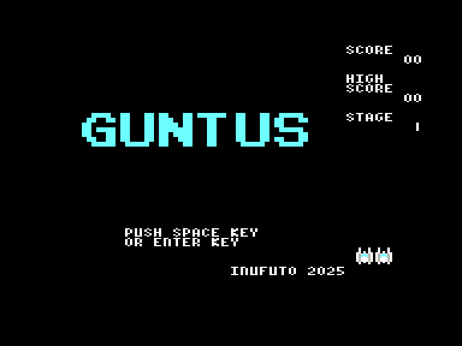
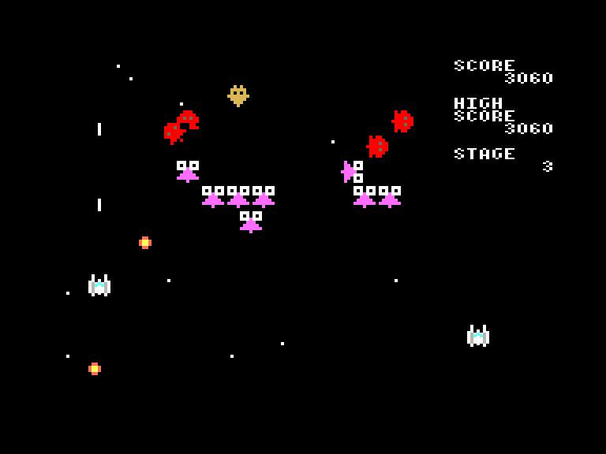
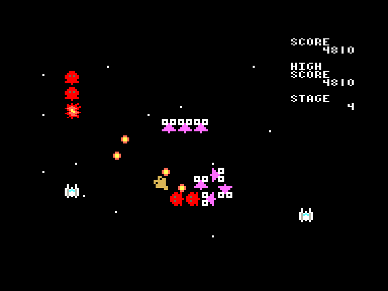
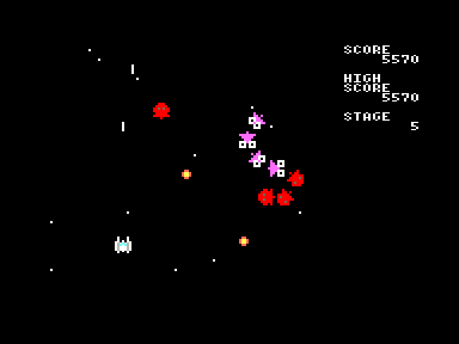

[0-9](../0/games-0.md) - [A](../a/games-a.md) - [B](../b/games-b.md) - [C](../c/games-c.md) - [D](../d/games-d.md) - [E](../e/games-e.md) - [F](../f/games-f.md) - [G](../g/games-g.md) - [H](../h/games-h.md) - [I](../i/games-i.md) - [J](../j/games-j.md) - [K](../k/games-k.md) - [L](../l/games-l.md) - [M](../m/games-m.md) - [N](../n/games-n.md) - [O](../o/games-o.md) - [P](../p/games-p.md) - [Q](../q/games-q.md) - [R](../r/games-r.md) - [S](../s/games-s.md) - [T](../t/games-t.md) - [U](../u/games-u.md) - [V](../v/games-v.md) - [W](../w/games-w.md) - [X](../x/games-x.md) - [Y](../y/games-y.md) - [Z](../z/games-z.md)

Ігри для [Enterprise 64k](../games-ep64.md) - [Enterprise 128k+RAMexp](../games-epramexp.md)

Ігри для систем [IS-DOS](../games-is-dos.md) - [SymbOS](../games-symbos.md) - [EDC Windows](../games-edcw.md)

Ігри для емуляторів [ZX Spectrum 48k/128k](../zxemu/games-zxemu.md) - [Amstrad CPC](../cpcemu/games-cpc.md) - [Sinclair ZX81](../zx81emu/games-zx81.md) - [Videoton TVC](../tvcemu/games-tvc.md) - [Commodore VIC-20](../vic20emu/games-vic20.md)

----------

# GUNTUS

**ID:** guntus

**Жанри:** Аркада

## Скріншоти

## Опис

(temporary description generated by AI [Assistant])

**Опис гри: Guntus**

Guntus — це класичний клон Galaxians, який імітує старі аркадні ігри. Гра доступна на різних платформах, включаючи версію для ZX81. Гравці стикаються з хвилями ворожих космічних кораблів, які можуть з'явитися з будь-якого боку екрану та атакувати вас точними жовтими снарядами. Ключ до успіху — запам'ятати патерни атак. Ваш космічний корабель може вільно переміщатися по всьому екрану, хоча маневрувати в верхній частині зазвичай не має сенсу. 

Гра має 16 різних рівнів складності, але після завершення рівня гра починається спочатку, що означає, що ви завжди змагаєтеся за високий бал. Збираючи зелений контейнер з написом 1UP, ви отримуєте додаткове життя — рідкісний скарб! Інтенсивний ігровий процес доповнюється музикою 128K, яка, можливо, не зовсім підходить до гри.

**Правила гри:**
- **Управління:** 
  - Для версії Spectrum: клавіатура (O, P, Q, A, SPACE) або джойстик Sinclair.
  - Для версії Enterprise: вбудований джойстик або клавіатура: 'L' - вгору, '.' - вниз, ',' - вліво, '/' - вправо, 'SPACE', 'Z' - вогонь. Натиснення RESET перенесе вас у меню.
- Уникайте ворожих снарядів і намагайтеся знищити якомога більше ворогів, щоб набрати високий бал.
- Збирайте бонуси для отримання додаткових життів.

Приготуйтеся до захоплюючого космічного бою!

## Основна інформація
- **Мови:** Англійська
### Системні вимоги
- **Апаратні:** EP64, EP128
### Геймплей
- **Керування:** Keyboard, Internal Joy
- **Кількість гравців:** 1 Player
### Розробка
- **Автор:** Inufuto

## Посилання
- [Домашня сторінка гри](http://inufuto.web.fc2.com/8bit/guntus/#ep64)
- [Опис гри на ep128.hu (угорською)](http://www.ep128.hu/Games/Guntus.htm)
- [Завантажити гру](http://www.ep128.hu/Ep_Games/Prg/Guntus.rar)
- [Завантажити гру](http://inufuto.web.fc2.com/8bit/ep64/guntus_rom.zip)
- [Easy Load&Play](https://t.me/EP128k_Load_n_Play/809?single) *(Telegram-канал Vibrant Waves)*

**Дата генерації:** 29.07.2026

## Відео

<iframe src="https://www.youtube.com/embed/8V-tL1hV1pM"  
style="width:75%; aspect-ratio:16/9;" allowfullscreen></iframe>
