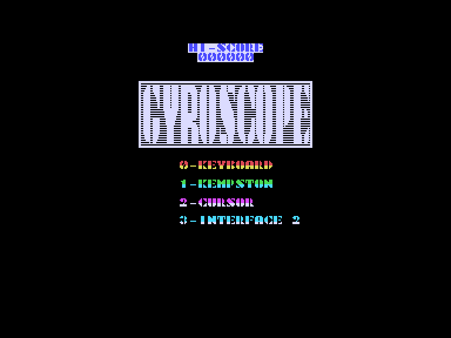
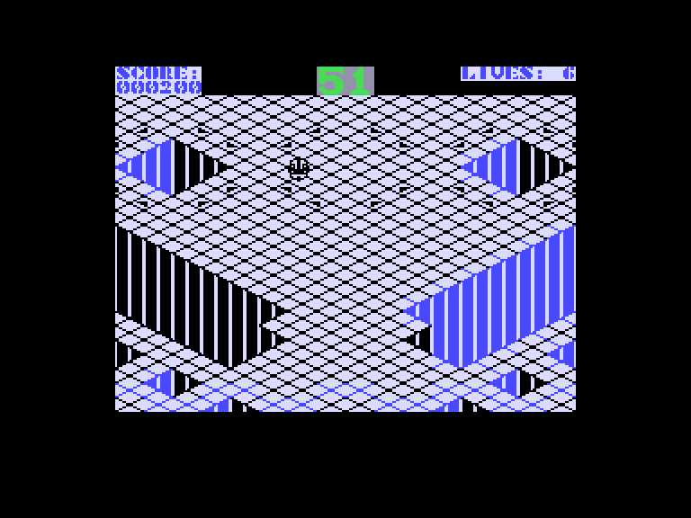
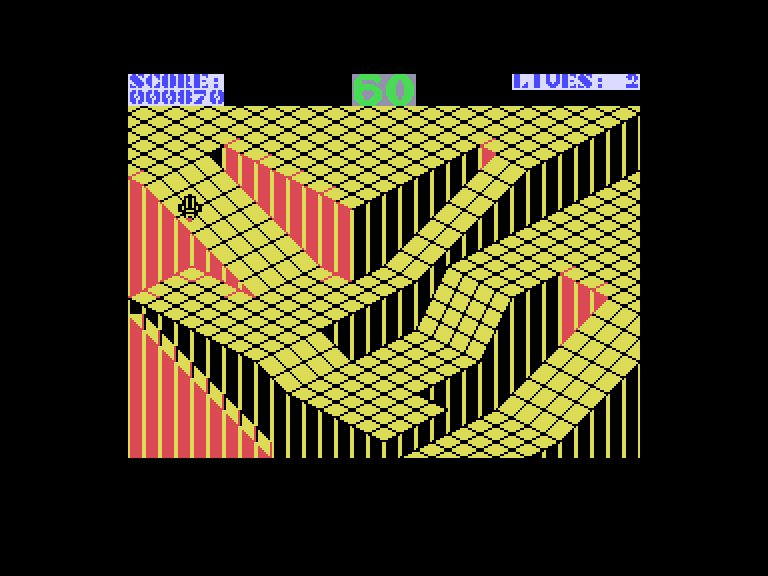
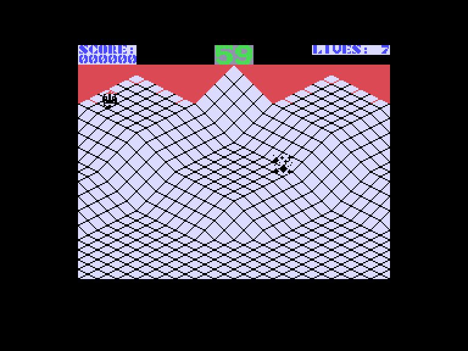

[0-9](../0/games-0.md) - [A](../a/games-a.md) - [B](../b/games-b.md) - [C](../c/games-c.md) - [D](../d/games-d.md) - [E](../e/games-e.md) - [F](../f/games-f.md) - [G](../g/games-g.md) - [H](../h/games-h.md) - [I](../i/games-i.md) - [J](../j/games-j.md) - [K](../k/games-k.md) - [L](../l/games-l.md) - [M](../m/games-m.md) - [N](../n/games-n.md) - [O](../o/games-o.md) - [P](../p/games-p.md) - [Q](../q/games-q.md) - [R](../r/games-r.md) - [S](../s/games-s.md) - [T](../t/games-t.md) - [U](../u/games-u.md) - [V](../v/games-v.md) - [W](../w/games-w.md) - [X](../x/games-x.md) - [Y](../y/games-y.md) - [Z](../z/games-z.md)

Ігри для [Enterprise 64k](../games-ep64.md) - [Enterprise 128k+RAMexp](../games-epramexp.md)

Ігри для систем [IS-DOS](../games-is-dos.md) - [SymbOS](../games-symbos.md) - [EDC Windows](../games-edcw.md)

Ігри для емуляторів [ZX Spectrum 48k/128k](../zxemu/games-zxemu.md) - [Amstrad CPC](../cpcemu/games-cpc.md) - [Sinclair ZX81](../zx81emu/games-zx81.md) - [Videoton TVC](../tvcemu/games-tvc.md) - [Commodore VIC-20](../vic20emu/games-vic20.md)

----------

# Gyroscope

**ID:** gyroscope-zx

## Скріншоти

## Опис

(temporary description generated by AI [ChatGPT])

**Опис гри:**
Ця гра є складною тривимірною аркадою, яка вимагає великих навичок та маневреності. Гравець має завдання провести обертовий спінер через різні рівні, уникати перешкод і потрапити на призначену зону приземлення. Гра має десять рівнів складності, кожен з яких має свої унікальні кольорові комбінації та виклики.

**Правила гри:**
1. Після завантаження гри виберіть один з чотирьох варіантів у головному меню.
2. Використовуйте клавіші I (вліво), P (вправо), Q (вгору), Z (вниз) для управління спінером.
3. Завдання — провести спінер через рівні, уникаючи падінь з платформи та зіткнень з ворогами.
4. На кожному рівні є 60 секунд для завершення. Якщо час вичерпається, ви втратите життя.
5. Гравець починає з 7 життів.
6. За успішне завершення рівня ви отримуєте бали, які розраховуються на основі залишкового часу.
7. Уникайте рухомих перешкод, оскільки вони також можуть призвести до втрати життя.
8. Гра містить приємні музичні ефекти та звукові сигнали, що підвищують атмосферу гри.

Успіхів у грі!

## Основна інформація
- **Оригінальна платформа:** ZX Spectrum

## Посилання
- [Опис гри на ep128.hu (угорською)](http://www.ep128.hu/Games/Gyroscope.htm)
- [Інформація про оригінальну версію](https://spectrumcomputing.co.uk/entry/2196/ZX-Spectrum/Gyroscope)
- [Завантажити гру](http://www.ep128.hu/Ep_Games/Prg/Gyroscope.rar)

