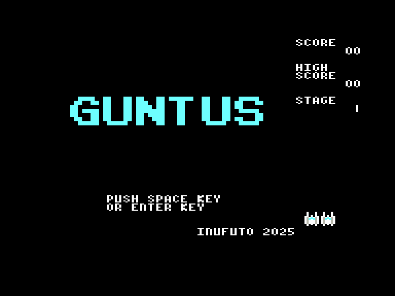
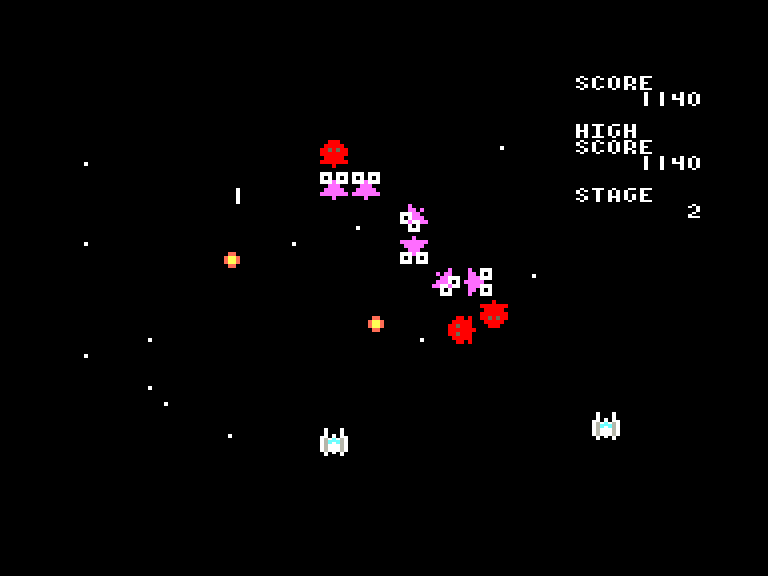
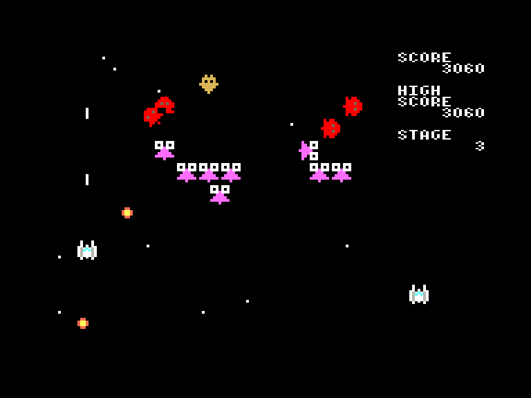
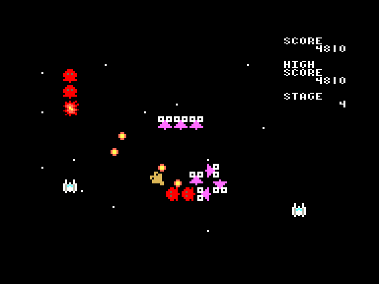

# Guntus

 
 
 

Жанр: аркада, скроллшутер  
Кількість гравців: 1  
Мова гри: англійська  

## Опис

Метою гри є набрати якомога більше очок, знищуючи інопланетних ворогів. Вони збираються в групи поблизу верхньої частини екрана, а потім починають летіти у вашу сторону, стріляючи і намагаючись протаранити. Бонус з написом UP дає додаткове життя. Гра закінчується, коли зіб'ють ваш останній винищувач.

Класичний геймплей у стилі Galaga

<iframe width="560" height="315" src="https://www.youtube.com/embed/8V-tL1hV1pM" title="YouTube video player" frameborder="0" allowfullscreen></iframe>

## Системні вимоги
### Мінімальні системні вимоги
Оперативна пам'ять: **64 КБ** (картридж-версія)  
Оперативна пам'ять: **128 КБ**  

## Керування та тонкощі запуску
### Елементи керування меню:

`Enter`/`Space`/`X`/`Z`: Почати гру  

### Основні [елементи керування](../controllers.md):
⌨ Клавіатура (`L`, `,`, `.`, `/`)  
🕹 Вбудований джойстик  

`Space`/`Z`: Вогонь

## Посилання

▶ [Easy Load&Play](https://t.me/EP128k_Load_n_Play/809) *(Telegram-канал Vibrant Waves)*  
💾 [Завантажити гру](http://www.ep128.hu/Ep_Games/Prg/Guntus.rar)  
📃 [Опис гри](http://www.ep128.hu/Games/Guntus.htm) (угорська)  
🏡 [Домашня сторінка гри](http://inufuto.web.fc2.com/8bit/guntus/#ep64)

## Автори
👨‍💻 Розробник: [Inufuto](../../peoples/community/inufuto.md)  
📅 Рік релізу: [2025](../release_years/2025.md)  