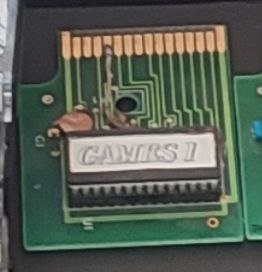
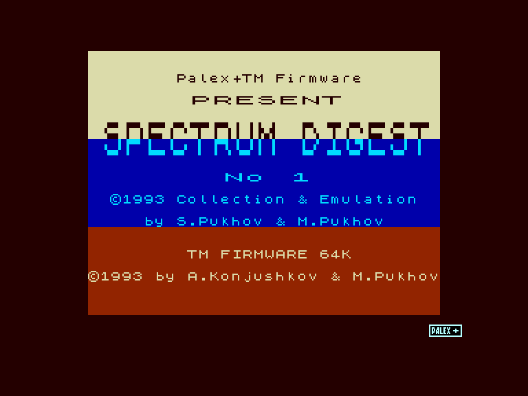
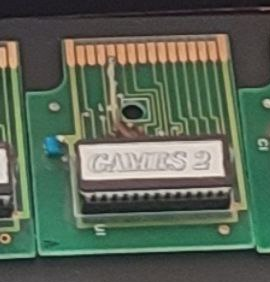
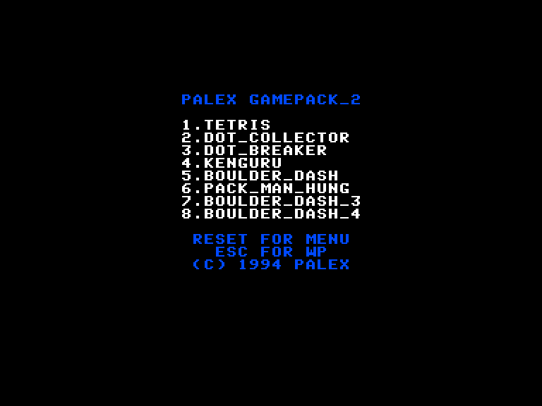
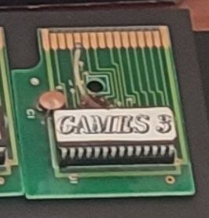
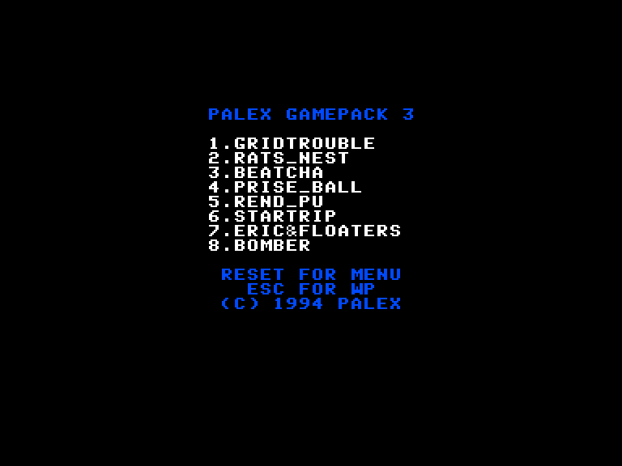

# Ігри на картріджах

Як відомо, Ентерпрайз має можливість запуску програм з картріджів, які вставляються в слот з лівого боку комп'ютера. Офіційно так і не було випущено ні однієї гри на даному носії (хоча **Cyrus Chess II** від Intelligent Software є готовим для релізу на картріджі), але користувачі та деякі фірми створювали самотужки такі пристрої. Через те що раніше на картріджах зазвичай були лише програми які потрібно було запускати вручну при потребі, то користувачі платформи перейняли таку практику і з ігровими картріджами. Хоча ніхто не заважає створити картрідж який буде автоматично запускати свій вміст при увімкнені комп'ютера.

Існуючі картріджі з іграми можна поділити на 2 категорії:

1. Код виконується безпосередньо з картріджу.
2. Картрідж додає в систему новий носій даних **ROM:** з спрощеною файловою системою ROMFS, на якому записані файли. Вони запускаються як і інші програми збережені на носіях даних - завантажуються в оперативну пам'ять і потім звідти запуcкаються.

Через те що різні ROM-файли були створені в різний час і різними методами вони використовують різні способи запуску, через що у непідготовленого користувача може виникнути плутанина. Нижче наведений перелік усіх ігор що можна записати на ПЗП картріджу, та метод їх запуску. На Ентерпрайзах 64 з EXOS 2.0 натискання **1** та команда `load "rom:*"` не працює.

Команди вказані для введення у Бейсіку. Якщо Бейсік відсутній, то у [WP](../software/st-wp.md) команди потрібно вводити трішки по-іншому:
 - команди типу `load "rom:HW2.COM"` - натиснути **F1** та ввести лише те що знаходиться у подвійних лапках: `rom:HW2.COM`.
 - команди типу `:game` - натиснути **F8** та ввести команду без двокрапки: `game`.

## Користувацькі збірки

| ROM                                                                         | Games                                                 | Loading                                                                                                                                                                                                                                                                                                                                                                                                                                                             | Minimal requirements |
| --------------------------------------------------------------------------- | ----------------------------------------------------- | ------------------------------------------------------------------------------------------------------------------------------------------------------------------------------------------------------------------------------------------------------------------------------------------------------------------------------------------------------------------------------------------------------------------------------------------------------------------- | ----------------------- |
| ALIEN8.ROM                                                                  | Alien 8 (ZX) TRN                                      | `:game`                                                                                                                                                                                                                                                                                                                                                                                                                                                             | EP128                   |
| alien_node.rom alien_node_corr.rom                                       | Alien 8 (CPC) Nodes of Yesod                       | Hold **1** at EP logo screen `load "rom:*"` `load "rom:alien8.com"` `load "rom:nodes.com"`                                                                                                                                                                                                                                                                                                                                                                 | EP64                    |
| Basic_Cartridge_Loading_Aid_10.rom                                          |                                                       |                                                                                                                                                                                                                                                                                                                                                                                                                                                                     |                         |
| BEACH.rom                                                                   | Beach Head                                            | `load "beach:"`                                                                                                                                                                                                                                                                                                                                                                                                                                                     | EP64                    |
| BEACHTRN.rom                                                                | Beach Head TRN                                        | `load "beach:"`                                                                                                                                                                                                                                                                                                                                                                                                                                                     | EP64                    |
| bouldash.rom bouldash_corr.rom bouldash_corr_corr.rom                 | Bouder Dash                                           | Hold **1** at EP logo screen `load "rom:*"` `load "rom:bouldash.com"`  and then select LVL file                                                                                                                                                                                                                                                                                                                                                            | EP64                    |
| BOULDER DASH.rom                                                            | Bouder Dash (ZX)                                      | Autostart                                                                                                                                                                                                                                                                                                                                                                                                                                                           | EP64                    |
| bricky1.rom bricky2.rom                                                  | BrickyPrise                                           | Hold **1** at EP logo screen `load "rom:*"` `load "rom:bricky.com"`                                                                                                                                                                                                                                                                                                                                                                                           | EP128                   |
| BRUCE.rom                                                                   | Bruce Lee                                             | `load "bruce:"`                                                                                                                                                                                                                                                                                                                                                                                                                                                     | EP64                    |
| BRUCE LEE(B).rom                                                            | Bruce Lee                                             | Autostart                                                                                                                                                                                                                                                                                                                                                                                                                                                           | EP64                    |
| BUZZSAW.rom                                                                 | Buzzsaw                                               | `:bzs`                                                                                                                                                                                                                                                                                                                                                                                                                                                              | EP64                    |
| CATACOMB.rom                                                                | Tombs of Doom (Catacomb)                              | Autostart                                                                                                                                                                                                                                                                                                                                                                                                                                                           | EP64                    |
| CYRUS.rom                                                                   | Cyrus Chess II                                        | `:cyrus`                                                                                                                                                                                                                                                                                                                                                                                                                                                            | EP64                    |
| DBREAK.rom                                                                  | Dot Breaker                                           | `load "dbreak:"`                                                                                                                                                                                                                                                                                                                                                                                                                                                    | EP64+EXOS2.1            |
| DIKTATOR.rom                                                                | Dictator (Hungary version)                            | `run "diktator:"` (IS-Basic required!)                                                                                                                                                                                                                                                                                                                                                                                                                              | EP128                   |
| EAT.rom                                                                     | Eat It Up                                             | `:eat`                                                                                                                                                                                                                                                                                                                                                                                                                                                              | EP64                    |
| eiu_hw2_bm.rom                                                              | Eat It Up Highway Encounter Batman              | `load "rom:eatitup.com"` `load "rom:hw2.com"` `load "rom:batman.com"`                                                                                                                                                                                                                                                                                                                                                                                         | EP64                    |
| exor_skram.rom                                                              | Exorcist Skramble                                  | Hold **1** at EP logo screen `load "rom:*"` `load "rom:exorcist.com"` `load "rom:skramble.com"`                                                                                                                                                                                                                                                                                                                                                            | EP128                   |
| GUN.ROM                                                                     | GunFright (ZX)                                        | `:game`                                                                                                                                                                                                                                                                                                                                                                                                                                                             | EP128                   |
| HAMIKA.rom                                                                  | Hamika                                                | `run "hamika:"` (IS-Basic required!)                                                                                                                                                                                                                                                                                                                                                                                                                                | EP64                    |
| HATTRICK.ROM                                                                | Team Hat Trick                                        | Hold **1** at EP logo screen `load "rom:*"` `load "rom:hattrick.com"`                                                                                                                                                                                                                                                                                                                                                                                         | EP64                    |
| HAVOC(B).rom                                                                | The Lands of Havoc ( ❗ didn't work properly)         | Autostart                                                                                                                                                                                                                                                                                                                                                                                                                                                           | EP64                    |
| HEA.rom                                                                     | Heathrow ATC                                           | `:hea`                                                                                                                                                                                                                                                                                                                                                                                                                                                              | EP64                    |
| HUNGARO\[128K].rom                                                          | F1 Hungaroring                                        | Autostart                                                                                                                                                                                                                                                                                                                                                                                                                                                           | EP128                   |
| IMPLOS(128K)\_Z.rom                                                         | Implosion                                             | Autostart                                                                                                                                                                                                                                                                                                                                                                                                                                                           | EP128                   |
| KNIG.ROM                                                                    | Knight Lore                                           | `:game`                                                                                                                                                                                                                                                                                                                                                                                                                                                             | EP128                   |
| MOZAIK\[128K]\(B).rom                                                       | Mozaik (❓Problematic)                                | Autostart                                                                                                                                                                                                                                                                                                                                                                                                                                                           | EP128                   |
| NETHER.ROM                                                                  | Nether Earth                                          | `:game`                                                                                                                                                                                                                                                                                                                                                                                                                                                             | EP128                   |
| NODES.rom                                                                   | Nodes of Yesod                                        | `load "nodes:"`                                                                                                                                                                                                                                                                                                                                                                                                                                                     | EP64                    |
| nodes-autorun.rom                                                           | Nodes of Yesod                                        | Autostart after EP logo screen                                                                                                                                                                                                                                                                                                                                                                                                                                      | EP64                    |
| NODESTRN.rom                                                                | Nodes of Yesod TRN                                    | `load "nodes:"`                                                                                                                                                                                                                                                                                                                                                                                                                                                     | EP64                    |
| PASIANS.rom                                                                 | Pasziansz Kaszino                                  | `:pa` `:ka`                                                                                                                                                                                                                                                                                                                                                                                                                                                      | EP128                   |
| PASZIANS.rom                                                                | Pasziansz Kaszino                                  | `:pa` `:ka`                                                                                                                                                                                                                                                                                                                                                                                                                                                      | EP128                   |
| quadrill_crill_tcave4k_atomix.rom quadrill_crill_tcave4k_atomix_corr.rom | Quadrillion Crillion Treasure Cave 4k Atomix | Hold **1** at EP logo screen `load "rom:*"` `load "rom:quad_4k.com"` to start **Quadrillion 4k** (EP64) `load "rom:quadrilm.com"` to start **Quadrillion** `load "rom:crillion.com"` to start **Crillion** `load "rom:crillio2.com"` to start **Crillion** (new levels) `load "rom:crilli93.com"` to start **Crillion93** 1993 ver `load "rom:tcave4k.com"` to start **Treasure Cave 4k**(EP64) `load "rom:atomix.com"` to start **Atomix** | EP64* EP128          |
| Quickload-Bomber-Cartridge.rom                                              |                                                       |                                                                                                                                                                                                                                                                                                                                                                                                                                                                     |                         |
| RAID.rom                                                                    | Raid over Moscow                                      | `load "raid:"`                                                                                                                                                                                                                                                                                                                                                                                                                                                      | EP64                    |
| RAIDTRN.rom                                                                 | Raid over Moscow TRN                                  | `load "raid:"`                                                                                                                                                                                                                                                                                                                                                                                                                                                      | EP64                    |
| rickdng2.rom                                                                | Rick Dangerous 2                                      | `load "rom:*"` `load "rom:rickdng2.com"`                                                                                                                                                                                                                                                                                                                                                                                                                         | EP128                   |
| SPACEBUB\[128K].rom                                                         | Space Bubble                                          | Autostart                                                                                                                                                                                                                                                                                                                                                                                                                                                           | EP128                   |
| SPECCIES1.rom                                                               | The Speccies                                          | Hold **1** at EP logo screen `load "rom:*"` `load "rom:speccies.com"`                                                                                                                                                                                                                                                                                                                                                                                         | EP128                   |
| SPECCIES2.rom                                                               | The Speccies 2                                        | Hold **1** at EP logo screen `load "rom:*"` `load "rom:species2.com"`                                                                                                                                                                                                                                                                                                                                                                                         | EP64                    |
| SPECCIES1-2.rom                                                             | The Speccies The Speccies 2                        | Hold **1** at EP logo screen `load "rom:*"` `load "rom:speccies.com"` `load "rom:species2.com"` (EP64)                                                                                                                                                                                                                                                                                                                                                     | EP64* EP128          |
| SSTRIKE.rom                                                                 | StarStrike 3D                                         | `load "sstrike:"`                                                                                                                                                                                                                                                                                                                                                                                                                                                   | EP64                    |
| StarSabre.rom                                                               | Star Sabre                                            | Hold **1** at EP logo screen `load "rom:*"` `load "rom:starsab.com"`                                                                                                                                                                                                                                                                                                                                                                                          | EP128                   |
| tcave_1.rom tcave_1_corr.rom                                             | Treasure Cave                                         | Hold **1** at EP logo screen `load "rom:*"` `load "rom:tcave.com"`                                                                                                                                                                                                                                                                                                                                                                                            | EP128                   |
| TETRISZ.rom                                                                 | Tetrisz                                               | `:te`                                                                                                                                                                                                                                                                                                                                                                                                                                                               | EP64+EXOS2.1            |
| TOMBS.rom                                                                   | Tombs of Doom (Catacomb)                              | `load "tombs:"`                                                                                                                                                                                                                                                                                                                                                                                                                                                     | EP64                    |
| VEXED.ROM                                                                   | Vexed                                               | Hold **1** at EP logo screen `load "rom:*"` `load "rom:vexed.com"`                                                                                                                                                                                                                                                                                                                                                                                          | EP64                   |
| WIZLAIR.rom                                                                 | Wizard's Lair                                         | `load "wizlair:"`                                                                                                                                                                                                                                                                                                                                                                                                                                                   | EP64                    |
| WRIG.rom                                                                    | Wriggler                                              | `:wrig`                                                                                                                                                                                                                                                                                                                                                                                                                                                             | EP64                    |
| xorgame.rom                                                                 | XORgame                                               | Hold **1** at EP logo screen `load "rom:*"` `load "rom:xorgame.com"`                                                                                                                                                                                                                                                                                                                                                                                          | EP128                   |
| YANGA.rom                                                                   | Yanga                                                 | Hold **1** at EP logo screen `load "rom:*"` `load "rom:yanga.com"`                                                                                                                                                                                                                                                                                                                                                                                            | EP128                   |

## Ігри від Inufuto

Ігри даного розробника запустяться на всіх моделях Ентерпрайзів.  
Гра запускається відразу після завершення процесу тестування пам'яті.  
[Домашня сторінка автора](http://inufuto.web.fc2.com/8bit/) (для доступу може знадобитись VPN)  

- [Aerial](a/sg-aerial.md)  
- [Antiair](a/sg-antiair.md)
- [Ascend](a/sg-ascend.md)
- AWASS
- [Battlot](b/sg-battlot.md)
- [Bootskell](b/sg-bootskell.md)
- [Cacorm](c/sg-cacorm.md)
- [Cavit](c/sg-cavit.md)
- [Cracky](c/sg-cracky.md)
- [Guntus](g/sg-guntus.md)
- [Hopman](h/sg-hopman.md)
- [Impetus](i/sg-impetus.md)
- Impetus Plus
- [Lift](l/sg-lift.md)
- [Mazy](m/sg-mazy.md)
- [Mazy 2](m/sg-mazy2.md)
- [Mieyen](m/sg-mieyen.md)
- [Neuras](n/sg-neuras.md)
- [Osotos](o/sg-osotos.md)
- [Ruptus](r/sg-ruptus.md)
- [Svellas](s/sg-svellas.md)
- SwordWork
- [Yewdow](y/sg-yewdow.md)

## Збірки фірми Palex ("Техника — молодёжи")

Зазвичай містять ігри портовані зі Спектрума, або інші невеликі ігри.  
Наразі відомо про три картріджа від даної фірми. 

Меню із списком ігор з'являється відразу після завершення процесу тестування пам'яті.

Більшість ігор запуститься лише на комп'ютерах з [EXOS](../software/ss-exos.md) версії 2.1 або вище.

### Spectrum Digest (GamePack 1)

 
 

Після запуску з'явиться стартовий екран, а потім будуть циклічно відображатись екрани завантаження ігор. Для запуску потрібної гри необхідно натиснути будь яку клавішу з **F1-F7** на відповідному екрані.  
**F8**: вихід у [WP](../software/st-wp.md)

- **Bzzzz** (EP64 та вище)
 - **Cookie** (EP64 з EXOS 2.1 та вище)
 - **Deathchase** (EP64 та вище)
 - **Enduro** (EP128 та вище)
 - **Harrier Attack!** (EP64 з EXOS 2.1 та вище)
 - **Jetpac** (EP64 з EXOS 2.1 та вище)
 - **Pssst** (EP64 з EXOS 2.1 та вище)

### GamePack 2

 
 

Після запуску з'явиться меню. Для запуску потрібної гри необхідно натиснути відповідну клавішу з **1-8**.  
**Esc**: вихід у [WP](../software/st-wp.md)

1. **Tetris** (**Enter-Stack**) (EP128 та вище)
2. **Dot Collector** (EP64 з EXOS 2.1 та вище)
3. **Dot Breaker** (EP64 з EXOS 2.1 та вище)
4. **Kenguru** (EP64 та вище)
5. **Boulder Dash (ZX)** (EP128 та вище)
6. **Packman (TVC)** (EP64 та вище)
7. **Boulder Dash 3 (ZX)** (EP128 та вище)
8. **Boulder Dash 4 (Roy Ferry) (ZX)** (EP128 та вище)

### GamePack 3

 
 

Після запуску з'явиться меню. Для запуску потрібної гри необхідно натиснути відповідну клавішу з **1-8**.  
**Esc**: вихід у [WP](../software/st-wp.md)

1. **GridTrouble** (EP64 з EXOS 2.1 та вище)
2. **Rats Nest** (EP64 з EXOS 2.1 та вище) 
3. **Beatcha** (EP64 та вище)
4. **Prise-ball** (EP64 з EXOS 2.1 та вище) 
5. **Rendező Pályaudvar** (EP64 та вище)
6. **Star Trip** (EP128 та вище)
7. **Eric and the Floaters** (EP128 та вище)
8. **Bomber** (EP128 та вище)

# Інші ROM-версії iгор

Ігри розміром більше **64 КБ** неможливо записати на картрідж. Але деякі апаратні розширення що під'єднуються до роз'єму системнії шини розширення дозволяють записувати/або встановлювати додаткову ROM-пам'ять. У 90-ті це були неофіційні карти EXDOS, а в наші роки це дозволяють EXDOS-карта від Pear та пристрої від TMTNet (Symbiface 3, RSF3).

Серед таких ігор є наступні:

- **Los Amores de Brunilda**
- **The Sword of Ianna**

ПЗП-версії цих ігор не потребують додаткової оперативної пам'яті.

# Архів ROM-версій ігор

[Пакунок з усіма іграми для запису на ПЗП](https://drive.google.com/file/d/1UAPUEmF3zqhM3pew-tGReSKirbaO_6Dg/view?usp=drive_link)

Розсортовані по окремих текам в залежності від типу запуску. При потребі, частину з них можна об'єднувати для запису декількох на один чіп більшого розміру, але вони повинні бути без автостарту та мати різний тип запуску. Тому файли в папці **ROMFS** не можна поєднувати між собою, але можна об'єднати з іншою. Також вважайте, що деякі файли мають розмір не кратний 16КБ. Перед об'єднанням (чи записом) їх потрібно буде доповнити нульовими байтами до кратного розміру (**16384**, **32768**, **49152**, **65536**).

# Як створити власну ROM-версію

В матеріалах Enterprise Computers, які врятував Вернер Лінднер, була виявлений прототип ПЗП із файловою системою ROMFS, яка дозволяє використовувати картрідж як ще один носій даних з якого можна завантажувати програми. На цій основі ентузіасти створили її розширену версію, яка дозволяла використовувати всі 4 сегменти пам'яті та можливість самотужки створювати власні збірки.

> [!NOTE]
> todo