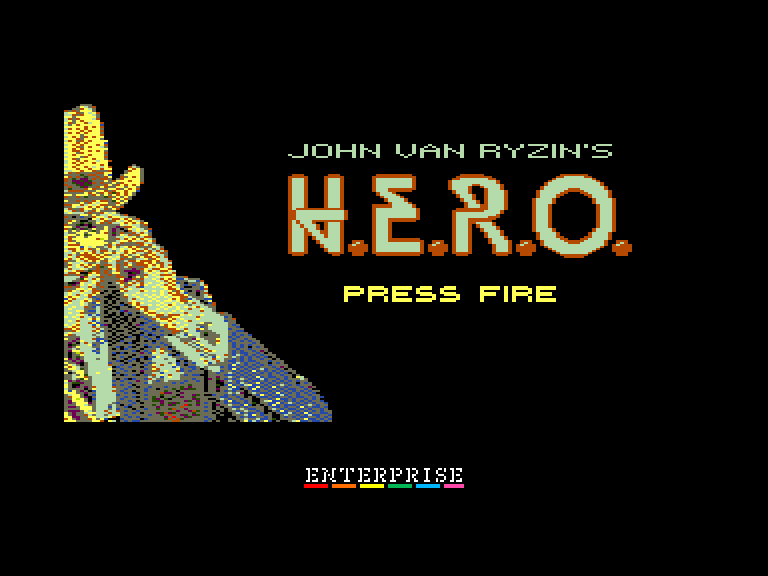
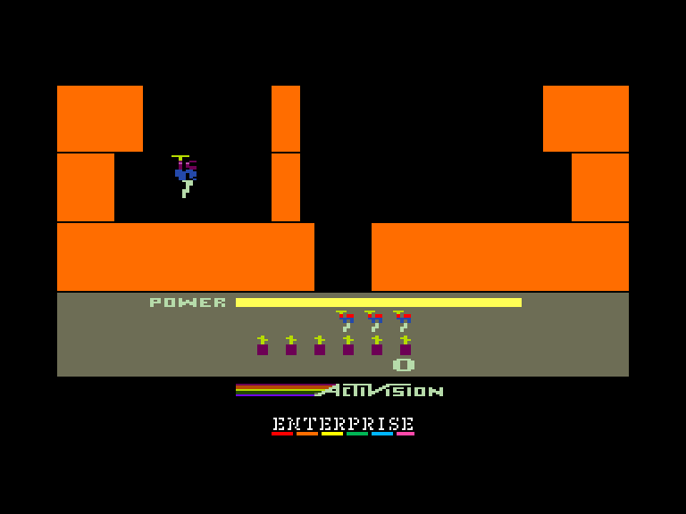
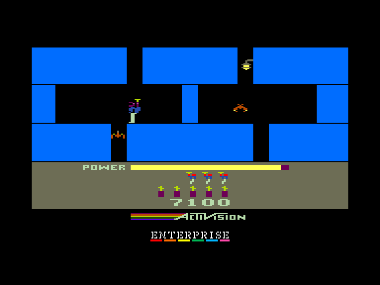
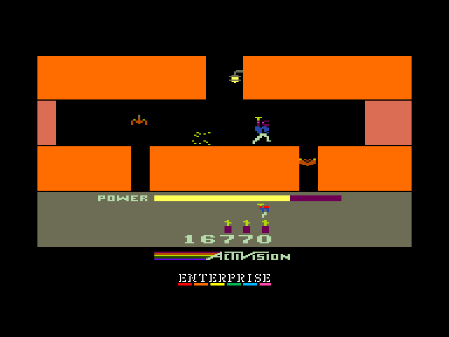

[0-9](../0/games-0.md) - [A](../a/games-a.md) - [B](../b/games-b.md) - [C](../c/games-c.md) - [D](../d/games-d.md) - [E](../e/games-e.md) - [F](../f/games-f.md) - [G](../g/games-g.md) - [H](../h/games-h.md) - [I](../i/games-i.md) - [J](../j/games-j.md) - [K](../k/games-k.md) - [L](../l/games-l.md) - [M](../m/games-m.md) - [N](../n/games-n.md) - [O](../o/games-o.md) - [P](../p/games-p.md) - [Q](../q/games-q.md) - [R](../r/games-r.md) - [S](../s/games-s.md) - [T](../t/games-t.md) - [U](../u/games-u.md) - [V](../v/games-v.md) - [W](../w/games-w.md) - [X](../x/games-x.md) - [Y](../y/games-y.md) - [Z](../z/games-z.md)

Ігри для [Enterprise 64k](../games-ep64.md) - [Enterprise 128k+RAMexp](../games-epramexp.md)

Ігри для систем [IS-DOS](../games-is-dos.md) - [SymbOS](../games-symbos.md) - [EDC Windows](../games-edcw.md)

Ігри для емуляторів [ZX Spectrum 48k/128k](../zxemu/games-zxemu.md) - [Amstrad CPC](../cpcemu/games-cpc.md) - [Sinclair ZX81](../zx81emu/games-zx81.md) - [Videoton TVC](../tvcemu/games-tvc.md) - [Commodore VIC-20](../vic20emu/games-vic20.md)

----------

# H.E.R.O.

**Альтернативні назви:**
 - Helicopter Emergency Rescue Operation

**ID:** h-e-r-o-cpc

## Скріншоти

## Опис

(temporary description generated by AI [Assistant])

**Опис гри H.E.R.O.**

H.E.R.O. — це класична гра, спочатку випущена у 1984 році, яка тепер доступна в адаптації для Amstrad CPC. Гравці беруть на себе роль героя, який повинен рятувати людей з небезпечних ситуацій, використовуючи різні інструменти, такі як динаміт. Гра пропонує кілька рівнів складності та захоплюючу графіку, адаптовану під можливості CPC.

**Правила гри:**
1. Після завантаження гри натисніть клавішу SPACE, щоб зупинити музику.
2. Для початку гри натисніть кнопку "вогонь" на джойстику EXT 1 або клавішу 'ALT'.
3. Використовуйте джойстик для вибору рівня складності (від 1 до 5), який визначає, з якого рівня почнеться гра.
4. Натисніть 'ESC', щоб вийти з гри.
5. На екрані 'CHEATS' ви можете запросити безсмертя або безкінечний динаміт.
6. Якщо граєте на Ep 64, натискайте 'Y' для активації чітів, оскільки питання не з'являється.

Гра H.E.R.O. забезпечує захоплюючий ігровий досвід, повертаючи гравців до класичних часів аркадних ігор.

## Основна інформація
- **Оригінальна платформа:** Amstrad CPC
### Загальні системні вимоги
- **Апаратні:** EP64, EP128

## Посилання
- [Опис гри на ep128.hu (угорською)](http://www.ep128.hu/Ep_Games/Leiras/HERO.htm)
- [Інформація про оригінальну версію](https://www.cpc-power.com/index.php?page=detail&num=3188)
- [Завантажити гру](http://www.ep128.hu/Ep_Games/Prg/HERO_CPC.rar)
- [Easy Load&Play](https://t.me/EP128k_Load_n_Play/375) *(Telegram-канал Vibrant Waves)*

## Відео

<iframe src="https://www.youtube.com/embed/JyXqu6oJpSo"  
style="width:75%; aspect-ratio:16/9;" allowfullscreen></iframe>

- [Відео](https://youtu.be/a9G5b2YzAc0)

