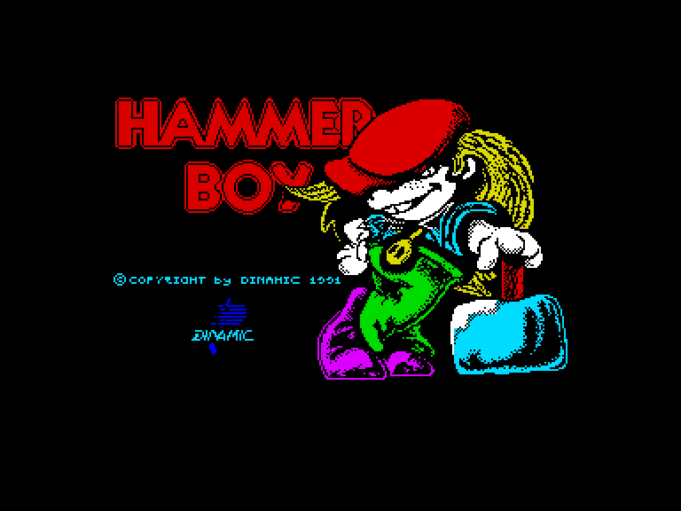
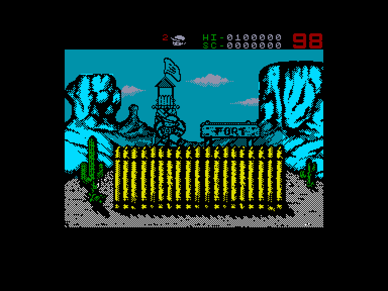
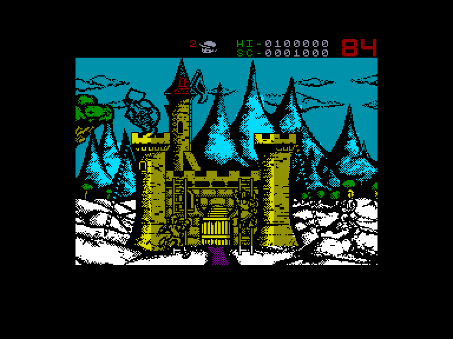
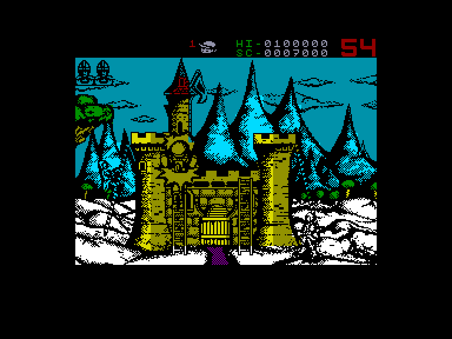

[0-9](../0/games-0.md) - [A](../a/games-a.md) - [B](../b/games-b.md) - [C](../c/games-c.md) - [D](../d/games-d.md) - [E](../e/games-e.md) - [F](../f/games-f.md) - [G](../g/games-g.md) - [H](../h/games-h.md) - [I](../i/games-i.md) - [J](../j/games-j.md) - [K](../k/games-k.md) - [L](../l/games-l.md) - [M](../m/games-m.md) - [N](../n/games-n.md) - [O](../o/games-o.md) - [P](../p/games-p.md) - [Q](../q/games-q.md) - [R](../r/games-r.md) - [S](../s/games-s.md) - [T](../t/games-t.md) - [U](../u/games-u.md) - [V](../v/games-v.md) - [W](../w/games-w.md) - [X](../x/games-x.md) - [Y](../y/games-y.md) - [Z](../z/games-z.md)

Ігри для [Enterprise 64k](../games-ep64.md) - [Enterprise 128k+RAMexp](../games-epramexp.md)

Ігри для систем [IS-DOS](../games-is-dos.md) - [SymbOS](../games-symbos.md) - [EDC Windows](../games-edcw.md)

Ігри для емуляторів [ZX Spectrum 48k/128k](../zxemu/games-zxemu.md) - [Amstrad CPC](../cpcemu/games-cpc.md) - [Sinclair ZX81](../zx81emu/games-zx81.md) - [Videoton TVC](../tvcemu/games-tvc.md) - [Commodore VIC-20](../vic20emu/games-vic20.md)

----------

# Hammer Boy

**ID:** hammer-boy-zx

## Скріншоти

## Опис

(temporary description generated by AI [ChatGPT])

**Опис гри: Hammer Boy 1-2**

Hammer Boy - це захоплююча аркадна гра, випущена в 1991 році, де гравець повинен захищати свою фортецю від натиску ворогів. Гра має дві частини, які відрізняються лише графікою та музикою. Ваше завдання - відбити атаки ворогів, які намагаються залізти на стіни вашої фортеці, використовуючи великий молот для їх скидання. Вам також потрібно гасити запальні снаряди, перш ніж вони вибухнуть. Гра вимагає швидкості та уважності, оскільки вороги атакують з обох сторін одночасно.

**Правила гри:**
1. Захищайте свою фортецю від ворогів, які намагаються залізти на стіни.
2. Використовуйте молот, щоб скинути ворогів з фортеці.
3. Гасіть запальні снаряди до їх вибуху.
4. Якщо третій снаряд вибухне або третій ворог потрапить у фортецю, ви програєте.
5. Гра триває до моменту, поки не закінчиться відведений час, що відображається на екрані.

Удачі у грі та не забувайте про свою фортецю!

## Основна інформація
- **Оригінальна платформа:** ZX Spectrum

## Посилання
- [Опис гри на ep128.hu (угорською)](http://www.ep128.hu/Games/Hammer_Boy.htm)
- [Інформація про оригінальну версію](https://spectrumcomputing.co.uk/entry/2216/ZX-Spectrum/Hammer_Boy)
- [Завантажити гру](http://www.ep128.hu/Ep_Games/Prg/Hammerboy_1.rar)
- [Завантажити гру](http://www.ep128.hu/Ep_Games/Prg/Hammerboy_2.rar)

**Дата генерації:** 28.07.2026

