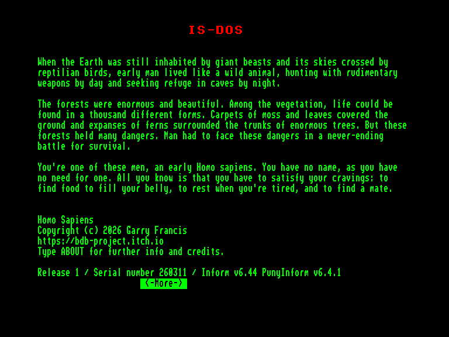
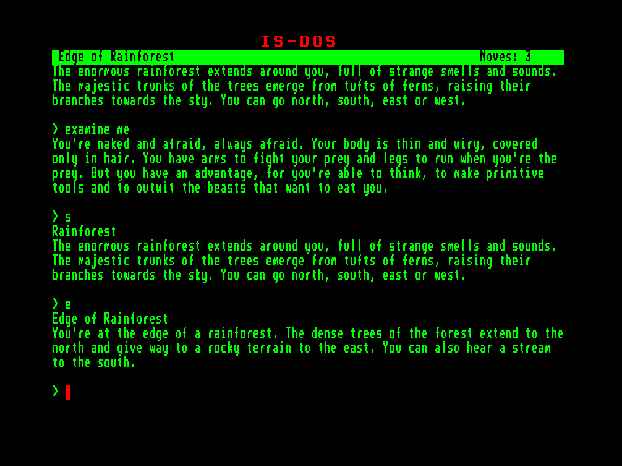
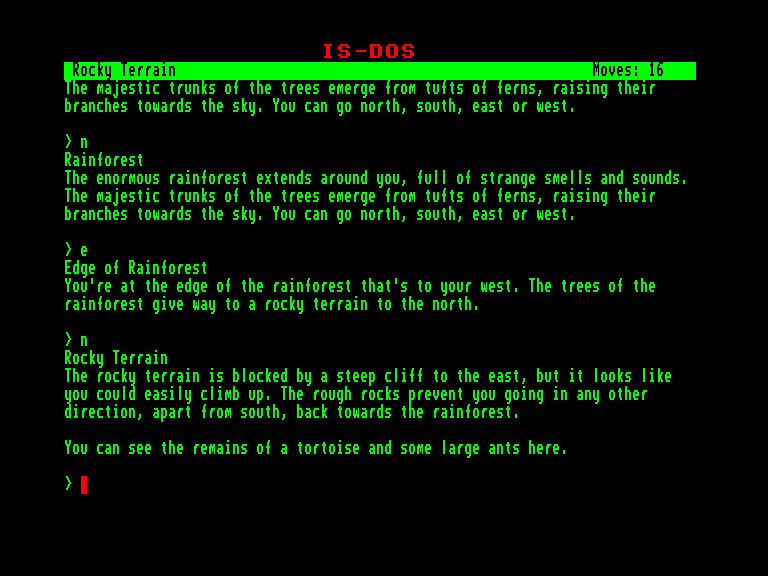
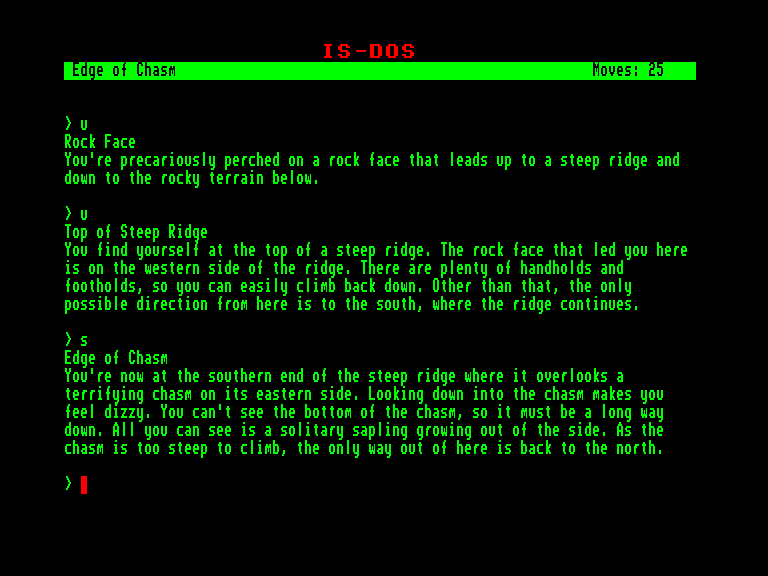

[0-9](../0/games-0.md) - [A](../a/games-a.md) - [B](../b/games-b.md) - [C](../c/games-c.md) - [D](../d/games-d.md) - [E](../e/games-e.md) - [F](../f/games-f.md) - [G](../g/games-g.md) - [H](../h/games-h.md) - [I](../i/games-i.md) - [J](../j/games-j.md) - [K](../k/games-k.md) - [L](../l/games-l.md) - [M](../m/games-m.md) - [N](../n/games-n.md) - [O](../o/games-o.md) - [P](../p/games-p.md) - [Q](../q/games-q.md) - [R](../r/games-r.md) - [S](../s/games-s.md) - [T](../t/games-t.md) - [U](../u/games-u.md) - [V](../v/games-v.md) - [W](../w/games-w.md) - [X](../x/games-x.md) - [Y](../y/games-y.md) - [Z](../z/games-z.md)

Ігри для [Enterprise 64k](../games-ep64.md) - [Enterprise 128k+RAMexp](../games-epramexp.md)

Ігри для систем [IS-DOS](../games-is-dos.md) - [SymbOS](../games-symbos.md) - [EDC Windows](../games-edcw.md)

Ігри для емуляторів [ZX Spectrum 48k/128k](../zxemu/games-zxemu.md) - [Amstrad CPC](../cpcemu/games-cpc.md) - [Sinclair ZX81](../zx81emu/games-zx81.md) - [Videoton TVC](../tvcemu/games-tvc.md) - [Commodore VIC-20](../vic20emu/games-vic20.md)

----------

# Homo Sapiens

**ID:** homo-sapiens-zcode

**Жанри:** Текстова пригода

## Примітка

Approved adaptation of the Italian adventure Antropos: Homo Sapiens

## Скріншоти

## Опис

Давним-давно, коли Землею ще блукали гігантські створіння, а її небо розтинали стародавні крилаті ящери, ми, первісні люди, жили первісним життям. Ми здобували їжу за допомогою грубих знарядь вдень і ховалися в безпечних печерах вночі.

Ліси тоді були безкраїми та мальовничими. Серед буйної зелені вирувало життя в тисячах форм. Густі килими моху та листя встеляли землю, а розлогі зарості папороті обступали стовбури старезних велетнів. Та ці праліси крили в собі безліч небезпек. Нам доводилося стикатися з ними у безперервній боротьбі за своє існування.

Ти – один із нас, представник найдавнішого людства. Ти безіменний, бо ім'я тоді не мало значення. Єдине, що ти усвідомлюєш – це необхідність задовольняти свої найпростіші інстинкти: добувати їжу, щоб втамувати голод, шукати спокій, коли виснаження бере своє, і відшукати собі супутника, щоб продовжити рід.

## Основна інформація
- **Мови:** Англійська
### Загальні системні вимоги
- **Апаратні:** EXDOS
- **Програмні:** IS-DOS
### Геймплей
- **Керування:** Keyboard
- **Кількість гравців:** 1 player
- **Додаткові теги:** Z-code
### Розробка
- **Рік випуску:** 2026
- **Автор:** Garry Francis

## Посилання
- [Домашня сторінка гри](https://bdb-project.itch.io/homo-sapiens)
- [Інформація про гру (SolutionArchive.com)](https://www.solutionarchive.com/game/id%2C10958/Homo+Sapiens.html)

