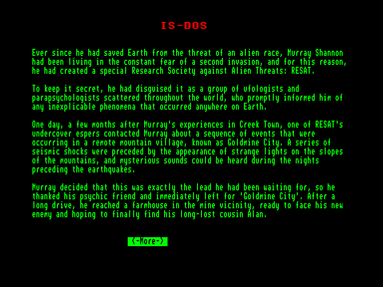
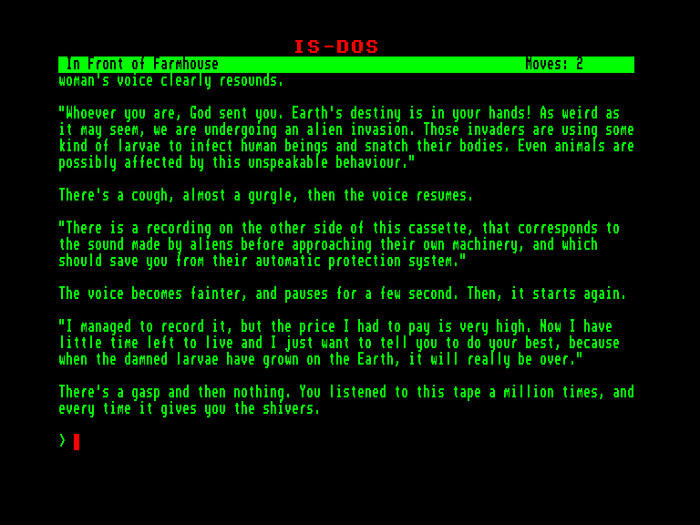
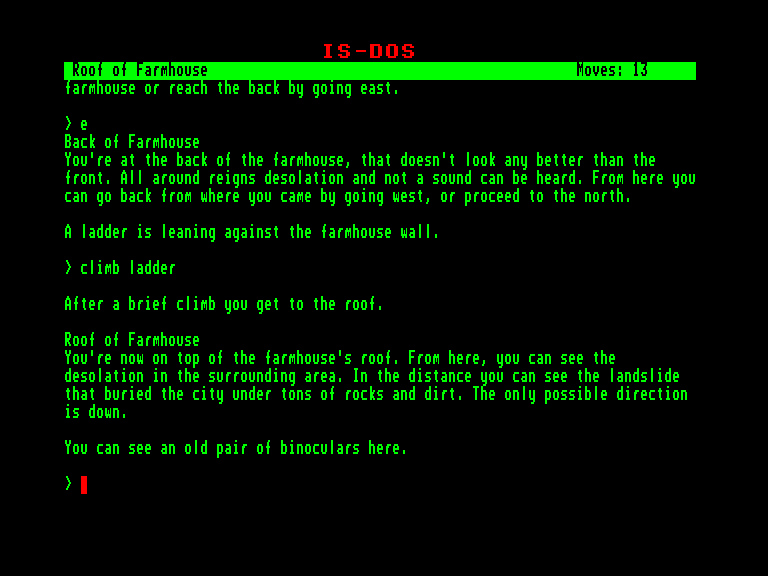
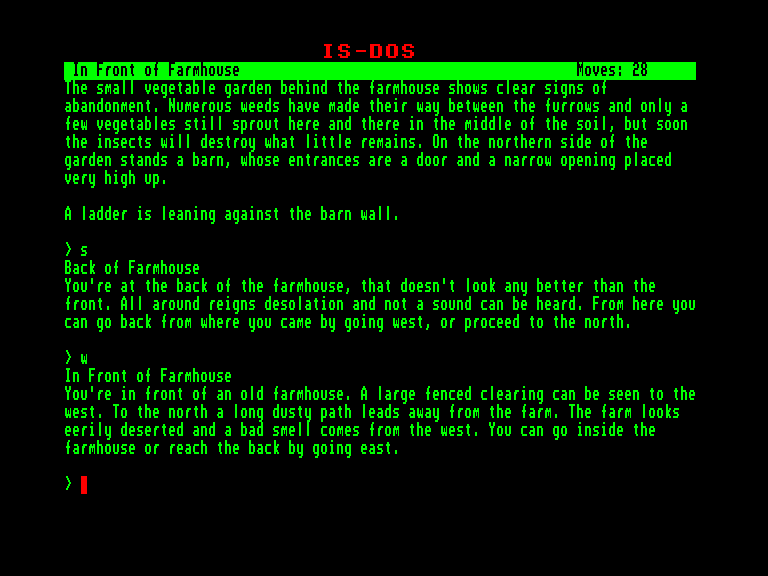

[0-9](../0/games-0.md) - [A](../a/games-a.md) - [B](../b/games-b.md) - [C](../c/games-c.md) - [D](../d/games-d.md) - [E](../e/games-e.md) - [F](../f/games-f.md) - [G](../g/games-g.md) - [H](../h/games-h.md) - [I](../i/games-i.md) - [J](../j/games-j.md) - [K](../k/games-k.md) - [L](../l/games-l.md) - [M](../m/games-m.md) - [N](../n/games-n.md) - [O](../o/games-o.md) - [P](../p/games-p.md) - [Q](../q/games-q.md) - [R](../r/games-r.md) - [S](../s/games-s.md) - [T](../t/games-t.md) - [U](../u/games-u.md) - [V](../v/games-v.md) - [W](../w/games-w.md) - [X](../x/games-x.md) - [Y](../y/games-y.md) - [Z](../z/games-z.md)

Ігри для [Enterprise 64k](../games-ep64.md) - [Enterprise 128k+RAMexp](../games-epramexp.md)

Ігри для систем [IS-DOS](../games-is-dos.md) - [SymbOS](../games-symbos.md) - [EDC Windows](../games-edcw.md)

Ігри для емуляторів [ZX Spectrum 48k/128k](../zxemu/games-zxemu.md) - [Amstrad CPC](../cpcemu/games-cpc.md) - [Sinclair ZX81](../zx81emu/games-zx81.md) - [Videoton TVC](../tvcemu/games-tvc.md) - [Commodore VIC-20](../vic20emu/games-vic20.md)

----------

# The Horror of Goldmine City

**ID:** horror-of-goldmine-city-zcode

**Жанри:** Текстова пригода

## Примітка

Approved adaptation of the Italian adventure Murray Shannon: L'Orrore di Goldmine City

## Скріншоти

## Опис

З того часу, як Мюррей Шеннон врятував нашу планету від прибульців, він ні на мить не забував про можливе повторне вторгнення. Цей постійний страх і спонукав його заснувати Дослідницьке товариство проти інопланетних загроз, або скорочено RESAT.

Щоб усе це тримати в секреті, він видав свою організацію за спільноту уфологів та людей з екстрасенсорними здібностями, які були розкидані по всіх куточках світу. Вони мали швидко доповідати йому про будь-які дивні чи незрозумілі речі, що відбувалися на планеті.

Через кілька місяців після того, як Мюррей пережив жахливі події в Крік-Тауні, з ним зв'язався один із його прихованих агентів RESAT з особливими здібностями. Він повідомив про низку дивних інцидентів, що трапилися у віддаленому гірському селищі, відомому під назвою Золота Шахта. Цим землетрусам передували незвичайні світла, що з'являлися на гірських схилах, а ще вночі, перед самими поштовхами, було чути якісь загадкові звуки.

Мюррей одразу зрозумів: це саме той знак, на який він так довго чекав. Він подякував своєму другові з екстрасенсорними здібностями і негайно рушив до Золотої Шахти. Після довгої і виснажливої дороги він дістався старої ферми неподалік шахти. Мюррей був готовий до зустрічі з новим супротивником і дуже сподівався, що нарешті знайде свого двоюрідного брата Алана, якого вважав давно втраченим.

## Основна інформація
- **Мови:** Англійська
### Загальні системні вимоги
- **Апаратні:** EXDOS
- **Програмні:** IS-DOS
### Геймплей
- **Керування:** Keyboard
- **Кількість гравців:** 1 player
- **Додаткові теги:** Z-code
### Розробка
- **Рік випуску:** 2026
- **Автор:** Gianluca Girelli, Garry Francis

## Посилання
- [Домашня сторінка гри](https://bdb-project.itch.io/horror-of-goldmine-city)
- [Інформація про гру (SolutionArchive.com)](https://www.solutionarchive.com/game/id%2C10947/Horror+of+Goldmine+City%2C+The.html)

