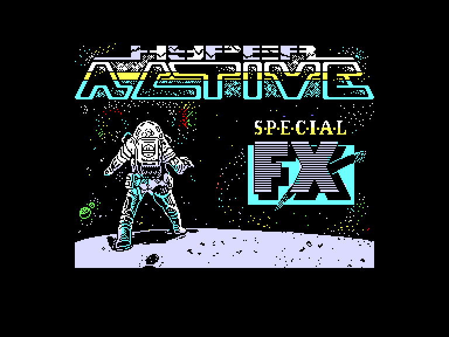
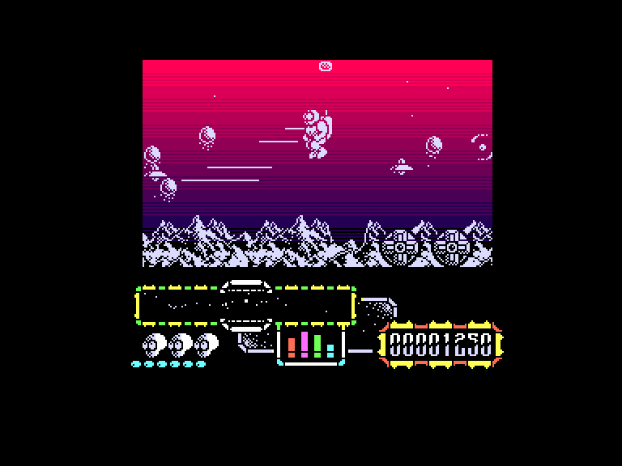
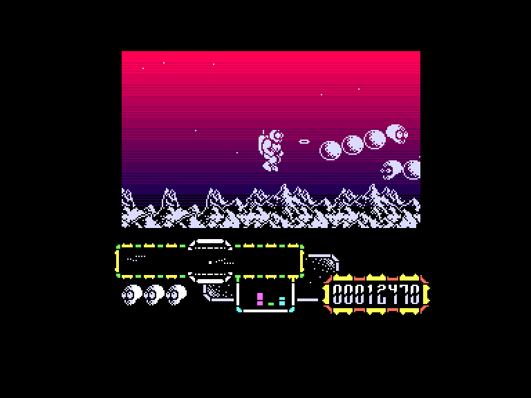
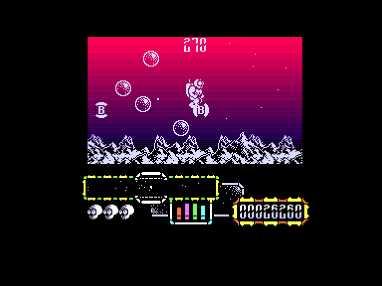

[0-9](../0/games-0.md) - [A](../a/games-a.md) - [B](../b/games-b.md) - [C](../c/games-c.md) - [D](../d/games-d.md) - [E](../e/games-e.md) - [F](../f/games-f.md) - [G](../g/games-g.md) - [H](../h/games-h.md) - [I](../i/games-i.md) - [J](../j/games-j.md) - [K](../k/games-k.md) - [L](../l/games-l.md) - [M](../m/games-m.md) - [N](../n/games-n.md) - [O](../o/games-o.md) - [P](../p/games-p.md) - [Q](../q/games-q.md) - [R](../r/games-r.md) - [S](../s/games-s.md) - [T](../t/games-t.md) - [U](../u/games-u.md) - [V](../v/games-v.md) - [W](../w/games-w.md) - [X](../x/games-x.md) - [Y](../y/games-y.md) - [Z](../z/games-z.md)

Ігри для [Enterprise 64k](../games-ep64.md) - [Enterprise 128k+RAMexp](../games-epramexp.md)

Ігри для систем [IS-DOS](../games-is-dos.md) - [SymbOS](../games-symbos.md) - [EDC Windows](../games-edcw.md)

Ігри для емуляторів [ZX Spectrum 48k/128k](../zxemu/games-zxemu.md) - [Amstrad CPC](../cpcemu/games-cpc.md) - [Sinclair ZX81](../zx81emu/games-zx81.md) - [Videoton TVC](../tvcemu/games-tvc.md) - [Commodore VIC-20](../vic20emu/games-vic20.md)

----------

# Hyper Active

**ID:** hyper-active-zx

**Жанри:** Аркада, Екшн

## Примітка

ℹ Сучасна неофіційна конверсія з платформи ZX Spectrum.

## Скріншоти

## Опис

Ваш герой у скафандрі опинився в пастці на крихітному нестабільному астероїді. Щоб вижити, ви повинні знайти сферичні енергетичні капсули і повернути їх до сховищ у центрі астероїда.

## Основна інформація
- **Мови:** Англійська
- **Оригінальна платформа:** ZX Spectrum
### Загальні системні вимоги
- **Апаратні:** EP64, EP128
### Геймплей
- **Керування:** Keyboard, Internal Joy, External Joy 1, External Joy 2
- **Кількість гравців:** 1 player
- **Додаткові теги:** Attribute mode
### Розробка
- **Рік випуску:** 1988
- **Автор:** Jonathan M. Smith, Charles Davies, Keith Tinman
- **Компанія:** Special FX Software Ltd

## Посилання
- [Опис гри на ep128.hu (угорською)](http://www.ep128.hu/Games/Hyper_Active.htm)
- [Тема на форумі enterpriseforever](https://enterpriseforever.com/spectrum-rol/hyperactive/)
- [Інформація про оригінальну версію](https://spectrumcomputing.co.uk/entry/2413/ZX-Spectrum/Hyper_Active)
- [Завантажити гру](http://www.ep128.hu/Ep_Games/Prg/Hyper_Active.rar)
- [Easy Load&Play](https://t.me/EP128k_Load_n_Play/738) *(Telegram-канал Vibrant Waves)*

## Відео

<iframe src="https://www.youtube.com/embed/DDGrmMSlA0s"  
style="width:75%; aspect-ratio:16/9;" allowfullscreen></iframe>

## [Керування](../controllers.md)

`Keyboard`: `Q`, `A`, `O`, `P`, `M` (можливість перевизначення)  
`Internal Joystick` + `Alt`/`0` (можливість перевизначення)  
`External Joystick 1`  
`External Joystick 2`  

`Space`: Призупинити гру

## Детальна інформація

### Системні вимоги  

#### Мінімальні системні вимоги  

Оперативна пам'ять: **64 КБ**  

### Рекомендовані системні вимоги  

Оперативна пам'ять: **128 КБ (або більше)**  

### Геймплей  

Підлітайте до капсул, і вони почнуть кружляти навколо вас; поверніться до сховища і закиньте капсулу в нього. Потім вирушайте за наступною.  

Використовуйте сканер внизу екрана, щоб знайти капсули. Коли ви зберете всі вісім, знищіть решту прибульців, щоб завершити рівень.  

Якщо ви будете надто довго чекати, до них приєднається самонавідна летюча тарілка, яка буде ще швидшою і злішою.  

Наступний рівень, Хвиля Драконів, містить чотири звивисті космічні змії, яких можна вбити лише численними вистрілами у голову.  

Третій рівень - це хвиля атаки, де все, що вам потрібно зробити, це знищити прибульців, уникаючи пошкоджень.  

На четвертому рівні, бонусній хвилі, ви повинні використовувати бомби, щоб знищити смертоносні бульбашки, збираючи при цьому якомога більше бонусних предметів за обмежений час.  

Після цього хвилі повторюються, з кожним разом стаючи все складнішими і складнішими.  

Отримані нами травми споживають нашу енергію, рівень якої позначається чотирма смужками, видимими під ігровим полем посередині. Коли всі чотири стовпці закінчуються, одне життя втрачається через брак енергії. Чотири стовпці енергії зліва направо: швидкий вогонь, щит, радар, енергія зброї. Так от, якщо одна з колонок зводиться до нуля, це впливає на вогневу міць нашої зброї або роботу радара!  

### Чіти  

(активація після завантаження гри)  
Безкінечна кількість життів (**Так**/**Ні**)