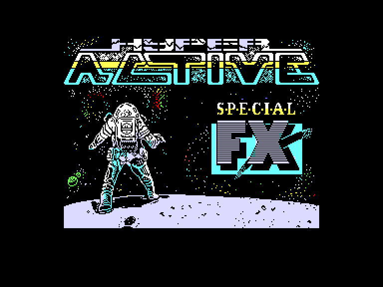
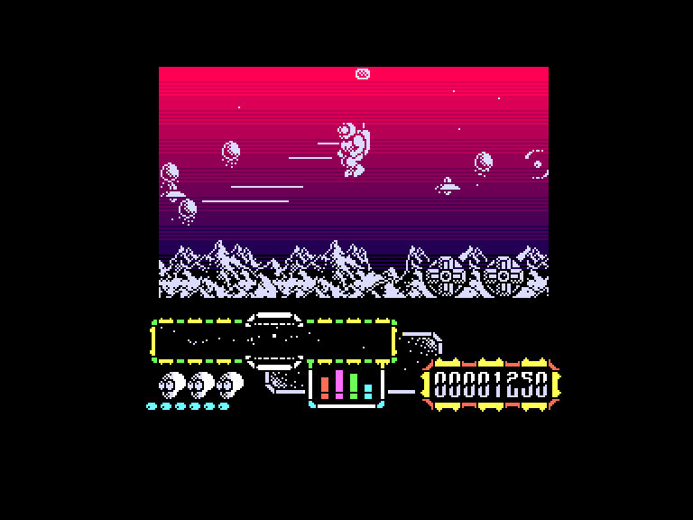
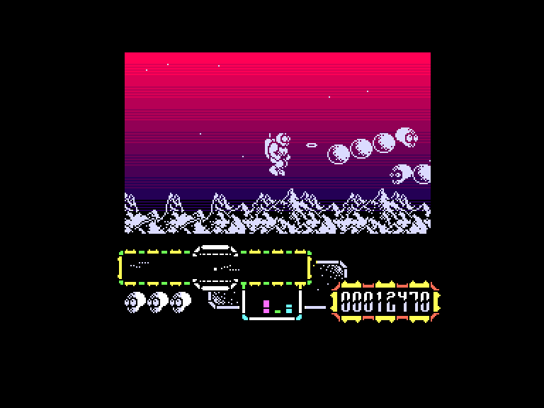
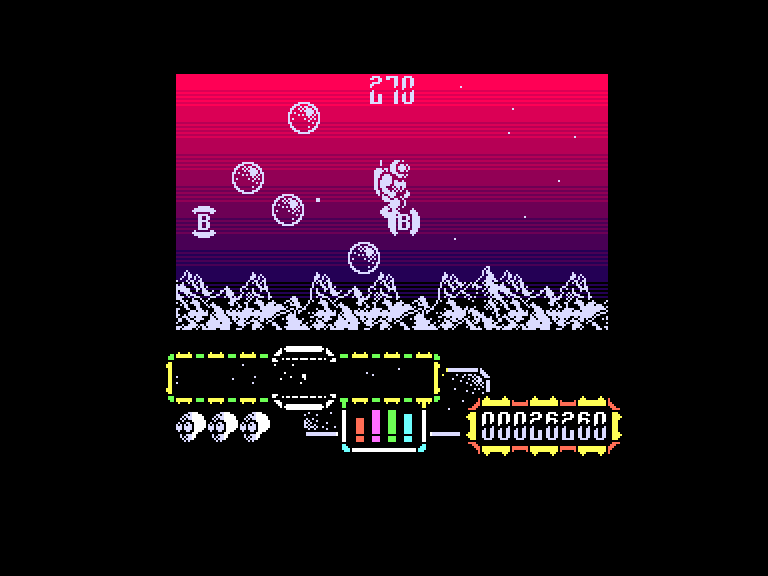

# Hyper Action

| | | | |
| --- | --- | --- | --- |
|||||

Жанр: аркада, Scrollshooter  
Кількість гравців: 1

## Опис

Ваш герой у скафандрі опинився в пастці на крихітному нестабільному астероїді. Щоб вижити, ви повинні знайти сферичні енергетичні капсули і повернути їх до сховищ у центрі астероїда. Підлітайте до капсул, і вони почнуть кружляти навколо вас; поверніться до сховища і закиньте капсулу в нього. Потім вирушайте за наступною.

Використовуйте сканер внизу екрана, щоб знайти капсули. Коли ви зберете всі вісім, знищіть решту прибульців, щоб завершити рівень.

Якщо ви будете надто довго чекати, до них приєднається самонавідна летюча тарілка, яка буде ще швидшою і злішою.

Наступний рівень, Хвиля Драконів, містить чотири звивисті космічні змії, яких можна вбити лише численними вистрілами у голову.

Третій рівень - це хвиля атаки, де все, що вам потрібно зробити, це знищити прибульців, уникаючи пошкоджень.

На четвертому рівні, бонусній хвилі, ви повинні використовувати бомби, щоб знищити смертоносні бульбашки, збираючи при цьому якомога більше бонусних предметів за обмежений час.

Після цього хвилі повторюються, з кожним разом стаючи все складнішими і складнішими.

Отримані нами травми споживають нашу енергію, рівень якої позначається чотирма смужками, видимими під ігровим полем посередині. Коли всі чотири стовпці закінчуються, одне життя втрачається через брак енергії. Чотири стовпці енергії зліва направо: швидкий вогонь, щит, радар, енергія зброї. Так от, якщо одна з колонок зводиться до нуля, це впливає на вогневу міць нашої зброї або роботу радара!

## Системні вимоги

|Мінімальні системні вимоги:|Рекомендовані системні вимоги:|
|---------------------------|------------------------------|
|Оперативна пам'ять: **64 КБ**|Оперативна пам'ять: **128 КБ (або більше)**|  

## Керування
### Основні [елементи керування](../controllers.md): 
⌨ Клавіатура (`Q`, `A`, `O`, `P`, `M`) (можливість перевизначення)  
🕹 Вбудований джойстик + `0` (можливість перевизначення)  
🎮 Зовнішній джойстик 1/2  

`Space`: Призупинити гру

## Чіт-коди та допомога у проходженні
### Активація після завантаження гри:
Безкінечна кількість життів (**Так**/**Ні**)

## Посилання

▶ [Easy Load&Play](https://t.me/EP128k_Load_n_Play/738) *(Telegram-канал Vibrant Waves)*  
💾 [Завантажити гру](http://www.ep128.hu/Ep_Games/Prg/Hyper_Active.rar)  
📃 [Опис гри](http://www.ep128.hu/Games/Hyper_Active.htm) (угорська)  
🗨 [Тема на форумі enterpriseforever.com](https://enterpriseforever.com/spectrum-rol/hyperactive/)  

## Автори
### Оригінальний реліз
🖥 Платформа: [ZX Spectrum](https://spectrumcomputing.co.uk/entry/2413/ZX-Spectrum/Hyper_Active)  
👨‍💻 Розробник: Special FX Software Ltd  
📅 Рік релізу: 1988  

### Версія гри для Enterprise
👨‍💻 Портування: [PJV](../../community/pjv.md)  
📅 Рік релізу: 2024