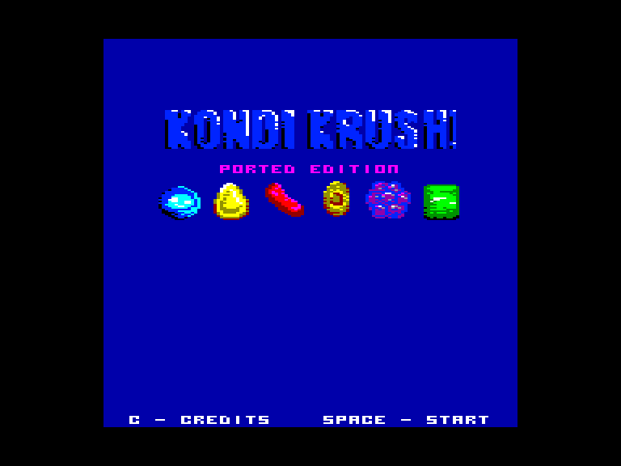
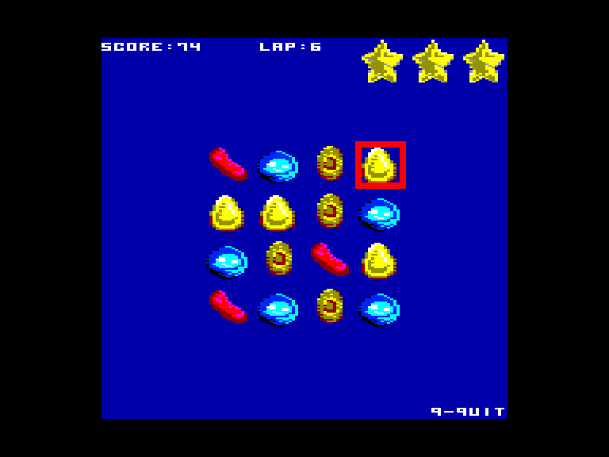
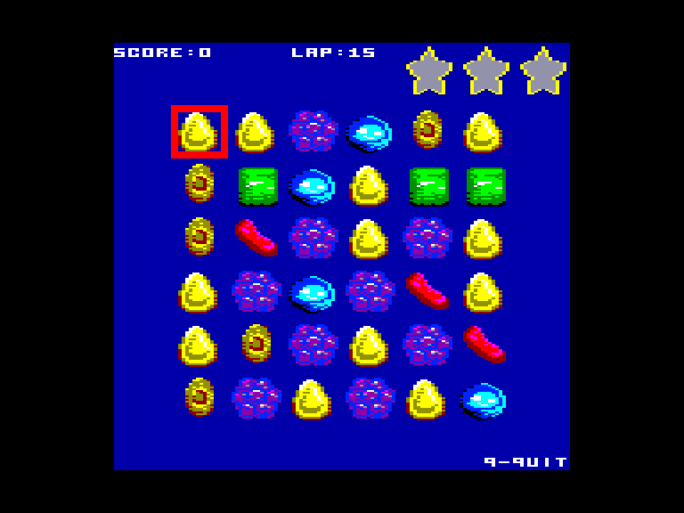
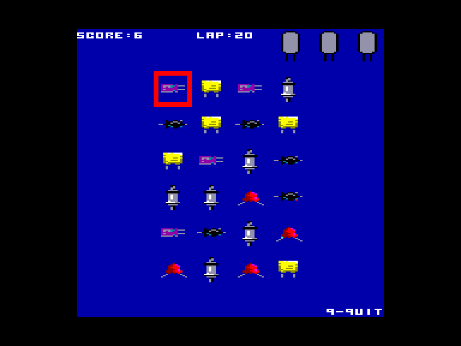

# Kondi Krush!

| | | | |
| --- | --- | --- | --- |
|||||

Жанр: три в ряд, тайм-кіллер  
Кількість гравців: 1

## Опис

Основний ігровий процес оснований на заміні двох сусідніх цукерок між кількома на ігровому полі, щоб утворити рядок або стовпець із принаймні трьох цукерок однакового кольору. Ціль гри — зібрати як можна більше очок за обмежену кількість переміщення елементів щоб отримати відповідну кількість зірок.

## Системні вимоги

|Мінімальні системні вимоги:|Рекомендовані системні вимоги:|
|---------------------------|------------------------------|
|Оперативна пам'ять: **128 КБ**|Оперативна пам'ять: **128 КБ (або більше)**|  

## Керування
### Основні [елементи керування](../controllers.md):
⌨ Клавіатура (`W`, `A`, `S`, `D`, `Space`)  
🕹 Вбудований джойстик  

### Додаткові клавіши:
`M`: перемикання між музикою та звуками  
`X` / `Q`: повернутись на попередній екран

`C`: показати інформацію про розробників *(на головному екрані)*  
`I`: показати інформацію про рівень *(на екрані вибору рівня)*

### Додаткова інформація:

На екрані з розробниками можна ввести секретні коди:
`CONDI`: змінити ігрові спрайти на зображення конденсаторів
`CANDY`: змінити ігрові спрайти на зображення цукерок

## Посилання

▶ [Easy Load&Play](https://t.me/EP128k_Load_n_Play/765) *(Telegram-канал Vibrant Waves)*  
💾 [Завантажити гру](https://downloads.anystone.games/kondikrush-enterprise-com)  
💾 [Завантажити гру](http://www.ep128.hu/Ep_Games/Prg/Kondi_Krush.rar)  

## Автори
### Оригінальний реліз
🖥 Платформа: [Videoton TVC](http://tvc.hu/html/k.html)  
👨‍💻 Програмісти: [Kis Róbert (AnyStone Games)](../../community/anystone.md)  
📅 Рік релізу: 2022  

### Версія гри для Enterprise
👨‍💻 Портування: [Kis Róbert (AnyStone Games)](../../community/anystone.md)  
📅 Рік релізу: 2025  