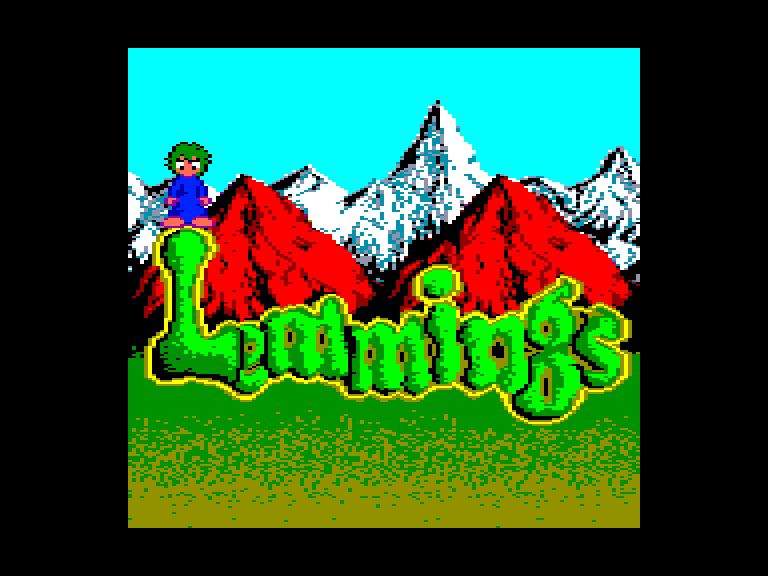
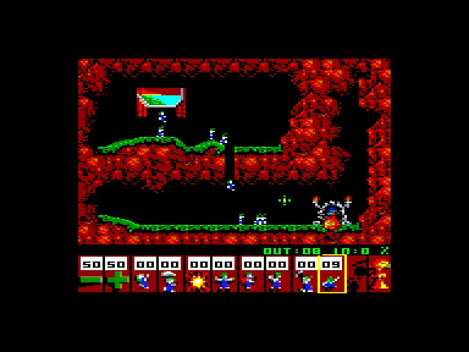
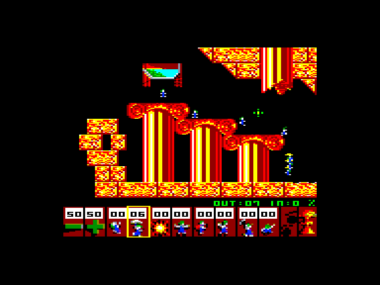
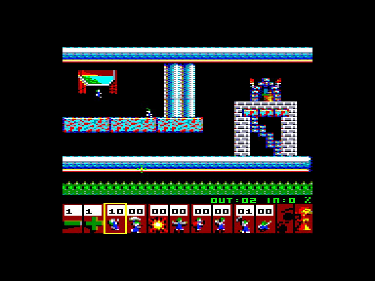

[0-9](../0/games-0.md) - [A](../a/games-a.md) - [B](../b/games-b.md) - [C](../c/games-c.md) - [D](../d/games-d.md) - [E](../e/games-e.md) - [F](../f/games-f.md) - [G](../g/games-g.md) - [H](../h/games-h.md) - [I](../i/games-i.md) - [J](../j/games-j.md) - [K](../k/games-k.md) - [L](../l/games-l.md) - [M](../m/games-m.md) - [N](../n/games-n.md) - [O](../o/games-o.md) - [P](../p/games-p.md) - [Q](../q/games-q.md) - [R](../r/games-r.md) - [S](../s/games-s.md) - [T](../t/games-t.md) - [U](../u/games-u.md) - [V](../v/games-v.md) - [W](../w/games-w.md) - [X](../x/games-x.md) - [Y](../y/games-y.md) - [Z](../z/games-z.md)

Ігри для [Enterprise 64k](../games-ep64.md) - [Enterprise 128k+RAMexp](../games-epramexp.md)

Ігри для систем [IS-DOS](../games-is-dos.md) - [SymbOS](../games-symbos.md) - [EDC Windows](../games-edcw.md)

Ігри для емуляторів [ZX Spectrum 48k/128k](../zxemu/games-zxemu.md) - [Amstrad CPC](../cpcemu/games-cpc.md) - [Sinclair ZX81](../zx81emu/games-zx81.md) - [Videoton TVC](../tvcemu/games-tvc.md) - [Commodore VIC-20](../vic20emu/games-vic20.md)

----------

# Lemmings

**ID:** lemmings-tvc

**Жанри:** Логічна, Екшн

## Скріншоти

## Опис

«Лемінги» – це захоплива логічна гра для одного гравця, де вам доведеться скеровувати групи маленьких створінь через підступні та небезпечні локації, наділяючи їх особливими навичками.

Кожен рівень починається з того, що лемінги з'являються, падаючи в ігрове середовище з видом збоку. 
Ці безрозсудні істоти бездумно прямують уперед, повертаючи назад лише тоді, коли натикаються на перешкоду. 
Вони можуть загинути від таких загроз, як ями, вода, лава або пастки, якщо ви не втрутитеся. 
Ваша основна мета – врятувати життя хоча б певній частині лемінгів, успішно доставивши їх до безпечного виходу. 
Кожна локація унікальна: деякі вимагають порятунку лише кількох, тоді як інші – детального обмірковування та швидких дій для збереження великих груп.

Замість того, щоб самостійно рухати лемінгів, ви за допомогою миші (курсору) призначаєте їм здібності з панелі управління внизу екрана. 
Набір доступних умінь змінюється залежно від рівня і може бути обмеженим. 
Серед типових ролей є альпіністи, що долають вертикальні стіни; парашутисти, що витримують довгі падіння; будівельники, які зводять мости; та землекопи, що проривають собі шлях крізь місцевість. 
Інші, як-от блокувальники, перегороджують шлях своїм побратимам, змушуючи інших змінювати напрямок. 
Саме точний вибір потрібної здатності для конкретного лемінга у вдалий момент визначає ваш успіх.

Ігровий процес вимагає вміння поєднувати швидкість реакції з точністю дій. 
Лемінги постійно виходять з місця появи, і вам слід регулювати їхній потік так, щоб вони не прямували безрозсудно у пастку і не накопичувалися забагато в обмеженому просторі. 
Таймінг є критично важливим під час зведення мостів, створення проходів або захисту груп від загроз. 
Деякі рівні дозволяють максимально застосовувати доступні вміння, тоді як інші пропонують лише кілька варіантів, спонукаючи до ощадливості та творчого підходу.

Гра пропонує 110 етапів, об'єднаних у тематичні групи: Веселощі, Хитрощі, Випробування та Хаос. 
Ці категорії побудовані як крива складності: на початкових етапах уміння вводяться поступово, а пізніші вимагають продуманих багатоходових стратегій. 
Ви зіткнетеся з різноманітними інтерактивними об'єктами довкілля, такими як руйновані ділянки, односторонні бар'єри, смертоносні пастки та рухомі острівці. 
Якщо ситуація зайшла в глухий кут, існує функція самогубства, яка дозволяє почати рівень заново. 
Система підрахунку балів заохочує ефективність, враховуючи кількість врятованих лемінгів і швидкість, з якою вони дісталися виходу.

## Основна інформація
- **Мови:** Англійська
- **Оригінальна платформа:** Videoton TVC
### Системні вимоги
- **Апаратні:** EP128, EXDOS
### Геймплей
- **Керування:** Mouse, Internal Joy, External Joy 1
- **Кількість гравців:** 1 player
- **Додаткові теги:** 16-color mode
### Розробка
- **Рік випуску:** 2026
- **Автор:** Kis Róbert (AnyStone), Geco, Norbicsek
- **Компанія:** AnyStone Games

## Посилання
- [Домашня сторінка гри](https://anystone.games)
- [Опис гри на ep128.hu (угорською)](https://www.ep128.hu/Ep_Games/Leiras/Lemmings.htm)
- [Завантажити гру](https://www.ep128.hu/Ep_Games/Prg/Lemmings.rar)
- [Завантажити гру](https://downloads.anystone.games/lemmings-ep128)

## Відео

<iframe src="https://www.youtube.com/embed/nPTXW1-RhDM"  
style="width:75%; aspect-ratio:16/9;" allowfullscreen></iframe>

- [Відео](https://www.youtube.com/watch?v=bKFvsY4VzJM)