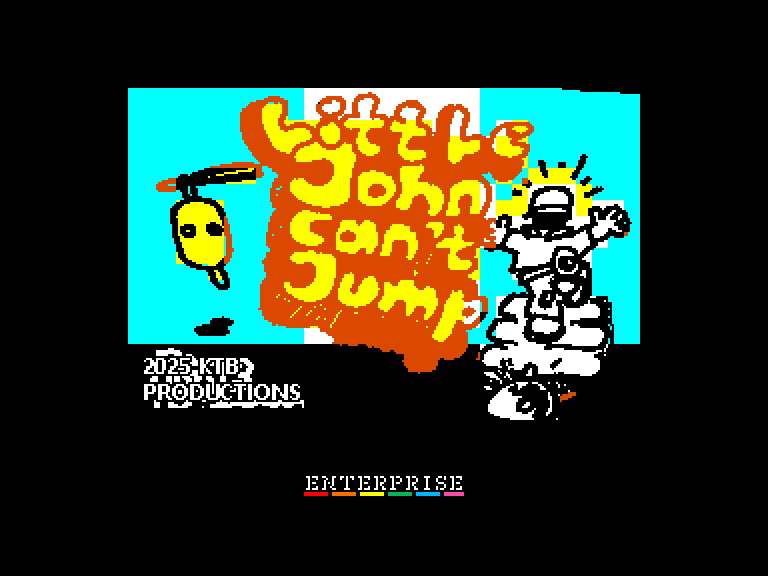
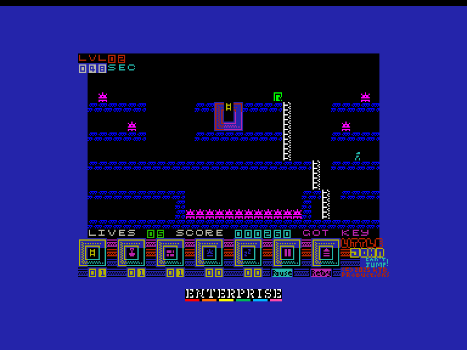
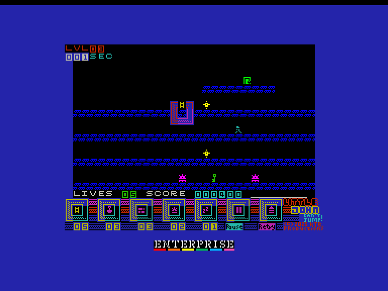
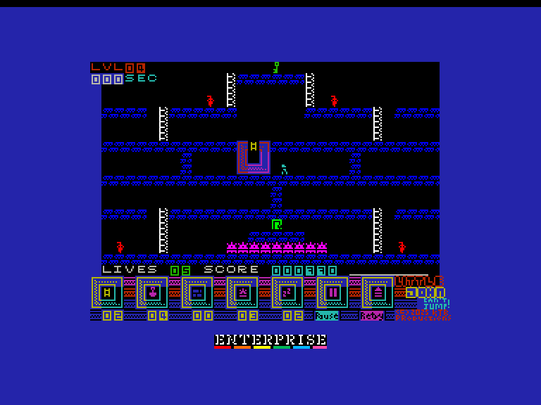

[0-9](../0/games-0.md) - [A](../a/games-a.md) - [B](../b/games-b.md) - [C](../c/games-c.md) - [D](../d/games-d.md) - [E](../e/games-e.md) - [F](../f/games-f.md) - [G](../g/games-g.md) - [H](../h/games-h.md) - [I](../i/games-i.md) - [J](../j/games-j.md) - [K](../k/games-k.md) - [L](../l/games-l.md) - [M](../m/games-m.md) - [N](../n/games-n.md) - [O](../o/games-o.md) - [P](../p/games-p.md) - [Q](../q/games-q.md) - [R](../r/games-r.md) - [S](../s/games-s.md) - [T](../t/games-t.md) - [U](../u/games-u.md) - [V](../v/games-v.md) - [W](../w/games-w.md) - [X](../x/games-x.md) - [Y](../y/games-y.md) - [Z](../z/games-z.md)

Ігри для [Enterprise 64k](../games-ep64.md) - [Enterprise 128k+RAMexp](../games-epramexp.md)

Ігри для систем [IS-DOS](../games-is-dos.md) - [SymbOS](../games-symbos.md) - [EDC Windows](../games-edcw.md)

Ігри для емуляторів [ZX Spectrum 48k/128k](../zxemu/games-zxemu.md) - [Amstrad CPC](../cpcemu/games-cpc.md) - [Sinclair ZX81](../zx81emu/games-zx81.md) - [Videoton TVC](../tvcemu/games-tvc.md) - [Commodore VIC-20](../vic20emu/games-vic20.md)

----------

# Little John Can't Jump

**ID:** little-john-cant-jump-agd

**Жанри:** Аркада, Платформер

## Примітка

ℹ Гра створена за допомогою MPAGD на основі версії для ZX Spectrum.

## Скріншоти

## Опис

Маленький Джон може ходити. Маленький Джон може лазити по драбинах. Але маленький Джон не може стрибати. І це є проблемою, оскільки йому потрібно знайти ключ, щоб відчинити двері та вибратись з цих кімнат наповнених колючими мінами та розлюченими роботами.  

На щастя, ви можете йому допомогти! Озброївшись сумкою з інструментами (драбини, лопати для копання, цегла для блокування, міни для підриву роботів та снодійний порошок, щоб приспати роботів або Джона), ви можете допомогти Джону знайти ключ та вихід.

## Основна інформація
- **Мови:** Англійська
- **Оригінальна платформа:** ZX Spectrum
### Загальні системні вимоги
- **Апаратні:** EP64, EP128
### Геймплей
- **Керування:** Keyboard, Internal Joy, External Joy 1, External Joy 2
- **Кількість гравців:** 1 player
- **Додаткові теги:** AGD, Attribute mode
### Розробка
- **Рік випуску:** 2025
- **Компанія:** KTB Retro Computing Productions

## Посилання
- [Домашня сторінка гри](https://ktbproductions.itch.io/enterprise-games)
- [Опис гри на ep128.hu (угорською)](https://www.ep128.hu/Games/Little_John_Cant_Jump.htm)
- [Інформація про оригінальну версію](https://spectrumcomputing.co.uk/entry/44471/ZX-Spectrum/Little_John_Cant_Jump)
- [Завантажити гру](https://www.ep128.hu/Ep_Games/Prg/Little_John_Cant_Jump.rar)
- [Easy Load&Play](https://t.me/EP128k_Load_n_Play/943) *(Telegram-канал Vibrant Waves)*

## [Керування](../controllers.md)

`Keyboard`: `Q`, `A`, `O`, `P`, `M`  
`Internal Joystick`  
`External Joystick 1`  
`External Joystick 2`

## Детальна інформація

### Системні вимоги  

#### Мінімальні системні вимоги  

Оперативна пам'ять: **64 КБ**  

### Рекомендовані системні вимоги  

Оперативна пам'ять: **128 КБ (або більше)**