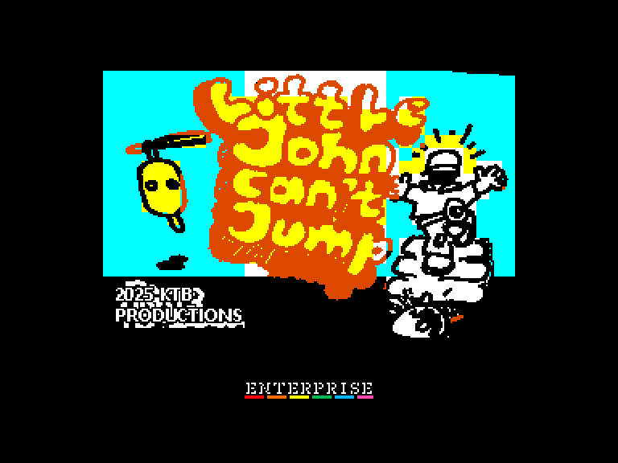
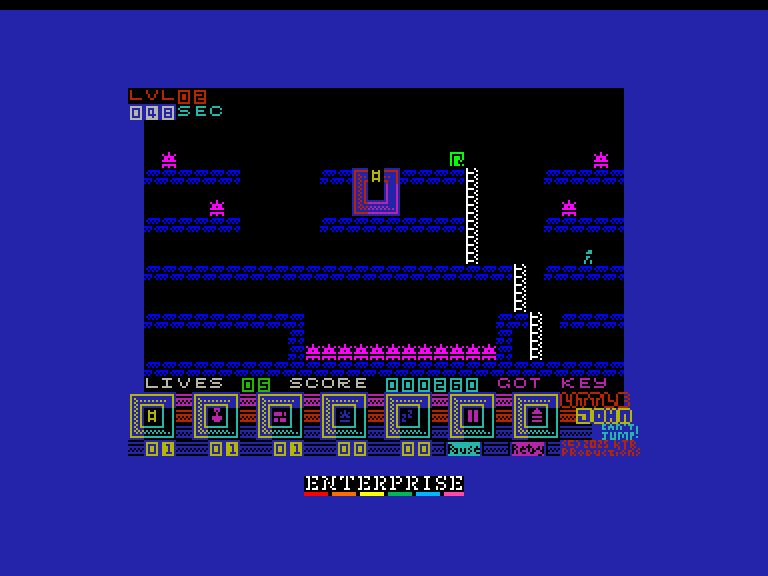
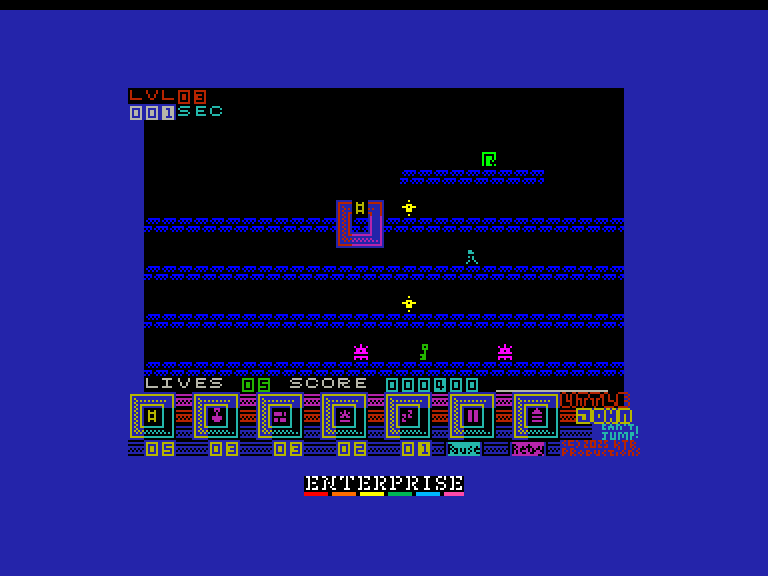
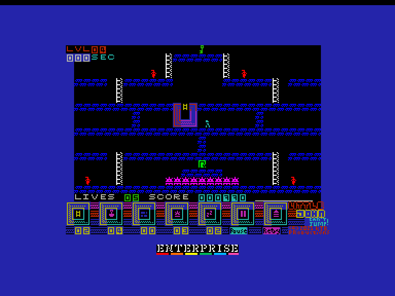

# Little John Can't Jump

| | | | |
| --- | --- | --- | --- |
|||||

Жанр: аркада, логіка  
Кількість гравців: 1  
Мова гри: англійська  

## Опис

Маленький Джон може ходити. Маленький Джон може лазити по драбинах. Але маленький Джон не може стрибати. І це є проблемою, оскільки йому потрібно знайти ключ, щоб відчинити двері та вибратись з цих кімнат наповнених колючими мінами та розлюченими роботами.

На щастя, ви можете йому допомогти! Озброївшись сумкою з інструментами (драбини, лопати для копання, цегла для блокування, міни для підриву роботів та снодійний порошок, щоб приспати роботів або Джона), ви можете допомогти Джону знайти ключ та вихід.

## Системні вимоги

|Мінімальні системні вимоги:|Рекомендовані системні вимоги:|
|---------------------------|------------------------------|
|Оперативна пам'ять: **64 КБ**|Оперативна пам'ять: **128 КБ (або більше)**|  

## Керування та тонкощі запуску
### Основні [елементи керування](../../controllers.md):
⌨ Клавіатура (`Q`, `A`, `O`, `P`, `M`)  
🕹 Вбудований джойстик  
🎮 Зовнішній джойстик 1/2

## Посилання

▶ [Easy Load&Play](https://t.me/EP128k_Load_n_Play/943) *(Telegram-канал Vibrant Waves)*  
💾 [Завантажити гру](https://www.ep128.hu/Ep_Games/Prg/Little_John_Cant_Jump.rar)  
📃 [Опис гри]() (угорська)  
🏡 [Домашня сторінка гри](https://ktbproductions.itch.io/enterprise-games)

## Автори
👨‍💻 Автор: Mas (KTB Retrocomputing Productions)  
📅 Рік релізу: 2025  