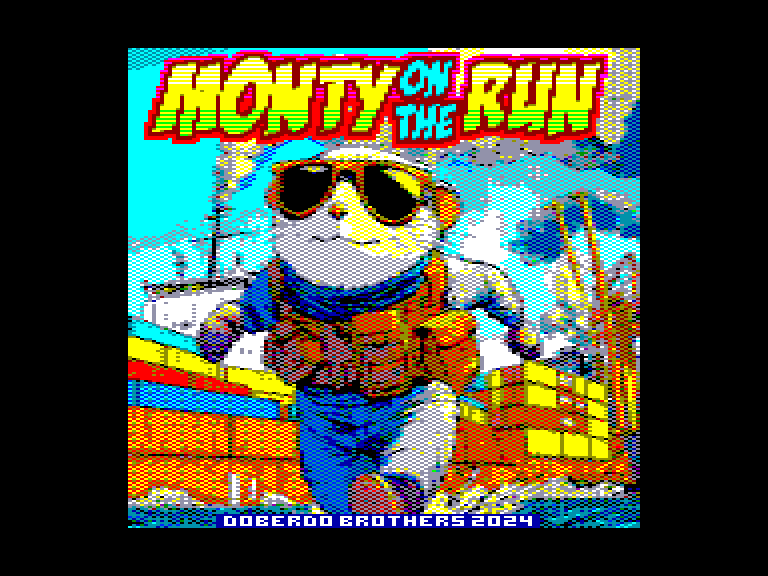
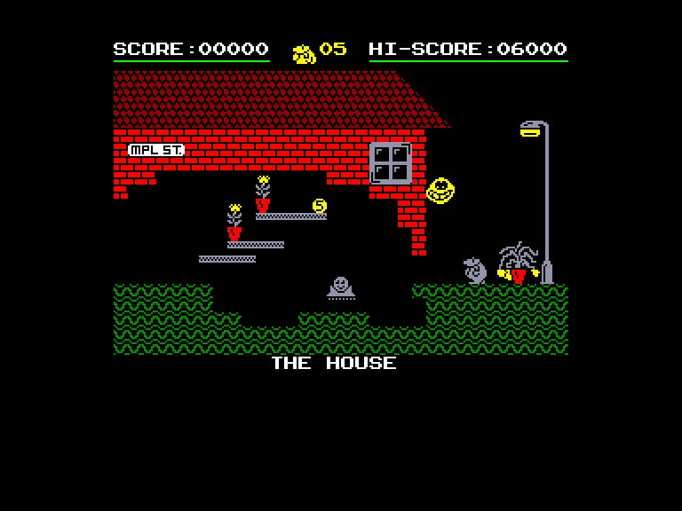
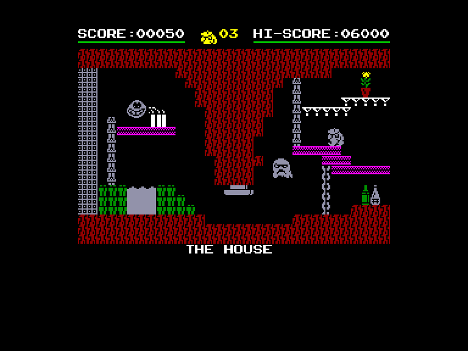
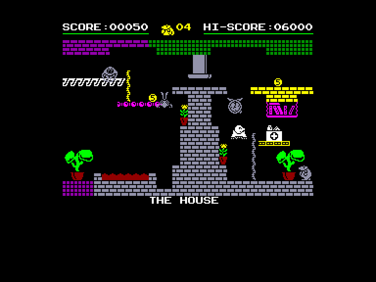

[0-9](../0/games-0.md) - [A](../a/games-a.md) - [B](../b/games-b.md) - [C](../c/games-c.md) - [D](../d/games-d.md) - [E](../e/games-e.md) - [F](../f/games-f.md) - [G](../g/games-g.md) - [H](../h/games-h.md) - [I](../i/games-i.md) - [J](../j/games-j.md) - [K](../k/games-k.md) - [L](../l/games-l.md) - [M](../m/games-m.md) - [N](../n/games-n.md) - [O](../o/games-o.md) - [P](../p/games-p.md) - [Q](../q/games-q.md) - [R](../r/games-r.md) - [S](../s/games-s.md) - [T](../t/games-t.md) - [U](../u/games-u.md) - [V](../v/games-v.md) - [W](../w/games-w.md) - [X](../x/games-x.md) - [Y](../y/games-y.md) - [Z](../z/games-z.md)

Ігри для [Enterprise 64k](../games-ep64.md) - [Enterprise 128k+RAMexp](../games-epramexp.md) - [2dfx](games-2dfx.md)

Ігри для систем [IS-DOS](../games-is-dos.md) - [SymbOS](../games-symbos.md) - [EDC Windows](../games-edcw.md)

Ігри для емуляторів [ZX Spectrum 48k/128k](../zxemu/games-zxemu.md) - [Amstrad CPC](../cpcemu/games-cpc.md) - [Sinclair ZX81](../zx81emu/games-zx81.md) - [Videoton TVC](../tvcemu/games-tvc.md) - [Commodore VIC-20](../vic20emu/games-vic20.md)

----------

# Monty on the Run

**ID:** monty-on-the-run-tvc

**Жанри:** Аркада, Платформер, Лабіринт

## Примітка

ℹ Сучасна конверсія з платформи Videoton TVC яка була створена на основі версій з ZX Spectrum та Commodore 64.

## Скріншоти

## Опис

Монті у відмінній фізичній формі і відчайдушно прагне свободи. Він здійснює зухвалу втечу з в'язниці Скадмор. Переслідуваний працівниками закону і порядку, наш наляканий герой знаходить притулок у злочинному світі, який пропонує шанс знову вдихнути свіжого повітря і погрітися під променями сонця. Йому потрібно пройти через свій будинок, каналізаційну систему під ним, навколишній ліс (пішки, на машині, з ракетним ранцем) і навіть інший човен, підбираючи дрібні гроші та інші предмети. Але подорож ускладнюють вороги, що з'являються звідусіль і бігають навколо, бомби, що вибухають від дотику, механічні преси та багато іншого. У грі Monty on the Run йдеться про те, як дістатися до корабля, що прямує до Гібралтару.  

Монті може бігти, перекидатися, лазити по канатах, літати назад, їздити, телепортуватися і т.д. Деякі механізми спричиняють смерть (приховані бомби, преси і т.д.), інші допомагають або навпаки перешкоджають (наприклад, телепортація). Деякі з предметів, які ви можете підбирати, змінюють деталі певних кімнат (мотузка, пестицид, паспорт, протигаз і т.д.) що допомагає просуватись у грі.

## Основна інформація
- **Мови:** Англійська
- **Оригінальна платформа:** Videoton TVC
### Загальні системні вимоги
- **Апаратні:** EP128
### Геймплей
- **Керування:** Keyboard, Internal Joy, External Joy 1
- **Кількість гравців:** 1 player
- **Додаткові теги:** 4-color mode
### Розробка
- **Рік випуску:** 1985, 2024
- **Компанія:** Gremlin Graphics Software, Doberdo Brothers

## Посилання
- [Домашня сторінка](https://www.doberdobrothers.hu/?page_id=2093)
- [Завантажити](http://www.ep128.hu/Ep_Games/Prg/Monty_on_the_Run_TVC.rar)
- [Завантажити](http://doberdobrothers.hu/ep128_files/monty_on_the_run_ep128.rar)
- [Easy Load&Play](https://t.me/EP128k_Load_n_Play/757) *(Telegram-канал Vibrant Waves)*

## Відео

<iframe src="https://www.youtube.com/embed/w5iOx8ynD8U"  
style="width:75%; aspect-ratio:16/9;" allowfullscreen></iframe>

## [Керування](../controllers.md)

`Keyboard`: `Q`, `A`, `O`, `P`, `Space`  
`Internal Joystick`  
`External Joystick 1`

## Детальна інформація

### Системні вимоги  

#### Мінімальні системні вимоги  

Оперативна пам'ять: **128 КБ**  

### Геймплей  

У оригінальних версіях для C64 та ZX Spectrum предмети з «freedom kit» потрібно було вибирати ще до початку гри. Оскільки від цього критично залежала можливість пройти гру (простіше кажучи, це було зайвим ускладненням на рівному місці), розробники сучасногої версії вирішили натомість розмістити ці предмети безпосередньо на рівнях.