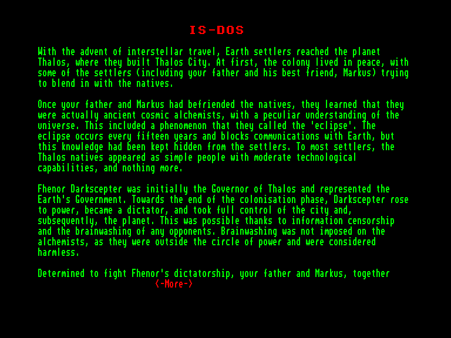
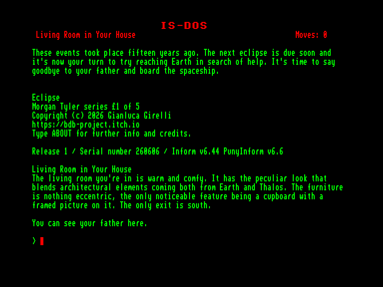
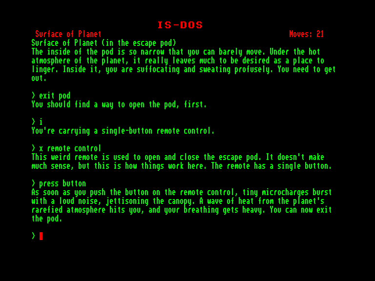
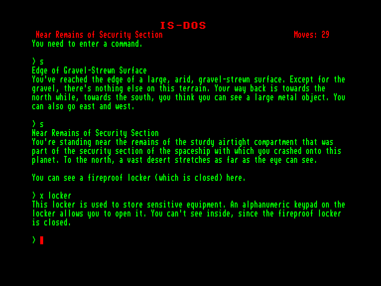

[0-9](../0/games-0.md) - [A](../a/games-a.md) - [B](../b/games-b.md) - [C](../c/games-c.md) - [D](../d/games-d.md) - [E](../e/games-e.md) - [F](../f/games-f.md) - [G](../g/games-g.md) - [H](../h/games-h.md) - [I](../i/games-i.md) - [J](../j/games-j.md) - [K](../k/games-k.md) - [L](../l/games-l.md) - [M](../m/games-m.md) - [N](../n/games-n.md) - [O](../o/games-o.md) - [P](../p/games-p.md) - [Q](../q/games-q.md) - [R](../r/games-r.md) - [S](../s/games-s.md) - [T](../t/games-t.md) - [U](../u/games-u.md) - [V](../v/games-v.md) - [W](../w/games-w.md) - [X](../x/games-x.md) - [Y](../y/games-y.md) - [Z](../z/games-z.md)

Ігри для [Enterprise 64k](../games-ep64.md) - [Enterprise 128k+RAMexp](../games-epramexp.md)

Ігри для систем [IS-DOS](../games-is-dos.md) - [SymbOS](../games-symbos.md) - [EDC Windows](../games-edcw.md)

Ігри для емуляторів [ZX Spectrum 48k/128k](../zxemu/games-zxemu.md) - [Amstrad CPC](../cpcemu/games-cpc.md) - [Sinclair ZX81](../zx81emu/games-zx81.md) - [Videoton TVC](../tvcemu/games-tvc.md) - [Commodore VIC-20](../vic20emu/games-vic20.md)

----------

# Morgan Tyler #1: Eclipse

**Альтернативні назви:**
 - Eclipse

**ID:** morgan-tyler1-eclipse-zcode

**Жанри:** Текстова пригода

## Примітка

ℹ Мультиплатформенна гра на рушії Z-machine від Infocom.

## Скріншоти

## Опис

З появою міжзоряних перельотів земні переселенці досягли планети Талос, де заснували місто Талос-Сіті. Спочатку колонія жила в мирі, а дехто з поселенців (зокрема твій батько та його найкращий друг Маркус) навіть намагався зблизитися з місцевими жителями.  

Подружившись із корінним населенням, батько з Маркусом дізналися, що насправді ті були давніми космічними алхіміками з особливим розумінням усесвіту. Вони розповіли, зокрема, про явище, яке називали «затьмаренням». Воно ставалося кожні п'ятнадцять років і повністю блокувало зв'язок із Землею, проте від решти колоністів це знання приховували. Для більшості поселенців жителі Талоса здавалися простим народом із досить скромними технологічними можливостями, і не більше.  

Фенор Дарксептер спочатку обіймав посаду губернатора Талоса й представляв уряд Землі. Однак під кінець фази колонізації він дорвався до влади, став диктатором і підпорядкував собі місто, а згодом і всю планету. Це вдалося завдяки жорсткій цензурі та промиванню мізків будь-яким неугодним. Алхіміків ця доля оминула, оскільки вони перебували поза владними колами й вважалися небезпеки не становлять.  

Прагнучи скинути диктатуру Фенора, твій батько та Маркус разом із кількома алхіміками розробили план втечі з Талоса, щоб повернутися на Землю й розповісти правду про події на планеті. Однієї ночі, саме під час затьмарення, Маркус сів у невеликий космічний корабель і вирушив по допомогу до Землі. Одразу після зльоту зв'язок із ним уривався, але через затьмарення це було передбачувано. Оскільки допомога із Землі так і не прибула, усі вирішили, що Маркус так і не дістався мети.  

Ці події сталися п'ятнадцять років тому. Настає час наступного затьмарення, і тепер твоя черга спробувати пробитися до Землі по допомогу. Настав час попрощатися з батьком і зійти на борт корабля.  

> Примітка: Це перша гра із саги про Моргана Тайлера. Кожна частина має завершений сюжет, проте рекомендовано проходити їх по порядку. Серія з 5 епізодів включає:  
>   
> - Morgan Tyler #1: Eclipse (ця гра)  
> - Morgan Tyler #2: The Cursed Planet  
> - Morgan Tyler #3: Star Plague (незабаром)  
> - Morgan Tyler #4: Shipwreck on Guyoth IV (незабаром)  
> - Morgan Tyler #5: Street Trooper (незабаром)

## Основна інформація
- **Мови:** Англійська
- **Оригінальна платформа:** Multiplatform
### Загальні системні вимоги
- **Апаратні:** EXDOS
- **Програмні:** IS-DOS
### Геймплей
- **Керування:** Keyboard
- **Кількість гравців:** 1 player
- **Додаткові теги:** Z-code
### Розробка
- **Рік випуску:** 2026
- **Автор:** Bonaventura Di Bello, Gianluca Girelli, Garry Francis

## Посилання
- [Домашня сторінка гри](https://bdb-project.itch.io/eclipse)

## [Керування](../controllers.md)

`Keyboard`

## Детальна інформація

### Системні вимоги  

#### Мінімальні системні вимоги  

EXDOS+IS-DOS  

### Історія розробки  

Ця гра є адаптацією італійської пригоди *«Morgan Tyler: Eclypse»* Бонавентури Ді Белло (Bonaventura Di Bello). Початково її було створено за допомогою систем *The Quill* та *Illustrator* і випущено компанією Edizioni Hobby S.r.l. на касетному додатку до журналу *Epic 3000* (№ 7, грудень 1986 року) для ZX Spectrum. Пізніше гра виходила на касетному додатку до *Explorer* (№ 7, травень 1987 року) для Commodore 64 та MSX.  

Тепер її перекладено англійською та переписано для сучасного гравця з дозволу автора оригіналу. Ця нова версія містить чимало покращень, яких не було в першоджерелі. Щоб дізнатися більше, введіть у грі команду **ABOUT**.