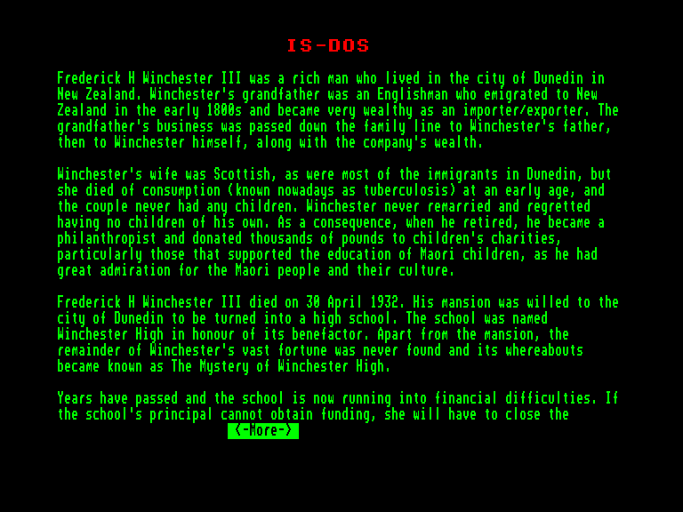
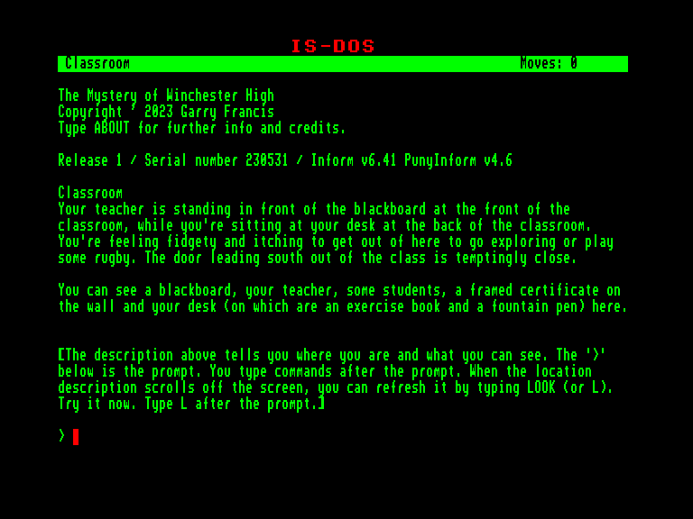
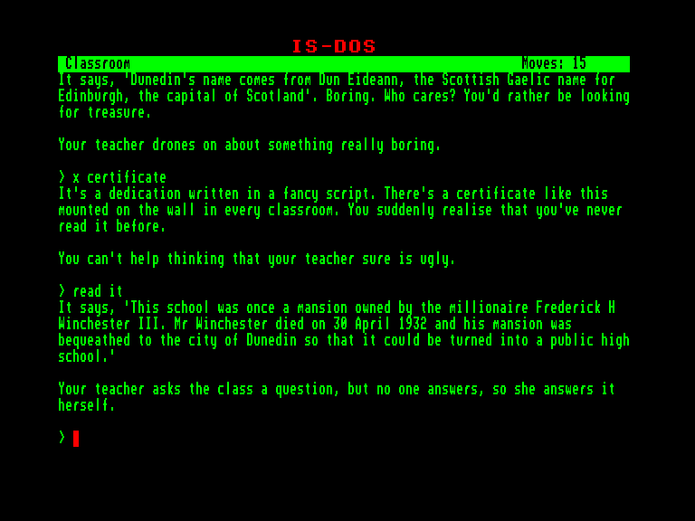
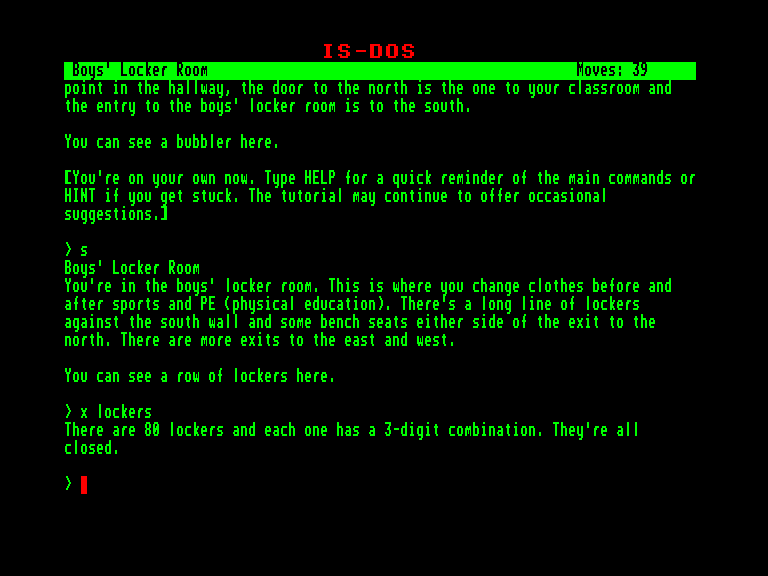

[0-9](../0/games-0.md) - [A](../a/games-a.md) - [B](../b/games-b.md) - [C](../c/games-c.md) - [D](../d/games-d.md) - [E](../e/games-e.md) - [F](../f/games-f.md) - [G](../g/games-g.md) - [H](../h/games-h.md) - [I](../i/games-i.md) - [J](../j/games-j.md) - [K](../k/games-k.md) - [L](../l/games-l.md) - [M](../m/games-m.md) - [N](../n/games-n.md) - [O](../o/games-o.md) - [P](../p/games-p.md) - [Q](../q/games-q.md) - [R](../r/games-r.md) - [S](../s/games-s.md) - [T](../t/games-t.md) - [U](../u/games-u.md) - [V](../v/games-v.md) - [W](../w/games-w.md) - [X](../x/games-x.md) - [Y](../y/games-y.md) - [Z](../z/games-z.md)

Ігри для [Enterprise 64k](../games-ep64.md) - [Enterprise 128k+RAMexp](../games-epramexp.md)

Ігри для систем [IS-DOS](../games-is-dos.md) - [SymbOS](../games-symbos.md) - [EDC Windows](../games-edcw.md)

Ігри для емуляторів [ZX Spectrum 48k/128k](../zxemu/games-zxemu.md) - [Amstrad CPC](../cpcemu/games-cpc.md) - [Sinclair ZX81](../zx81emu/games-zx81.md) - [Videoton TVC](../tvcemu/games-tvc.md) - [Commodore VIC-20](../vic20emu/games-vic20.md)

----------

# The Mystery of Winchester High

**ID:** mystery-of-winchester-high-zcode

**Жанри:** Текстова пригода

## Скріншоти

## Опис

Фредерік Г. Вінчестер III, заможний мешканець Данідіна, успадкував значний статок своєї родини, пов'язаний з імпортом/експортом, який на початку 1800-х років заснував його англійський дід. Його шотландська дружина померла молодою від хвороби, залишивши його бездітним і самотнім на все життя, про що він глибоко оплакував. Вийшовши на пенсію, він став відданим філантропом, щедро жертвуючи на допомогу дітям, особливо на освіту маорі, що відображало його захоплення їхньою культурою.

Вінчестер помер у 1932 році. Його велична резиденція була заповідана як Вінчестерська середня школа, названа на його честь. Однак його величезний залишок статків зник, ставши відомим як «Таємниця Вінчестерської середньої школи».

Сьогодні школі неминуче закриття через фінансові труднощі. Як студенту, дізнавшись, що закриття означає переведення до гіршого закладу, я розпочав розслідування. Я планую розкрити приховані активи Вінчестера, підозрюючи, що вони можуть бути знайдені в частинах старого особняка, який не використовувався, коли його переобладнали на школу.

## Основна інформація
- **Мови:** Англійська
### Загальні системні вимоги
- **Апаратні:** EXDOS
- **Програмні:** IS-DOS
### Геймплей
- **Керування:** Keyboard
- **Кількість гравців:** 1 player
- **Додаткові теги:** Z-code
### Розробка
- **Рік випуску:** 2023
- **Автор:** Garry Francis

## Посилання
- [Домашня сторінка гри](https://warrigal.itch.io/mystery-of-winchester-high)
- [Інформація про оригінальну версію](https://www.cpc-power.com/index.php?page=detail&num=19137)
- [Інформація про гру (SolutionArchive.com)](https://solutionarchive.com/game/id%2C10427/Mystery+of+Winchester+High%2C+The.html)
- [Завантажити гру](https://www.ep128.hu/Ep_Games/Prg/Z-machine_Adventures.rar)

