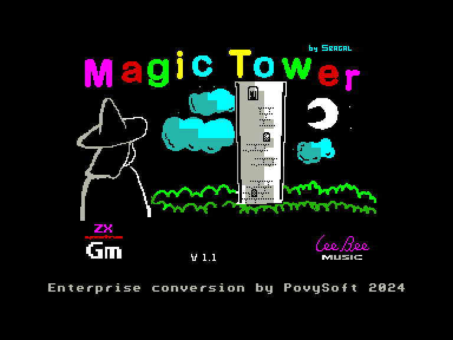
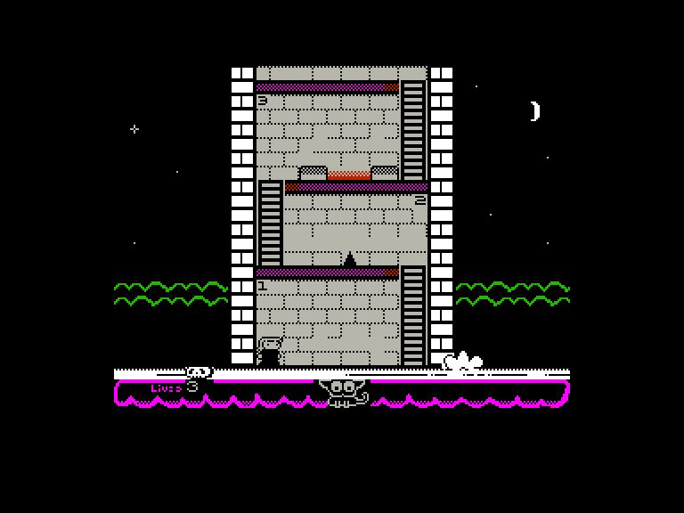
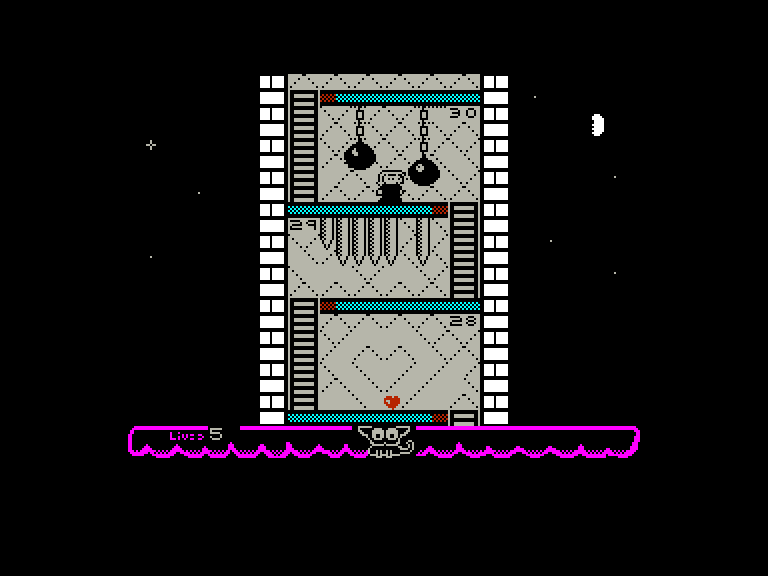
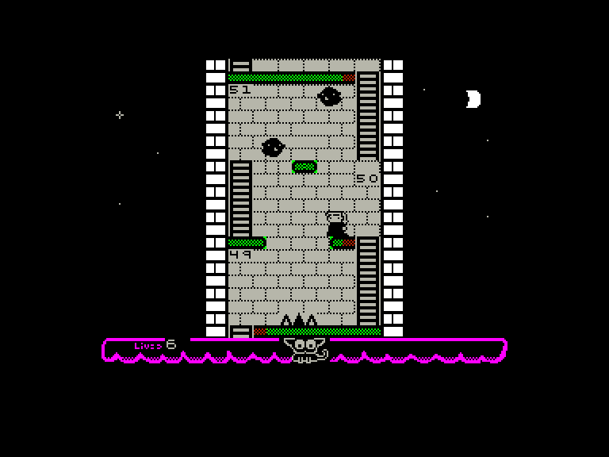

# Magic Tower

| | | | |
| --- | --- | --- | --- |
|||||

Жанр: аркада, платформер
Кількість гравців: 1

## Опис

Ваш неслухняний кіт ПомПом вкрав вашу м'яку і пухнасту чаклунську шапку і виніс її на вершину чарівної вежі. У вас є два варіанти: або ви купуєте іншу, або йдете і забираєте її назад. Якщо ви вибрали другий варіант, насолоджуйтеся грою і її 66 поверхами випробувань і пасток!

## Системні вимоги

|Мінімальні системні вимоги:|Рекомендовані системні вимоги:|
|---------------------------|------------------------------|
|Оперативна пам'ять: **128 КБ**|Оперативна пам'ять: **128 КБ (або більше)**|  

## Керування

### Основні [елементи керування](../controllers.md):
⌨ Клавіатура (`Q`, `O`, `P`, `Space`)  
🕹 Вбудований джойстик  
🎮 Зовнішній джойстик 1

## Чіт-коди та допомога у проходженні

### Активація під час завантаження:
Безкінечна кількість життів (**Так**/**Ні**)  

### Відеопроходження:

## Посилання

▶ [Easy Load&Play](https://t.me/EP128k_Load_n_Play/749) *(Telegram-канал Vibrant Waves)*  
💾 [Завантажити гру](http://www.ep128.hu/Ep_Games/Prg/Magic_Tower.rar)  
📃 [Опис гри](http://www.ep128.hu/Games/Magic_Tower.htm) (угорська)  
🗨 [Тема на форумі enterpriseforever.com](https://enterpriseforever.com/spectrum-rol/magic-tower/)  
🏡 [Домашня сторінка гри](https://seagal112.itch.io/magic-tower)

## Автори
### Оригінальний реліз
🖥 Платформа: [ZX Spectrum](https://spectrumcomputing.co.uk/entry/43628/ZX-Spectrum/Magic_Tower)  
👨‍💻 Програміст: Seagal  
👨‍💻 Музика: Lee Bee  
📅 Рік релізу: 2024  

### Версія гри для Enterprise
👨‍💻 Портування: [Povi](../../community/povi.md)  
📅 Рік релізу: [2024](../release_years/2024.md)