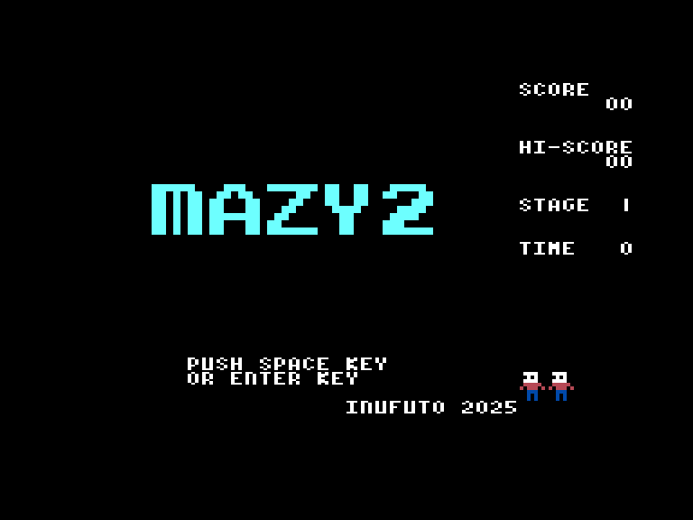
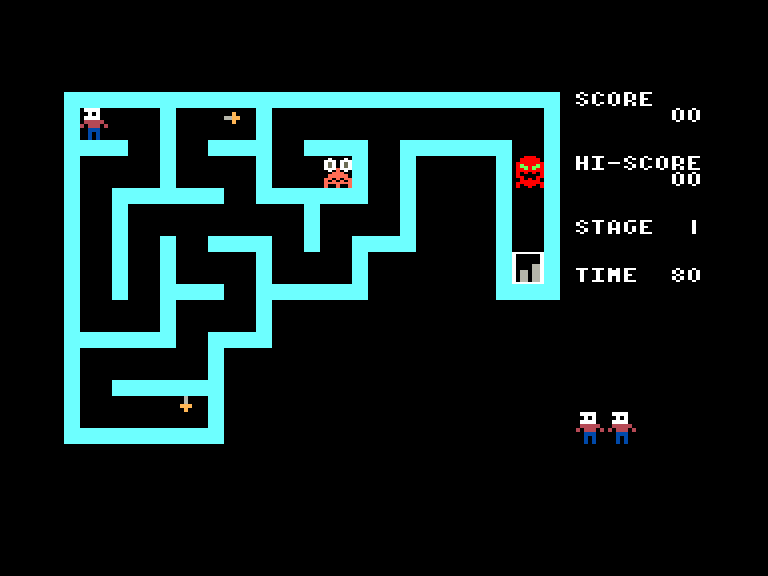
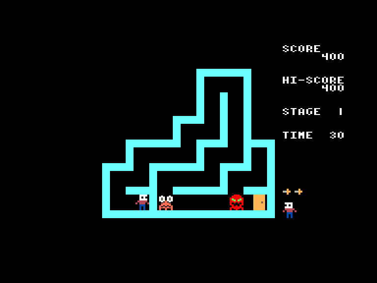
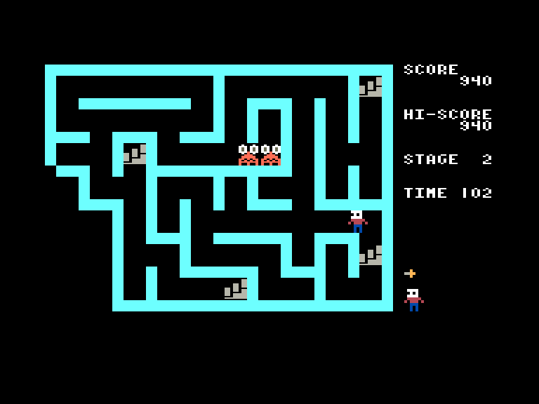

# Mazy 2

 
 
 

Жанр: аркада, лабіринт  
Кількість гравців: 1  
Мова гри: англійська  

## Опис

Ваша ціль знайти вихід з лабіринту знищуючи монстрів, які у ньому проживають. Для вбивства монстрів використовуються метальні ножі, які можна знайти на вашому шляху.

У даній гри кожен рівень складається з декількох лабіринтів.

<iframe width="560" height="315" src="https://www.youtube.com/embed/OE0lNUefKIo" title="YouTube video player" frameborder="0" allowfullscreen></iframe>

## Системні вимоги
### Мінімальні системні вимоги
Оперативна пам'ять: **64 КБ** (картридж-версія)  
Оперативна пам'ять: **128 КБ**  

## Керування та тонкощі запуску
### Елементи керування меню:

`Enter`/`Space`/`X`/`Z`: Почати гру  

### Основні [елементи керування](../controllers.md):
⌨ Клавіатура (`L`, `,`, `.`, `/`)  
🕹 Вбудований джойстик  

`Space`/`Z`: Метнути ножа

## Посилання

▶ [Easy Load&Play](https://t.me/EP128k_Load_n_Play/825) *(Telegram-канал Vibrant Waves)*  
💾 [Завантажити гру](http://www.ep128.hu/Ep_Games/Prg/Mazy2.rar)  
📃 [Опис гри](http://www.ep128.hu/Games/Mazy2.htm) (угорська)  
🏡 [Домашня сторінка гри](http://inufuto.web.fc2.com/8bit/mazy2/#ep64)

## Автори
👨‍💻 Розробник: [Inufuto](../../community/inufuto.md)  
📅 Рік релізу: [2025](../release_years/2025.md)  