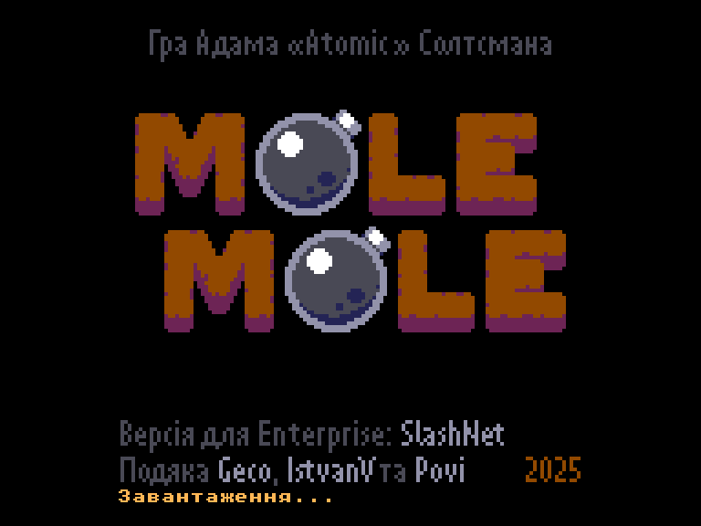
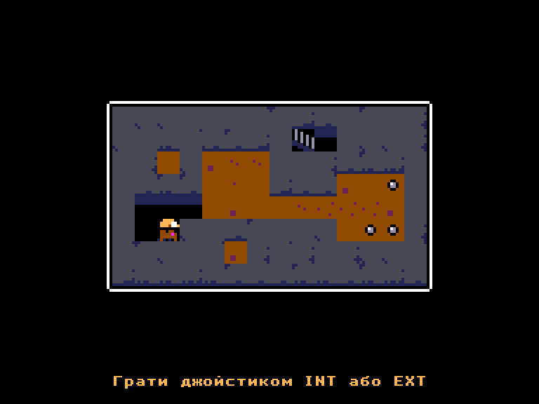
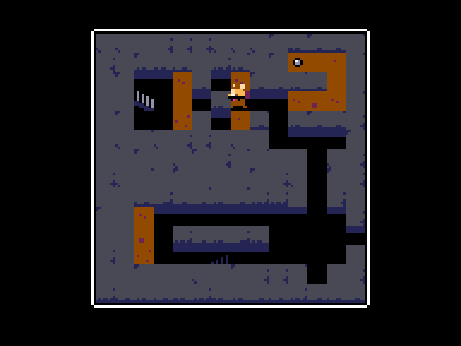
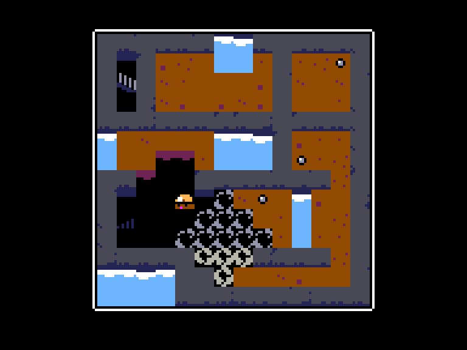

# Mole Mole

 
 
 

Жанр: логічна  
Кількість гравців: 1  
Мова гри: англійська, українська  

## Опис

Кротик дуже хоче в своє ліжечко. Щоб дістатись до нього він має прокласти новий шлях у підземному лабіринті. Використовуючи бомби можна створювати нові проходи, але будьте уважні: вода швидко просочується навіть у найменшу щілинку.

<iframe width="560" height="315" src="https://www.youtube.com/embed/ANpnlPCR2Hs" title="YouTube video player" frameborder="0" allowfullscreen></iframe>

## Системні вимоги

|Мінімальні системні вимоги:|Рекомендовані системні вимоги:|
|---------------------------|------------------------------|
|Оперативна пам'ять: **128 КБ**|Оперативна пам'ять: **128 КБ (або більше)**|  

## Керування та тонкощі запуску
### Основні [елементи керування](../controllers.md):
🕹 Вбудований джойстик + `Space`  
🎮 Зовнішній джойстик 1/2

`Fire`: Встановити бомбу  
`Fire2`/`Del`: Рестарт рівня  

## Чіт-коди та допомога у проходженні

### Комбінація клавіш під час гри:
`F1`+`F8`: Пропустити рівень

### Відеопроходження:
<iframe width="560" height="315" src="https://www.youtube.com/embed/Owtj3zwea3Q" title="YouTube video player" frameborder="0" allowfullscreen></iframe>

## Посилання

▶ [Easy Load&Play](https://t.me/EP128k_Load_n_Play/927) *(Telegram-канал Vibrant Waves)*  
💾 [Завантажити гру]()  
📃 [Опис гри]() (угорська)  
🗨 [Тема на форумі enterpriseforever.com](https://enterpriseforever.com/games/molemole/)  
🏡 [Домашня сторінка гри](https://adamatomic.itch.io/mole-mole)  

## Автори
### Оригінальний реліз
🖥 Платформа: [Pico-8](https://www.lexaloffle.com/bbs/?tid=148484)  
👨‍💻 Програмісти: Adam Saltsman (Adam Atomic)  
📅 Рік релізу: 2025  

### Версія гри для Enterprise
👨‍💻 Портування: **SlashNet**  
📅 Рік релізу: 2025