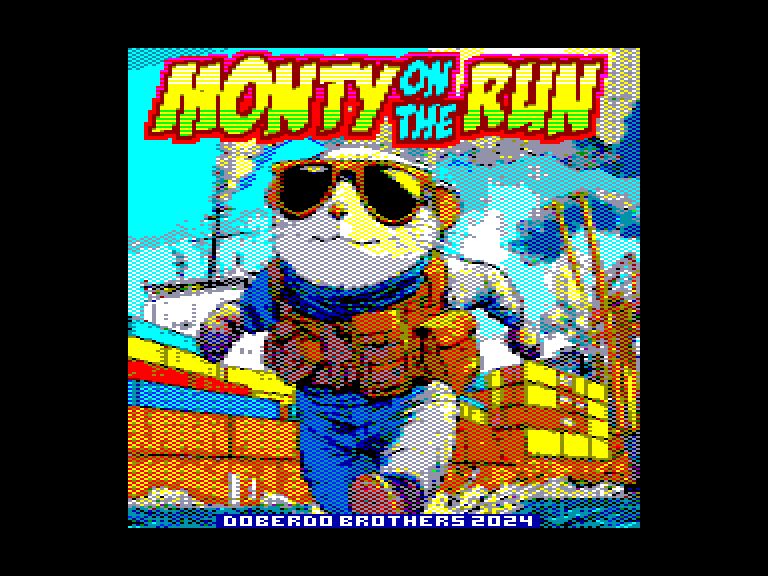
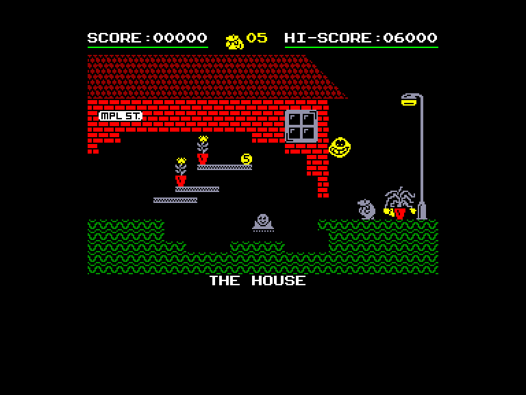
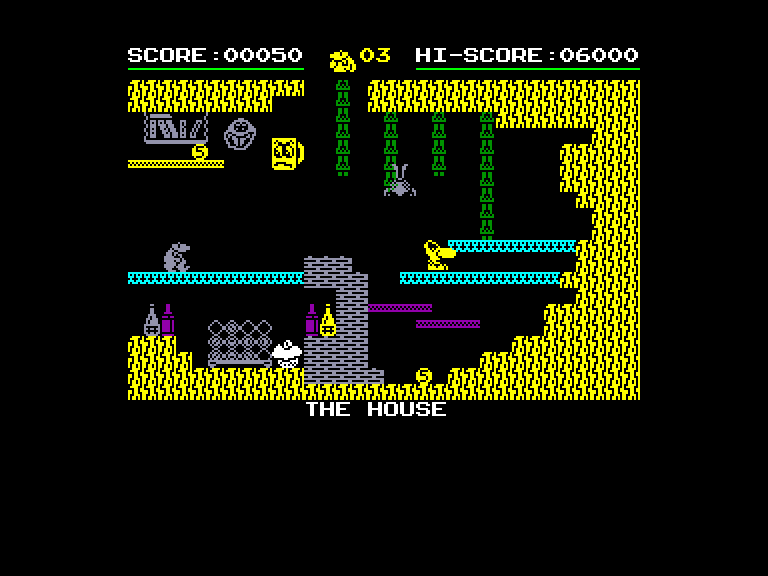
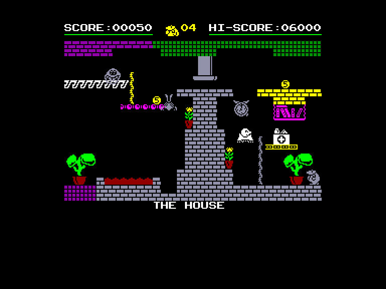

# Monty on the Run

| | | | |
| --- | --- | --- | --- |
|||||

Жанр: аркада, пригода  
Кількість гравців: 1

## Опис

Монті у відмінній фізичній формі і відчайдушно прагне свободи. Він здійснює зухвалу втечу з в'язниці Скадмор. Переслідуваний працівниками закону і порядку, наш наляканий герой знаходить притулок у злочинному світі, який пропонує шанс знову вдихнути свіжого повітря і погрітися під променями сонця. Йому потрібно пройти через свій будинок, каналізаційну систему під ним, навколишній ліс (пішки, на машині, з ракетним ранцем) і навіть інший човен, підбираючи дрібні гроші та інші предмети. Але подорож ускладнюють вороги, що з'являються звідусіль і бігають навколо, бомби, що вибухають від дотику, механічні преси та багато іншого. У грі Monty on the Run йдеться про те, як дістатися до корабля, що прямує до Гібралтару.

Монті може бігти, перекидатися, лазити по канатах, літати назад, їздити, телепортуватися і т.д. Деякі механізми спричиняють смерть (приховані бомби, преси і т.д.), інші допомагають або навпаки перешкоджають (наприклад, телепортація). Деякі з предметів, які ви можете підбирати, змінюють деталі певних кімнат (мотузка, пестицид, паспорт, протигаз і т.д.) що допомагає просуватись у грі.

## Системні вимоги

|Мінімальні системні вимоги:|Рекомендовані системні вимоги:|
|---------------------------|------------------------------|
|Оперативна пам'ять: **128 КБ**|Оперативна пам'ять: **128 КБ (або більше)**|  

## Керування та тонкощі запуску
### Основні [елементи керування](../controllers.md):
⌨ Клавіатура (`Q`, `A`, `O`, `P`, `Space`)  
🕹 Вбудований джойстик  
🎮 Зовнішній джойстик 1

## Посилання

▶ [Easy Load&Play](https://t.me/EP128k_Load_n_Play/757) *(Telegram-канал Vibrant Waves)*  
💾 [Завантажити гру](http://doberdobrothers.hu/ep128_files/monty_on_the_run_ep128.rar)  
🏡 [Домашня сторінка гри](https://www.doberdobrothers.hu/?page_id=2093)

## Автори
### Оригінальний реліз
🖥 Платформа: [ZX Spectrum](https://spectrumcomputing.co.uk/entry/3258/ZX-Spectrum/Monty_on_the_Run) / [Commodore 64](https://www.lemon64.com/?game_id=1705) / [Amstrad CPC](https://www.cpc-power.com/index.php?page=detail&num=1452)  
👨‍💻 Розробник: Gremlin Graphics Software  
📅 Рік релізу: 1985  

### Версія гри для Enterprise
👨‍💻 Портування: [Doberdo Brothers](../../community/doberdo_brothers.md)  
📅 Рік релізу: 2025