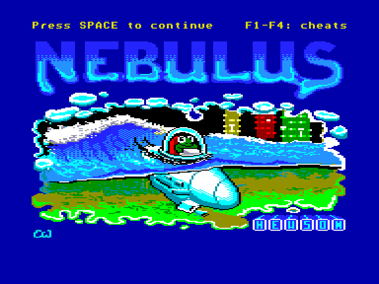
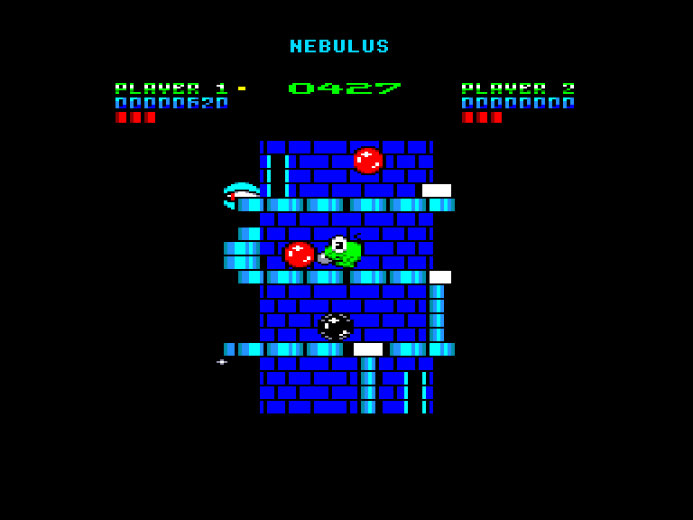
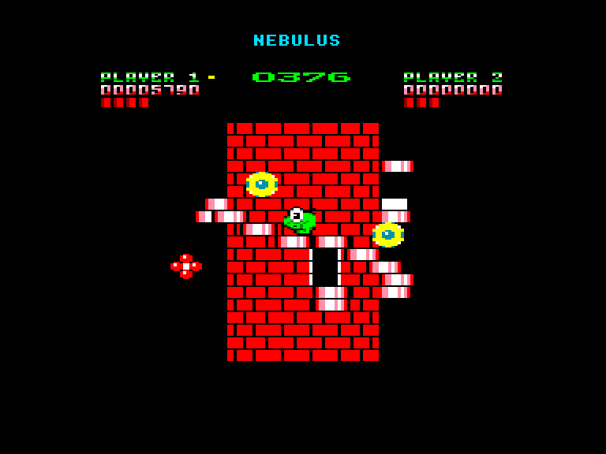
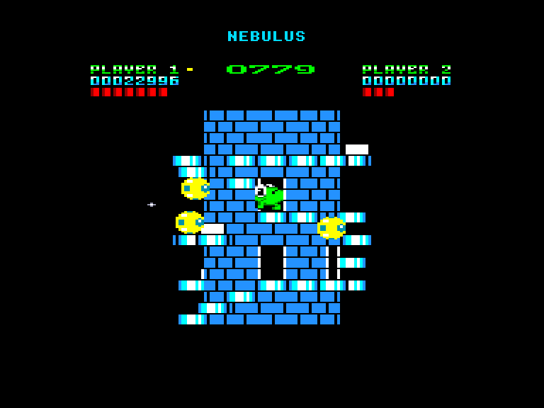

[0-9](../0/games-0.md) - [A](../a/games-a.md) - [B](../b/games-b.md) - [C](../c/games-c.md) - [D](../d/games-d.md) - [E](../e/games-e.md) - [F](../f/games-f.md) - [G](../g/games-g.md) - [H](../h/games-h.md) - [I](../i/games-i.md) - [J](../j/games-j.md) - [K](../k/games-k.md) - [L](../l/games-l.md) - [M](../m/games-m.md) - [N](../n/games-n.md) - [O](../o/games-o.md) - [P](../p/games-p.md) - [Q](../q/games-q.md) - [R](../r/games-r.md) - [S](../s/games-s.md) - [T](../t/games-t.md) - [U](../u/games-u.md) - [V](../v/games-v.md) - [W](../w/games-w.md) - [X](../x/games-x.md) - [Y](../y/games-y.md) - [Z](../z/games-z.md)

Ігри для [Enterprise 64k](../games-ep64.md) - [Enterprise 128k+RAMexp](../games-epramexp.md)

Ігри для систем [IS-DOS](../games-is-dos.md) - [SymbOS](../games-symbos.md) - [EDC Windows](../games-edcw.md)

Ігри для емуляторів [ZX Spectrum 48k/128k](../zxemu/games-zxemu.md) - [Amstrad CPC](../cpcemu/games-cpc.md) - [Sinclair ZX81](../zx81emu/games-zx81.md) - [Videoton TVC](../tvcemu/games-tvc.md) - [Commodore VIC-20](../vic20emu/games-vic20.md)

----------

# Nebulus

**Альтернативні назви:**
 - Tower Toppler

**ID:** nebulus-cpc

**Жанри:** Аркада, Екшн, Платформер

## Скріншоти

## Опис

(temp) 

Nebulus — це аркадна гра-платформер 1988 року, адаптована для системи Enterprise з версії для Amstrad CPC. 
Цей порт відомий своєю відмінною графікою та динамічною музикою, що робить його дуже якісним перенесенням.

Гра відбувається на планеті Небулус, поверхня якої повністю вкрита водою.

Ігровий процес
Ви керуєте маленькою жабкою, яка прибуває на місце подій на підводному човні. Ваше завдання — підійматися на вершини маяків за відведений час.

Основні деталі:

Мета: Піднятися на верхівку маяка.

Вороги: Різноманітні вороги намагаються зіштовхнути вас з платформ.

Особливості:

Циліндричні вежі: Маяки мають циліндричну форму, що створює ефект обертання.

Двері: Заходячи в двері, ви переміщаєтеся на іншу сторону вежі.

Небезпеки: Платформи можуть руйнуватися, а літаючі об'єкти намагаються зіштовхнути вас.

Втрата життя: Ви втрачаєте життя, якщо падаєте у воду або закінчується час. Якщо вас зіштовхнули, ви падаєте до найближчої платформи.

## Основна інформація
- **Мови:** Англійська
- **Оригінальна платформа:** Amstrad CPC
### Системні вимоги
- **Апаратні:** EP128
### Геймплей
- **Керування:** Keyboard, Internal Joy, External Joy 1, External Joy 2
- **Кількість гравців:** 1 player, 2 players (alternate)
- **Додаткові теги:** 16-color mode
### Розробка
- **Рік випуску:** 1988
- **Автор:** Chris Wood, Dave Rogers, John Phillips

## Посилання
- [Опис гри на ep128.hu (угорською)](http://www.ep128.hu/Ep_Games/Leiras/Nebulus.htm)
- [Інформація про оригінальну версію](https://www.cpc-power.com/index.php?page=detail&num=1499)
- [Завантажити гру](http://www.ep128.hu/Ep_Games/Prg/Nebulus_CPC.rar)
- [Easy Load&Play](https://t.me/EP128k_Load_n_Play/39) *(Telegram-канал Vibrant Waves)*

## Відео

<iframe src="https://www.youtube.com/embed/4h9maFWsC48"  
style="width:75%; aspect-ratio:16/9;" allowfullscreen></iframe>

- [Відео](https://www.youtube.com/watch?v=sRNzvAj20-0)